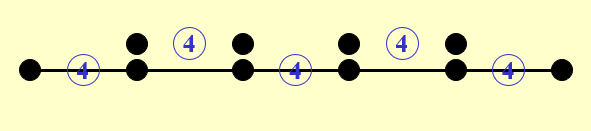
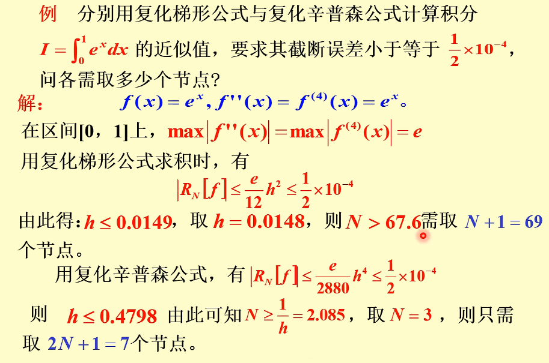

alias:: 复合辛普森求积公式

- 将区间$[a,b]$分为 $n$ 等分，在每个子区间 $[x_k,x_{k+1}]$ 上采用[[Simpson 式]],若记 $x_{k+1/2}=x_{k}+\frac{1}{2}h$ , 则得
  \begin{aligned}
  I &=\int_{a}^{b}f\left(x\right)\mathrm{d}x=\sum_{k=0}^{n-1}\int_{x_{k}}^{x_{k+1}}f\left(x\right)\mathrm{d}x \\
  &=\frac{h}{6}\sum_{k=0}^{n-1}\bigl[f(x_{k})+4f(x_{k+1/2})+f(x_{k+1})\bigr]+R_{n}(f).
  \end{aligned}
  记
  \begin{aligned}
  S_{n} &=\frac{h}{6}\sum_{k=0}^{n-1}\bigl[f(x_{k})+4f(x_{k+1/2})+f(x_{k+1})\bigr] \\
  &=\frac{h}{6}\bigg[f(a)+4\sum_{k=0}^{n-1}f(x_{k+1/2})+2\sum_{k=1}^{n-1}f(x_{k})+f(b)\bigg],
  \end{aligned}
  称为[[复和辛普森求积公式]]。
  
- 其[余项](求积公式余项)由[式](((65a5331f-979f-41be-9f75-45d9e5a43489)))，得
  $$R_{n}(f)=I-S_{n}=-\frac{h}{180}\left(\frac{h}{2}\right)^{4} \sum_{k=0}^{n-1} f^{(4)}\left(\eta_{k}\right), \quad \eta_{k} \in\left(x_{k}, x_{k+1}\right) .$$
  于是当  $f(x) \in C^{4}[a, b]$  时,与复化梯形公式相似有
  $$R_{n}(f)=I-S_{n}=-\frac{b-a}{180}\left(\frac{h}{2}\right)^{4} f^{(4)}(\eta), \quad \eta \in(a, b) .$$
  由上式看出, 误差阶为  $h^{4}$ , [收敛性]([[求积公式收敛性]])是显然的.
- 实际上, 只要  $f(x) \in C[a, b]$ , 则可得到[收敛性]([[求积公式收敛性]]),  即
  $$\lim _{n \rightarrow \infty} S_{n}=\int_{a}^{b} f(x) \mathrm{d} x .$$
  此外, 由于  $S_{n}$  中求积系数均为正数, 故知复和辛普森公式计算[稳定]([[求积公式稳定性]]).
- ## 例子
	- {:height 508, :width 754}