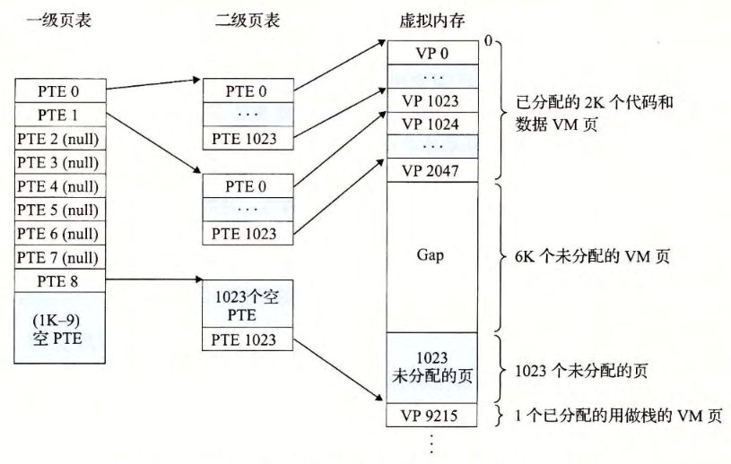
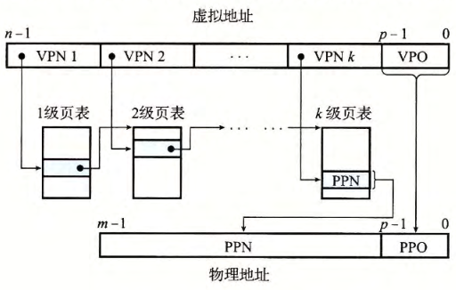

- #+BEGIN_TIP
  到目前为止，我们一直假设系统只用一个单独的页表来进行地址翻译。但是如果我们有 一 个 32 位的地址空间、 4KB 的页面和 一 个 4 字节的 PTE, 那么即使应用所引用的只是虚拟地址空间中很小的一部分，也总是需要一个 4MB 的页表驻留在内存中。对于地址空间为 64 位的系统来说，问题将变得更复杂。
  #+END_TIP
- 用来[[压缩页表]]的常用方法是使用 *有层次结构的[[页表]]* 。 
  用一个具体的示例是最容易理解这个思想的。假设 32 位虚拟地址空间被分为 4KB 的页，而每个页表条目都是 4 字节。还假设在这一时刻，[[虚拟地址空间]]有如下形式：内存的前 2K 个页面分配给了代码和数据，接下来的 6K 个页面还未分配，再接下来的 1023 个页面也未分配，接下来的 1 个页面分配给了用户栈。下图展示了我们如何为这个虚拟地址空间构造一个两级的页表层次结构。
	- [[一级页表]]中的每个[[PTE]]负责[[映射]][[虚拟地址空间]]中 一 个 4MB 的[[片]], 这里 每一片 都是由 $1024$ 个连续的[[页面]]组成的。比如， PTE 0 映射第一片， PTE 1 映射接下来的一片，以此类推。假设地址空间是 4GB, 1024 个 PTE 已经足够覆盖整个空间了。
		- 
		- 如果 片 1 中的**每个页面都未被分配**，那么 一级 PTE $i$ 就为空 。 例如，下图中，片 2~7 是未被分配的。
		- 然而，如果在片 t 中**至少有一个页是分配了的**，那么 一级 PTE $i$ 就指向 一个[[二级页表]]的**基址**。例如图中，片 0 、1 和 8 的所有或者部分已被分配，所以它们的一级 PTE 就指向二级页表。
		- [[二级页表]]中的每个[[PTE]]都负责映射一个4KB的[[虚拟内存页面]]，就像我们查看只有一级的页表一样。注意，使用 4字节的 PTE, 每个一级和二级页表都是4KB字节，这刚好和一个[[页面]]的大小是一样的。这种方法从两个方面**减少了内存要求**：
			- 如果[[一级页表]]中的一个[[PTE]]是**空的**，那么相应的[[二级页表]]就**根本不会存在**。这代表着一种巨大的潜在节约，因为对于一个典型的程序，4GB的虚拟地址空间的大部分都会是未分配的。
			  logseq.order-list-type:: number
			- **只有**[[一级页表]]才需要总是在[[主存]]中；虚拟内存系统可以在需要时[[创建]]、[[页面调入]]或[[调出]][[二级页表]]，这就减少了主存的压力；只有最经常使用的二级页表才需要缓存在主存中。
			  logseq.order-list-type:: number
		- 下图描述了使用 *k级页表层次结构* 的[[地址翻译]]。[[虚拟地址]]被划分成为 $K$ 个[[VPN]]和 $1$ 个 [[VPO]]。每个 VPN $i$ 都是一个 到第 $i$ 级页表的索引 ，其中 $1\le i\le k$。第 $j$ 级页表中的每个[[PTE]], $1\le j\le k-1$ , 都指向第 $j+1$ 级的某个页表的基址。第 K级页表中的每个 PTE包含某个物理页面的 PPN,或者一个磁盘块的地址。为了构造物理地址，在能够确定 PPN之前， MMU必须访问 K个 PTE。对千只有一级的页表结构， PPO和 VPO是相同的。
		  