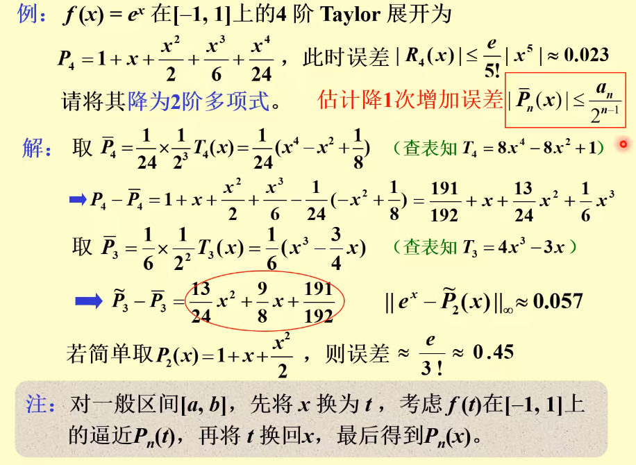

alias:: economization of power series, 幂级数项数节约, reduce the degree of polynomial

- 设$f(x)\approx P_n(x)$。在降低[[多项式]]$P_n(x)$ 次数的同时，使因此 *增加的误差* 尽可能小。
- 从 $P_n$ 中去掉一个含有其最高次项的$\overline{P}_n$, 结果降次为 $\tilde{P}_{n-1}$ , 则：
  id:: 65a25fa1-69ef-4022-acf1-dae0c7ddecd3
  $$\max_{[-1,1]} |f(x)-\widetilde{P}_{n-1}(x)|_{\leq}\max_{[-1,1]}|f(x)-P_n(x)|+\max_{[-1,1]}|\overline{P}_n(x)|$$
  $\max_{[-1,1]}|\overline{P}_n(x)|$ 表示 *因降次而增加的误差*，所以目标是使其尽可能小。
- 设 $P_n$ 的首项系数为 $\alpha_n$ , 则取 
  $$\overline{P_n}(x)=a_n\times\frac{T_n(x)}{2^{n-1}}$$ 
  ([[最小零偏差]])
  可使精度尽可能少损失。
- ## 例子
	- 