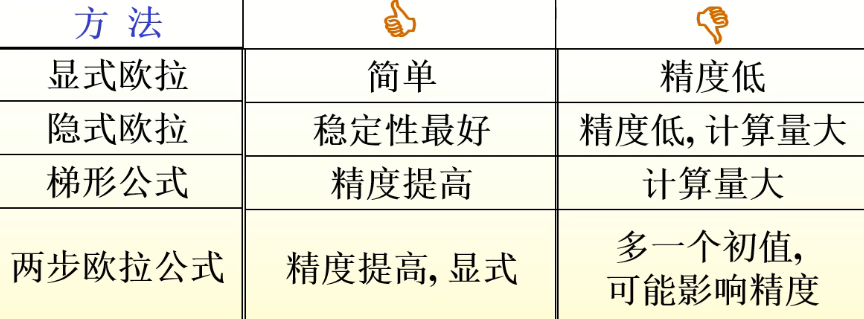

alias:: Local truncation error，LTE, 显式单步法的局部截断误差

- ### 增量函数
  初值问题的[[单步法]]可用一般形式表示为 
  $$y_{n+1}=y_{n}+h \varphi\left(x_{n}, y_{n}, y_{n+1}, h\right), \tag{1}$$
  其中, [[多元函数]]  $\varphi$  与  $f(x, y)$  有关, 当  $\varphi$  含有  $y_{n+1}$  时, 方法是隐式的, 若不含  $y_{n+1}$  则为显式方法. 所以[[显式单步法]]可表示为
  $$y_{n+1}=y_{n}+h \varphi\left(x_{n}, y_{n}, h\right),$$
  其中,  $\varphi(x, y, h)$  称为[[增量函数]].
	- 例如对[[显式欧拉公式]], 有
	  $$\varphi(x, y, h)=f(x, y) .$$
- ### 整体截断误差
  从  $x_{0}$  开始计算, 如果考虑每一步产生的误差, 直到  $x_{n}$ , 则误差  
  $$e_{n}=y\left(x_{n}\right)-y_{n}$$  
  称为该方法在  $x_{n}$  点的[[整体截断误差]].
	- 分析和求得整体截断误差  $e_{n}$  是复杂的. 为此, 仅考虑从  $x_{n}$ 到  $x_{n+1}$  的局部情况, 并假设  $x_{n}$  之前的计算没有误差, 即  $y_{n}=y\left(x_{n}\right)$ , 给出单步法的局部截断误差概念.
- ### 局部截断误差
  设  $y(x)$  是[初值问题]([[一阶常微分方程的初值问题]])的精确解, 称
  $$T_{n+1}=y\left(x_{n+1}\right)-y\left(x_{n}\right)-h \varphi\left(x_{n}, y\left(x_{n}\right), h\right)$$
  为[[显式单步法的局部截断误差]].
- ### [[数值解法的精度]]
  设 $y(x)$ 是初值问题的精确解，若存在最大整数 $p$ 使[[显式单步法的局部截断误差]]满足
  $$T_{n+1}=y(x+h)-y(x)-h \varphi(x, y, h)=O\left(h^{p+1}\right),$$
  则称方法 $(1)$ 是  $p$  阶的,或称具有 $p$  阶[精度]([[数值解法的精度]]).
  若将上式写成
  $$T_{n+1}=\psi\left(x_{n}, y\left(x_{n}\right)\right) h^{p+1}+O\left(h^{p+2}\right),$$
  则  $\psi\left(x_{n}, y\left(x_{n}\right)\right) h^{p+1}$  称为[[局部截断误差主项]].
- 求局部截断误差的步骤：
	- 1) 作局部化假设, 即设  $y_{n}=y\left(x_{n}\right)$ ;
	- 2) 将[差分解]([[数值解]])  $\boldsymbol{y}_{n+1}$  在  $\boldsymbol{x}_{n}$  处（泰勒）展开;
	- 3) 将精确解  $\boldsymbol{y}\left(\boldsymbol{x}_{n+1}\right)$  在  $\boldsymbol{x}_{n}$  处（泰勒）展开;
	- 4) 比较  $T_{n+1}=y\left(x_{n+1}\right)-y_{n+1}$ 。
	- [[显式欧拉公式]]的局部截断误差：
	  \begin{aligned}
	  T_{n+1} &=y\left(x_{n+1}\right)-y_{n+1} \\
	  &=\left[y\left(x_{n}\right)+h y^{\prime}\left(x_{n}\right)+\frac{h^{2}}{2} y^{\prime \prime}\left(x_{n}\right)+O\left(h^{3}\right)\right]-\left[y_{n}+h f\left(x_{n}, y_{n}\right)\right] \\
	  & =\frac{h^{2}}{2} y^{\prime \prime}\left(x_{n}\right)+O\left(h^{3}\right)
	  \end{aligned}
	  欧拉法具有 $1$ 阶精度。
	- [[两步欧拉法]]的局部截断误差:
	  $$T_{n+1}=y\left(x_{n+1}\right)-y_{n+1}=O\left(h^{3}\right)$$  
	  即两步欧拉公式具有 $2$ 阶精度。
- 以上定义对[[隐式单步法]]也是适用的.
	- 例如, 对 [[后退欧拉公式]]其局部截断误差为
	  \begin{aligned}
	  T_{n+1} & =y\left(x_{n+1}\right)-y\left(x_{n}\right)-h f\left(x_{n+1}, y\left(x_{n+1}\right)\right) \\
	  & =h y^{\prime}\left(x_{n}\right)+\frac{h^{2}}{2} y^{\prime\prime}\left(x_{n}\right)+O\left(h^{3}\right)-h\left[y^{\prime}\left(x_{n}\right)+h y^{\prime \prime}\left(x_{n}\right)+O\left(h^{2}\right)\right] \\
	  & =-\frac{h^{2}}{2} y^{\prime \prime}\left(x_{n}\right)+O\left(h^{3}\right),
	  \end{aligned}
	  这里 精度 $p=1$ , 是 $1$ 阶方法, [[局部截断误差主项]]为  $-\frac{h^{2}}{2} y^{\prime \prime}\left(x_{n}\right)$ .
	- [[梯形欧拉公式]]  $y_{n+1}=y_{n}+\frac{h}{2}\left[f\left(x_{n}, y_{n}\right)+f\left(x_{n+1}, y_{n+1}\right)\right]$  的局部截断误差：
	  \begin{array}{l}
	  T_{n+1}=y\left(x_{n+1}\right)-y\left(x_{n}\right)-\frac{h}{2}\left[y^{\prime}\left(x_{n}\right)+y^{\prime}\left(x_{n+1}\right)\right] \\
	  =h y^{\prime}\left(x_{n}\right)+\frac{h^{2}}{2} y^{\prime \prime}\left(x_{n}\right)+\frac{h^{3}}{3 !} y^{\prime \prime \prime}\left(x_{n}\right) \\
	  -\frac{h}{2}\left[y^{\prime}\left(x_{n}\right)+y^{\prime}\left(x_{n}\right)+h y^{\prime \prime}\left(x_{n}\right)+\frac{h^{2}}{2} y^{\prime \prime \prime}\left(x_{n}\right)\right]+\mathrm{O}\left(h^{4}\right) \\
	  =-\frac{h^{3}}{12} y^{\prime \prime \prime}\left(x_{n}\right)+\mathrm{O}\left(h^{4}\right)
	  \end{array}
- 
-