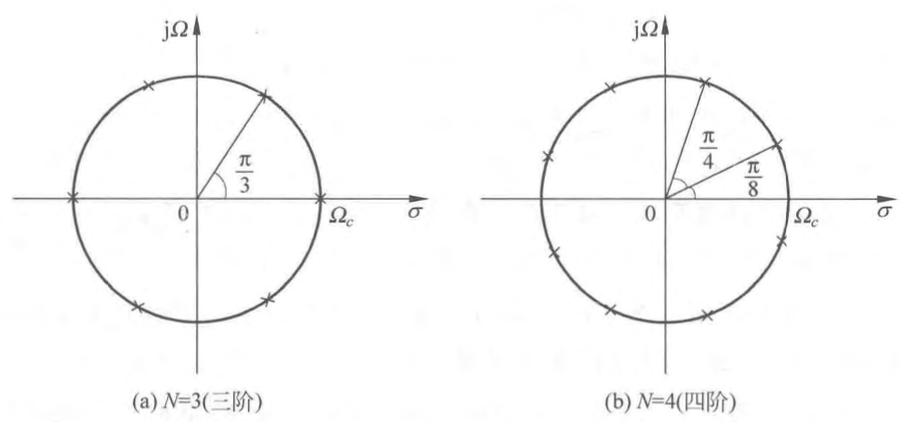

### ${H}_{a}(s) {H}_{a}(-s)$ 的极点
	- [[幅度平方函数]]在[[s 平面]]的[[解析延拓]]即为 $H_{a}(s) H_{a}(-s)$ ，由于 $h_{a}(t)$ 为实数，故有
	  $$\begin{aligned}
	  H_{a}(s) H_{a}(-s) & =\left|H\left(\mathrm{e}^{\mathrm{j} \Omega}\right)\right|_{\Omega=s / \mathrm{j}}^{2}=\left.H_{a}(\mathrm{j} \Omega) H_{a}^{*}(\mathrm{j} \Omega)\right|_{\Omega=s / \mathrm{j}}=\left.H_{a}(\mathrm{j} \Omega) H(-\mathrm{j} \Omega)\right|_{\Omega=s / \mathrm{j}} \\
	  & =\left|H_{a}(s)\right|^{2}=\frac{1}{1+\left(\frac{s}{\mathrm{j} \Omega_{c}}\right)^{2 N}}
	  \end{aligned} \tag{1}$$
	  可以看出巴特沃思滤波器系统函数的全部零点都在 $s=\infty$ 处，而在有限 $s$ 平面只有[[极点]]，因而属于^^全极点型滤波器^^。
	   $H_{a}(s) H_{a}(-s)$ 的极点为
	  $$s_{k}=(-1)^{\frac{1}{2 N}}\left(\mathrm{j} \Omega_{c}\right)=\Omega_{c} \mathrm{e}^{\mathrm{j}\left(\frac{1}{2} \frac{2 k-1}{2 N}\right) \pi}, \quad k=1,2, \cdots, 2 N \tag{2}$$
	- 由此式可得到 $H(s) H(-s)$ 的极点分布图，见图 1 ，
	  collapsed:: true
	   
	  其分布特点为
		- 极点在 $s$ 平面是象限对称的，分布在半径为 $\Omega_{c}$ 的圆（称为巴特沃思圆）上，有 $2 N$ 个极点。在 $(2)$ 式中，当 $k=1$ ， $2$ ， $\cdots$ ， $N$ 时， $s_{k}$ 即为 $s$ 平面左半平面极点，它就是 $H_{a}(s)$ 的极点。
		  logseq.order-list-type:: number
		- 极点间隔的角度为 $\frac{\pi}{N} \mathrm{rad}$ 。
		  logseq.order-list-type:: number
		- 极点绝不会落在虚轴上，这样滤波器 $H_{a}(s)$ 才可能是[稳定]([[滤波器稳定]])的。
		  logseq.order-list-type:: number
		- 当 $N$ 为奇数时，实轴上有极点；当 $N$ 为偶数时，实轴上没有极点。
		  logseq.order-list-type:: number
- ### ${H}_{a}(s)$ 的极点
	- $H_{a}(s)$ 的极点是 $H_{a}(s) H_{a}(-s)$ 在 $s$ 平面的**左半平面**的[[极点]]，即有
	  $$s_{k}=\Omega_{c} \mathrm{e}^{\left(\frac{1}{2}+\frac{2 k-1}{2 N}\right) \pi}, \quad k=1,2, \cdots, N\tag{3}$$
	  参见图 1（左半平面），
	- 当 $N$ 为偶数时，极点全为共轭对，即为
	   $$s_{k}, s_{N+1-k}=s_{k}^{*}, k=1, 2, \cdots, N / 2,\quad N\text{为偶数}\tag{4}$$
	- 当 $N$ 为奇数时，则除了有 $\frac{N-1}{2}$ 个和上面一样的共轭极点对以外，还有一个实极点，即有
	  $$\left.\begin{aligned}
	  s_{k}, \quad s_{N+1-k}=s_{k}^{*}, \quad k=1,2, \cdots,(N-1) / 2, \\
	  s_{(N+1) / 2}=-\Omega_{c}, \quad k=(N+1) / 2
	  \end{aligned}\right\} N \text { 为奇数 }\tag{5}$$
- ###  巴特沃思低通滤波器的系统函数 ${H}_{a}({s})$
	- 由图 $1$ 左半平面极点（见 $(3)$ 式），可得到
	  $$H_{a}(s)=\frac{1}{\sqrt{1+\left(s / \mathrm{j} \Omega_{c}\right)^{2 N}}}=\frac{\Omega_{c}^{N}}{\prod_{h=1}^{N}\left(s-s_{k}\right)}\tag{6}$$
	  将一对共轭极点构成一个二阶实系数子系统 $H_{k}(s)$ 为
	  $$H_{k}(s)=\frac{\Omega_{c}^{2}}{\left(s-s_{k}\right)\left(s-s_{N+1-k}\right)}=\frac{\Omega_{c}^{2}}{s^{2}-2 \Omega_{c} s \cos \left(\frac{\pi}{2}+\frac{(2 k-1) \pi}{2 N}\right)+\Omega_{c}^{2}}\tag{7}$$
	  利用 $(7)$ 式，[[通带截止频率]]为 $\Omega_{c}$ 的^^巴特沃思低通模拟滤波器的系统函数^^为
	  $$\begin{aligned}
	  H_{a}(s)=\prod_{k=1}^{N / 2} H_{k}(s), \quad N \text { 为偶数 } \\
	  H_{a}(s)=\frac{\Omega_{c}}{s+\Omega_{c}} \prod_{k=1}^{(N-1) / 2} H_{k}(s), N \text { 为奇数 }
	  \end{aligned}$$
- ## [[巴特沃斯归一化原型低通滤波器]]
- ## [[巴特沃斯低通滤波器的设计]]