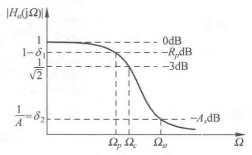

## 设计参数的确定
	- ### 设计时给定参数
	  logseq.order-list-type:: number
	  参见图 2 巴特沃思低通滤波器性能指标示意图， 
	  {:height 310, :width 492} 
	  $\Omega_{p}$ 为所需的通带截止频率； $R_{p}(\mathrm{~dB})$ 为 $\Omega_{p}$ 处 $\left|H_{a}\left(\mathrm{j} \Omega_{p}\right)\right|$ 的衰减的最大值 $($ 注意， $\Omega_{p}$ 不一定是 $-3 \mathrm{~dB}$ 处的截止频率，即 $R_{p}$ 可能不等于 $\left.3 \mathrm{~dB}\right)$ ； $\Omega_{s t}$ 为所需的阻带截止频率； $A_{s}(\mathrm{~dB})$ 为 $\Omega_{s t}$ 处 $\left|H_{a}\left(\mathrm{j} \Omega_{s t}\right)\right|$ 的衰减的最小值
	  $$\begin{aligned}
	  20 \lg \left|\frac{H_{a}(\mathrm{j} 0)}{H_{a}\left(\mathrm{j} \Omega_{p}\right)}\right|=-20 \lg \left|H_{a}\left(\mathrm{j} \Omega_{p}\right)\right| \leqslant R_{p} \\
	  20 \lg \left|\frac{H_{a}(\mathrm{j} 0)}{H_{a}\left(\mathrm{j} \Omega_{s t}\right)}\right|=-20 \lg \left|H_{a}\left(\mathrm{j} \Omega_{s t}\right)\right| \geqslant A_{s}
	  \end{aligned}\tag{1}$$
	- ### 求滤波器阶次 $N$ 
	  logseq.order-list-type:: number
	  collapsed:: true
	  将 $(1)$ 式与[[巴特沃斯频率响应幅度]] $\left|H_{a}(\mathrm{j} \Omega)\right|$ 的以下公式结合起来
	  $$\left|H_{a}(\mathrm{j} \Omega)\right|=\frac{1}{\sqrt{1+\left(\frac{\Omega}{\Omega_{c}}\right)^{2 N}}}$$
	  于是，通带边沿及阻带边沿的增益（ $\mathrm{dB}$ ）满足以下关系
	  $$\begin{aligned}
	  20 \lg \left|H_{a}\left(\mathrm{j} \Omega_{p}\right)\right|=-10 \lg \left[1+\left(\frac{\Omega_{p}}{\Omega_{c}}\right)^{2 N}\right] \geqslant-R_{p} \\
	  20 \lg \left|H_{a}\left(\mathrm{j} \Omega_{s t}\right)\right|=-10 \lg \left[1+\left(\frac{\Omega_{s t}}{\Omega_{c}}\right)^{2 N}\right] \leqslant-A_{s}
	  \end{aligned}\tag{2}$$
	  故有
	  $$\begin{aligned}
	  \left(\Omega_{p} / \Omega_{c}\right)^{2 N} \leqslant 10^{0.1 R_{p}}-1 \\
	  \left(\Omega_{s t} / \Omega_{c}\right)^{2 N} \geqslant 10^{0.1 A_{s}}-1
	  \end{aligned}\tag{3}$$
	  因而
	  $$\frac{10^{0.1 A_{s}}-1}{10^{0.1 R_{p}}-1} \leqslant\left(\frac{\Omega_{s t}}{\Omega_{p}}\right)^{2 N}\tag{4}$$
		- 由此得出滤波器阶次 $N$ 为 $($ 当 $\Omega=\Omega_{p}$ 时， $R_{p} \neq 3 \mathrm{~dB} )$ 
		  logseq.order-list-type:: number
		  $$N \geqslant \lg \left(\frac{10^{0.1 A_{s}}-1}{10^{0.1 R_{p}}-1}\right) /\left[2 \lg \left(\frac{\Omega_{s t}}{\Omega_{p}}\right)\right]\tag{5}$$
		  若令
		  $$\frac{\Omega_{s t}}{\Omega_{p}}=\lambda_{s}$$
		  $$\sqrt{\frac{10^{0.1 A_{s}}-1}{10^{0.1 R_{p}}-1}}=g$$
		  则有
		  $$N \geqslant \lg g / \lg \lambda_{s}\tag{6}$$
		  取滤波器阶数为 $\lfloor N+1\rfloor$（即取 $(N+1)$ 的整数部分）。
		- $*$ 若 $R_{p}=3 \mathrm{~dB}$ ，即 $\Omega_{p}=\Omega_{c}$ ，则 $R_{p}=10 \lg \left[1+\left(\frac{\Omega_{c}}{\Omega_{c}}\right)^{2 N}\right]=10 \lg 2=3(\mathrm{~dB})$ ，将其代人 $(5)$ 式，可得 ${R}_{p}={3 d B}$ 时的阶次 ${N}$ 为
		  logseq.order-list-type:: number
		  $$N \geqslant \lg \left(10^{0.1 A_{s}}-1\right) /\left[2 \lg \left(\frac{\Omega_{s t}}{\Omega_{p}}\right)\right]=\lg \left(10^{0.1 A_{s}}-1\right) /\left[2 \lg \left(\lambda_{s}\right)\right], \quad R_{p}=3 \mathrm{~dB}\tag{7}$$
	- ### 求 ${\Omega}_{c}$ 
	  logseq.order-list-type:: number
	  当 $R_{p} \neq 3 \mathrm{~dB}$ 时， $\Omega_{p} \neq \Omega_{c}$ ，[[巴特沃思滤波器归一化低通原型]]的通带截止频率为 $\Omega_{c}=1$ ，去归一化时必须用 $3 \mathrm{~dB}$ 衰减处的 $\Omega_{c}$ ，才能进行转换，为此必须求 $\Omega_{c}$ 。从 $(6.5.19a)$ 式及 $(6.5.19b)$ 式可分别求得两个 ${\Omega}_{c}$ 的表达式
	  $$\begin{aligned}
	  \Omega_{c} \geqslant \Omega_{p} / \sqrt[2 N]{10^{0.1 R_{p}}-1}=\Omega_{c p} \\
	  \Omega_{c} \leqslant \Omega_{s t} / \sqrt[2 N]{10^{0.1 A_{s}}-1}=\Omega_{c s}
	  \end{aligned}\tag{8}$$
	  即
	  $$\Omega_{c p} \leqslant \Omega_{c} \leqslant \Omega_{c s}$$
	  由于阶次选为 $\lfloor N+1\rfloor$ ，比要求的 $N$ 大，故若用 $(8.a)$ 式取等号求 $\Omega_{c}$ ，则[[通带衰减]]满足要求，阻带指标则可超过要求（ $\Omega_{s t}$ 处衰减可大于 $A_{s} \mathrm{~dB}$ ）；若用 $(8.b)$ 式取等号求 $\Omega_{c}$ ，则阻带衰减满足要求，通带指标则可超过要求（ $\Omega_{p}$ 处衰减可小于 $R_{p} \mathrm{~dB}$ ）。
	  若选
	  $$\Omega_{c}=\left(\Omega_{k p}+\Omega_{\mathrm{cs}}\right) / 2\tag{9}$$
	  则通带、阻带衰减皆可超过要求 。
-
- ## 例子
	- ((6615231e-63aa-4a4f-ba90-f2c1e7c5dc08))