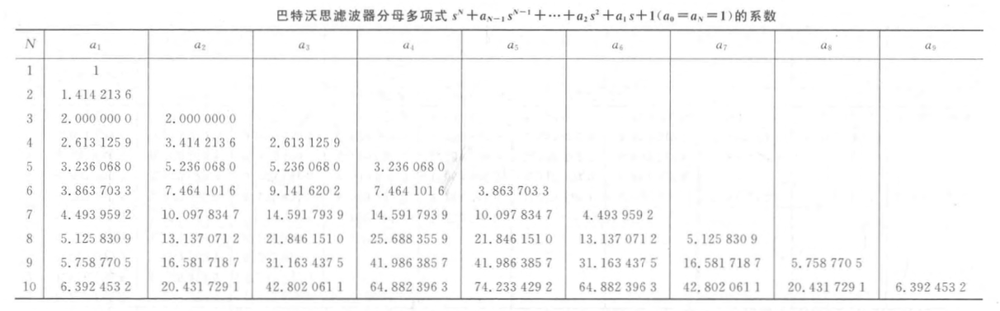
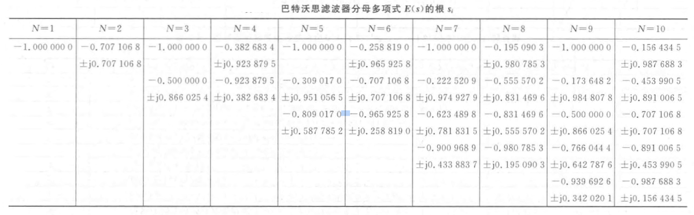
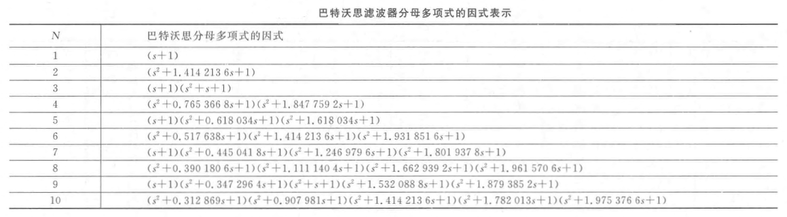

alias:: 巴特沃斯滤波器归一化低通原型

- ### 巴特沃斯归一化原型低通滤波器的系统函数 ${H}_{a n}(s)$
  为了便于对各种类型及各种截止频率 $\Omega_{c}$ 滤波器进行设计，在滤波器设计手册中，都是将低通滤波器的[截止频率]([[3 dB 截止频率]]) ${\Omega}_{c}$ ^^归一化^^为 $\Omega_{c}=1$ ，也就是说将衰减[[3 dB]]处的截止频率归一化为 $1$ 。此时巴特沃斯归一化低通滤波器的极点及系统函数只需将上面所有公式中的截止频率 $\Omega_{\mathrm{c}}$ 换成 $\Omega_{\mathrm{c}}=1$ ，将[[系统函数]]用 $H_{a n}(s)$ 表示即可。
- 表 1 、表 2 和表 3 分别给出了归一化巴特沃思低通原型滤波器分母多项式用系数、根以及因式表示的数据。
	- 
	- 
	  id:: 6614eeeb-9df5-4423-9833-482132e782dd
	- 
	  id:: 6614ef7f-70c4-44d1-a27e-8084808e8957
- $H_{a n}(s)$ 的分母多项式用系数 $a_{0}=1$ ， $a_{1}$ ， $\cdots$ ， $a_{N-1}$ ， $a_{N}=1$ 及根表示时为
  $$H_{a n}(s)=\frac{d_{0}}{1+a_{1} s+a_{2} s^{2}+\cdots+s^{N}}=\frac{d_{0}}{\left(s-s_{1}\right)\left(s-s_{2}\right) \cdots\left(s-s_{N}\right)}$$
  其中 $d_{0}$ 一般由 $\Omega=0$ 时 $\left|H_{a n}(\mathrm{j} 0)\right|=1$（增益为 $1$）来确定，由于 $a_{0}=1$ ，故这时 $d_{0}=a_{0}=1$ 。
- 由归一化原型低通滤波器系统函数 ${H}_{a n}(s)$ “去归一化”后得到 $3 \mathrm{~dB}$ 衰减处为 ${\Omega}_{c}$ 的一般低通滤波器 ${H}_{a}(s)$ 的方法是用 $s=\frac{s^{\prime}}{{\Omega}_{\mathrm{c}}}$ 替换 ${H}_{a n}\left({s}^{\prime}\right)$ 中的 ${s}^{\prime}$ 
  $$H_{a}(s)=\left.H_{a n}\left(s^{\prime}\right)\right|_{s^{\prime}=\frac{s}{a_{c}}}=H_{a n}\left(\frac{s}{\Omega_{c}}\right)$$