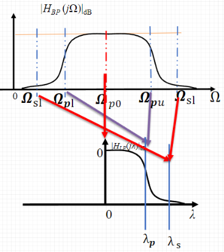

## 带通滤波器的参数指标与转换
	- 通过 下通带截止频率 ${\Omega}_{{p}}$ 和 上通带截止频率 ${\Omega}_{p u}$ ，推出：
	  $$\lambda_{p}=1$$
	  通过 下阻带截止频率 ${\Omega}_{\mathrm{s} l}$ 和 上阻带截止频率 ${\Omega}_{\mathrm{su}}$ ，推出：
	  $$\Longrightarrow \lambda_{\mathrm{s}}=\frac{\Omega_{p 0}^{2}-\Omega_{s l}^{2}}{\Omega_{s l} B_{\omega}}$$
	- $$\mathrm{B}_{\omega}={\Omega}_{p u}-{\Omega}_{p \mathrm{l}}$$
	  当 $\Omega_{\mathrm{pl}} {\Omega}_{\mathrm{pu}} \neq {\Omega}_{\mathrm{sl}} {\Omega}_{\mathrm{su}}$ 时，用 ${\Omega}^{\prime}{ }_{\mathrm{sl}}$ 取代  $\Omega_{s l}$ ：
	  $${\Omega}_{\mathrm{sl}}^{\prime}=\frac{{\Omega}_{\mathrm{pl}} {\Omega}_{\mathrm{pu}}}{{\Omega}_{\mathrm{su}}}$$
	- 
- ## 设计步骤
	- 将带通滤波器的指标转换成低通归一化指标
	  logseq.order-list-type:: number
		- 归一化通带截止频率 $\lambda_{{p}}=1$ 
		  logseq.order-list-type:: number
		- 通带衰减 $\alpha_{p}$ 
		  logseq.order-list-type:: number
		- 归一化阻带截止频率 $\lambda_{\mathrm{S}}=\frac{\Omega_{p 0}^{2}-\Omega_{s l}^{2}}{\Omega_{S} B_{\omega}}$ 
		  logseq.order-list-type:: number
		- 阻带衰减 $\alpha_{\mathrm{S}}$
		  logseq.order-list-type:: number
	- 按[[巴特沃斯低通滤波器的设计]]方法计算低通滤波器的阶数 $\mathrm{N}$ 
	  logseq.order-list-type:: number
	- 查表得到低通滤波器的归一化传输函数 $G_{a}(p)$ 
	  logseq.order-list-type:: number
	- 以通带频率为依据计算归一化 $3 \mathrm{~dB}$ 频率 $\lambda_{c}=\lambda_{\mathrm{p}}\left(10^{0.1 \alpha_{p}}-1\right)^{-\frac{1}{2 N}}$ 
	  logseq.order-list-type:: number
	- 令 $p=\frac{s^{2}+\Omega_{p 0}^{2}}{s \lambda_{c} B_{\omega}}$ 将 $G_{a}(p)$ 转换成 $H_{B P}(s)$ 即为所求^^带通滤波器系统函数^^。
	  logseq.order-list-type:: number
- ## 例子
	- ((6616ac2f-b28a-4517-accc-0c8d8599022d))