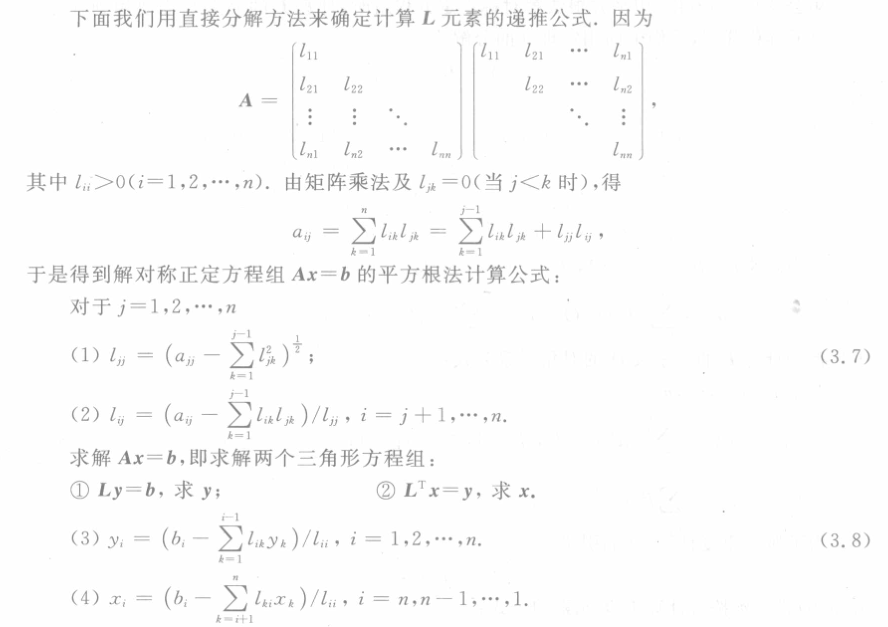
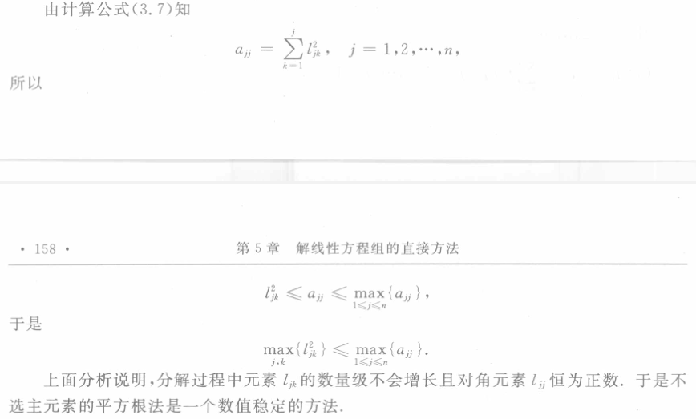

alias:: Cholesky 法, 楚列斯基分解, Cholesky 分解, 对称正定矩阵的三角分解

- # Theorem
	- ## [[对称阵的三角分解定理]]
	  logseq.order-list-type:: number
	- ## [[对称正定矩阵的三角分解]]
	  logseq.order-list-type:: number
	  如果$\boldsymbol A$为 $n$ 阶[[对称正定矩阵]]，则存在一个实的 *非奇异[[下三角矩阵]]* $L$ 使$\boldsymbol A=\boldsymbol{LL}^T$, 当限定 $\boldsymbol L$ 的 *对角元素* 为 *正* 时，这种分解是**唯一的**.
		- ## Proof
			- 现设$\boldsymbol A$ 为[[对称正定矩阵]]。首先说明 $\boldsymbol A$ 的分解式 $\boldsymbol A=\boldsymbol{LDL}^{\mathrm{T}}$ 中 $\boldsymbol D$ 的对角元素 $d_i$ 均为[[正数]]，由 $A$ 的 *对称正定性* ，定理
			  {{embed ((656d4f89-ab61-4f38-a32e-d5d444e67045))}}成立，即
			  $$
			  \begin{aligned}d_1&=D_1>0,\:d_i=D_i/D_{i-1}>0,\quad i=2,3,\cdots,n.\end{aligned}
			  $$
			  于是
			  $$\boldsymbol D = 
			  \begin{bmatrix}d_1 & & \\
			  & \ddots & \\
			  & &  d_n
			  \end{bmatrix}=
			  \begin{bmatrix}\sqrt{d_1} & & \\
			  & \ddots & \\
			  & &  \sqrt{d_n}
			  \end{bmatrix}
			  \begin{bmatrix}\sqrt{d_1} & & \\
			  & \ddots & \\
			  & &  \sqrt{d_n}
			  \end{bmatrix}=\boldsymbol{D}^\frac{1}{2} \boldsymbol{D}^\frac{1}{2}$$
			  所以
			  $$
			  \boldsymbol A=\boldsymbol {LDL}^T=\boldsymbol {LD}^{\frac12}\boldsymbol D^{\frac12}\boldsymbol L^T=(\boldsymbol{LD}^{\frac12})(\boldsymbol{LD}^{\frac12})^T=\boldsymbol{L_1L_1}^T,
			  $$
			  其中 $\boldsymbol L_1=\boldsymbol{LD}^{\frac12}$ 为下三角矩阵。
		- ## 递推公式
		  
		- ## [[数值稳定性]]
		  
		- ## 计算量
			- 当求出 $\boldsymbol L$ 的第 $j$ 列元素时，$\boldsymbol L^\mathrm{T}$ 的第 $j$ 行元素亦算出。所以平方根法约需 $n^3/6$ 次乘除法，大约为一般[[直接 LU 分解法]][[计算量]]的一半。
		- ## 存储
			- 由于 $\boldsymbol A$为对称矩阵，因此在计算机实现时只需存储$\boldsymbol A$的下三角部分，共需要存储$n( n+ 1)/2个元素，可用[[一维数组]]存放，即
			  $$\boldsymbol A(n(n+1)/2)=\{a_{11},a_{21},a_{22},\cdots,a_{n1},a_{n2},\cdots,a_{nn}\}$$
			  矩阵元素 $a_{ij}$ 一维数组的表示为 $A(i(i-1)/2+j)$ , $\boldsymbol L$ 的元素存放在 $A$ 的相应位置。
- # [[改进的平方根法]]
-