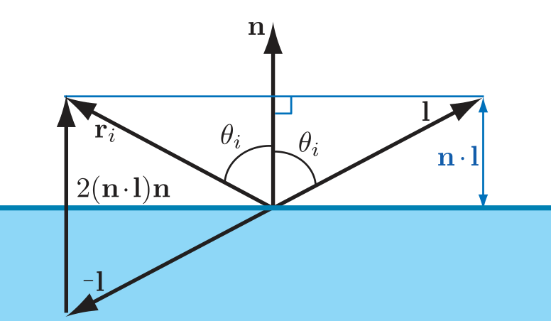

- [[反射光]]的方向向量 $\bold r_i$ 与[[表面法线]]的夹角与[[表面法线]] $\bold n$ 和[[入射]]方向 $\bold l$ 的夹角相同，记为 $θ_i$ 。如下图所示：
  {:height 452/2, :width 776/2}
  [[反射]]向量 $\bold r_i$ 可以从 $\bold n$ 和 $\bold l$ 计算得到：
  $$\bold r_i=2(\bold n\cdot\bold l)\bold n-\bold l$$
-