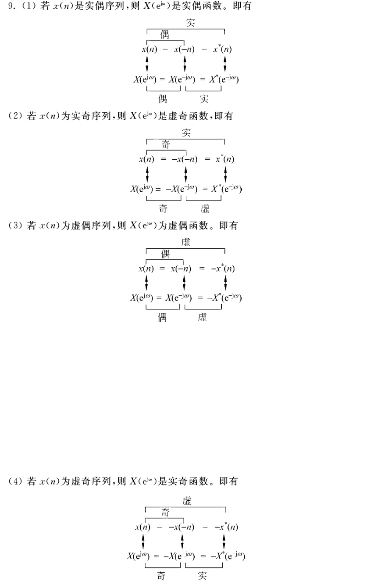

- 任一[[复序列]]  $x(n)$  可分解成[[共轭对称分量]]  $x_{e}(n)$  与[[共轭反对称分量]]  $x_{o}(n)$  之和 （$x_{e}(n)$  与  $x_{o}(n)$  也是复序列）。
  logseq.order-list-type:: number
  $$x(n)=x_{e}(n)+x_{o}(n) \tag{1}$$
	- [[共轭对称序列]] (分量)  $x_{e}(n)$  满足
	  logseq.order-list-type:: number
	  $$x_{e}(n)=x_{e}^{*}(-n)\tag{2}$$
	  若
	  $$x_{e}(n)=\operatorname{Re}\left[x_{e}(n)\right]+\mathrm{j} \operatorname{Im}\left[x_{e}(n)\right] \tag{3}$$
	  则有
	  $$
	  \operatorname{Re}\left[x_{e}(n)\right]=\operatorname{Re}\left[x_{e}(-n)\right] \tag{4}
	  $$
	  $$
	  \operatorname{Im}\left[x_{e}(n)\right]=-\operatorname{Im}\left[x_{e}(-n)\right]\tag{5}
	  $$
	  即 共轭对称序列 的 实部是偶对称的, 虚部是奇对称的。
	- [[共轭反对称序列]] (分量)  $x_{o}(n)$  满足
	  logseq.order-list-type:: number
	  $$x_{o}(n)=-x_{o}^{*}(-n)\tag{6}$$
	  若
	  $$x_{o}(n)=\operatorname{Re}\left[x_{o}(n)\right]+\mathrm{j} \operatorname{Im}\left[x_{o}(n)\right]\tag{7}$$
	  则有
	  $$
	  \operatorname{Re}\left[x_{o}(n)\right]=-\operatorname{Re}\left[x_{o}(-n)\right] \tag{8}
	  $$
	  $$
	  \operatorname{Im}\left[x_{o}(n)\right]=\operatorname{Im}\left[x_{0}(-n)\right] \tag{9}
	  $$
	  即共轭反对称序列的 实部是奇对称的, 虚部是偶对称的。
	  因而有  $\operatorname{Re}\left[x_{o}(0)\right]=0$ , 即  $x_{o}(0)$  为纯虚数。
- 若  $x(n)$  是[[实序列]], 则仍有 $(1)$ 式, 但此时,  $x_{e}(n)$  称为[[偶对称分量]],  x_{o}(n)  称为[[奇对称分量]], 二者均为实序列。
  logseq.order-list-type:: number
  $$
  x_{e}(n)=x_{e}(-n) \tag{10}
  $$
  $$
  x_{o}(n)=-x_{o}(-n) \tag{11}
  $$
  即实序列可分解成偶对称分量与奇对称分量之和。
- 若  $x(n)$  为[[复序列]]。只要能找到  $x_{e}(n)$  和  $x_{o}(n)$ , 就可证明 $(1)$ 式的正确性。
  logseq.order-list-type:: number
  若令
  $$
  x_{e}(n)=\frac{1}{2}\left[x(n)+x^{*}(-n)\right]\tag{12}
  $$
  $$
  x_{o}(n)=\frac{1}{2}\left[x(n)-x^{*}(-n)\right]\tag{13}
  $$
  则由此组成的  $x_{e}(n)$  一定满足共轭对称的关系式 $(2)$ ,  x_{o}(n)  一定满足共轭反对称的关系式 $(6)$ 。
	- logseq.order-list-type:: number
	  $$\operatorname{DTFT}[x_e(n)]=\frac{1}{2}\left[X(e^{j\omega})+X^*(e^{j\omega})\right]
	  =\operatorname{Re}(X(e^{j\omega}))$$
	  即序列的共轭对称部分对应傅里叶变换的实部。
	- logseq.order-list-type:: number
	  $$\operatorname{DTFT}[x_o(n)]=\frac{1}{2}\left[X(e^{j\omega})-X^*(e^{j\omega})\right]
	  =j\operatorname{Im}(X(e^{j\omega}))$$
	  即序列的共轭反对称部分对应傅里叶变换的虚部(包括 $j$ )。
- 若  $x(n)$  是[[实序列]], 则其[[偶对称分量]]  x_{e}(n)  及[[奇对称分量]]  x_{o}(n)  分别为（[[实数]]的[[共轭]]为其自身，所以相较于上面可以省略 $*$）
  logseq.order-list-type:: number
  $$
  x_{e}(n)=\frac{1}{2}[x(n)+x(-n)] \tag{14}
  $$
  $$
  x_{o}(n)=\frac{1}{2}[x(n)-x(-n)]\tag{15}
  $$
  这两个式子各自满足 $(10)$ 式和 $(11)$ 式, 即分别是[[偶对称序列]]和[[奇对称序列]]。
- 同样, 一个序列  $x(n)$  的[傅里叶变换]([[序列傅里叶变换]])  $X\left(\mathrm{e}^{\mathrm{j} \omega}\right)$  也可分解为[[共轭对称分量]]  $X_{e}\left(\mathrm{e}^{\mathrm{j} \omega}\right)$  与[[共轭反对称分量]]  $X_{o}\left(\mathrm{e}^{\mathrm{j} \omega}\right)$  之和
  logseq.order-list-type:: number
  $$X\left(\mathrm{e}^{\mathrm{j} \omega}\right)=X_{e}\left(\mathrm{e}^{\mathrm{j} \omega}\right)+X_{o}\left(\mathrm{e}^{\mathrm{j} \omega}\right)\tag{16}$$
  $X_{e}\left(\mathrm{e}^{\mathrm{j} \omega}\right)$ 、$X_{o}\left(\mathrm{e}^{\mathrm{j} \omega}\right)$  的共轭对称、共轭反对称关系以及由  $X\left(\mathrm{e}^{\mathrm{j} \omega}\right)$  构成它们的方法, 都与上述时域序列的完全相似。
- 序列及其傅里叶变换的共轭对称分量、共轭反对称分量及实部虚部的关系可归纳为（参考 $(12)$ 和 $(13)$）
  logseq.order-list-type:: number
  \begin{array}{l}
  x(n)&=\operatorname{Re}[x(n)]&+\mathrm{j} \operatorname{Im}[x(n)] \\
  \updownarrow & \updownarrow & \updownarrow \\
  X\left(\mathrm{e}^{\mathrm{j} \omega}\right)&=X_{e}\left(\mathrm{e}^{\mathrm{j} \omega}\right)&+X_{o}\left(\mathrm{e}^{\mathrm{j} \omega}\right) \\ \tag{17}
  \end{array}
  注意  $\mathrm{j} \operatorname{Im}[x(n)] \leftrightarrow X_{o}\left(\mathrm{e}^{\mathrm{j} \theta}\right)$
  \begin{array}{l}
  x(n) &=x_{e}(n)&+ x_{o}(n) \\
  \updownarrow & \updownarrow & \updownarrow \\
  X\left(\mathrm{e}^{\mathrm{j} \omega}\right) &=\operatorname{Re}\left[X\left(\mathrm{e}^{\mathrm{j} \omega}\right)\right]&+\mathrm{j} \operatorname{Im}\left[X\left(\mathrm{e}^{\mathrm{j} \omega}\right)\right] \tag{18}
  \end{array}
  注意  $x_{o}(n) \leftrightarrow \mathrm{j} \operatorname{Im}\left[X\left(\mathrm{e}^{\mathrm{j} \omega}\right)\right]$  。
	- 以上 4 个式子就表示了时域与频域间的对偶关系,符号 $\updownarrow$ 及 $\leftrightarrow$ 表示互为 DTFT、 IDTFT 变换对关系。$(17)$ 式说明, 时域  $x(n)$  的实部及  $\mathrm{j}$  乘虚部的傅里叶变换分别等于频域  $X\left(\mathrm{e}^{\mathrm{j} \omega}\right)$  的[[共轭对称分量]]与[[共轭反对称分量]]; $(18)$ 式说明, 时域  $x(n)$  的共轭对称分量及共轭反对称分量的傅里叶变换分别等于频域  $X\left(\mathrm{e}^{\mathrm{j} \omega}\right)$  的实部与  $\mathrm{j}$  乘虚部。
- ### 实序列的傅里叶变换
  logseq.order-list-type:: number
  id:: 65e31fbf-b462-4448-b1e9-76879513cbde
  由 $(17)$ 式的关系可得出, 当  $x(n)$  是[[实序列]]时, 其[[傅里叶变换]]  $X\left(\mathrm{e}^{\mathrm{j} \omega}\right)$  只存在[[共轭对称分量]]  $X_{e}\left(\mathrm{e}^{\mathrm{j} \omega}\right)$ , 因而实序列的傅里叶变换  $\boldsymbol{X}\left(\mathrm{e}^{\mathrm{j} \omega}\right)$  满足[[共轭对称性]]  $\boldsymbol{X}\left(\mathrm{e}^{\mathrm{j} \omega}\right)=\boldsymbol{X}^{*}\left(\mathrm{e}^{-\mathrm{j} \omega}\right)$ , 即  $\boldsymbol{X}\left(\mathrm{e}^{j \omega}\right)$  的[[实部]]满足[[偶对称关系]], [[虚部]]满足[[奇对称关系]]；
  或[[模]]满足[[偶对称关系]], [[相角]]满足[[奇对称关系]], 即
  若  $x(n)$  为实序列, 其[[离散时间傅里叶变换]]可表示为
  $$
  X\left(\mathrm{e}^{\mathrm{j} \omega}\right)=\operatorname{DTFT}[x(n)]=\operatorname{Re}\left[X\left(\mathrm{e}^{\mathrm{j} \omega}\right)\right]+\mathrm{j} \operatorname{Im}\left[X\left(\mathrm{e}^{\mathrm{j} \omega}\right)\right]=\left|X\left(\mathrm{e}^{\mathrm{j} \omega}\right)\right| \mathrm{e}^{\mathrm{j} \arg \left[X\left(\mathrm{e}^{\mathrm{j} \omega}\right)\right]}
  $$
  则有以下关系
  \begin{array}{l}
  \operatorname{Re}\left[X\left(\mathrm{e}^{\mathrm{j} \omega}\right)\right]=\operatorname{Re}\left[X\left(\mathrm{e}^{-\mathrm{j} \omega}\right)\right] \\
  \operatorname{Im}\left[X\left(\mathrm{e}^{\mathrm{j} \omega}\right)\right]=-\operatorname{Im}\left[X\left(\mathrm{e}^{-\mathrm{j} \omega}\right)\right] \\
  \left|X\left(\mathrm{e}^{\mathrm{j} \omega}\right)\right|=\left|X\left(\mathrm{e}^{-\mathrm{j} \omega}\right)\right| \\
  \arg \left[X\left(\mathrm{e}^{\mathrm{j} \omega}\right)\right]=-\arg \left[X\left(\mathrm{e}^{-\mathrm{j} \omega}\right)\right]
  \end{array}
	- 即**任意序列的频率函数，实部 偶对称，虚部 奇对称，模 偶对称，幅角 奇对称。**
- 对于实序列有：
  logseq.order-list-type:: number
	- 若 $x(n)$ 是实偶序列, 则 $X\left(\mathrm{e}^{\mathrm{j} \omega}\right)$ 是实偶函数。
	  logseq.order-list-type:: number
	- 若 $x(n)$ 是实奇序列, 则 $X\left(\mathrm{e}^{\mathrm{j} \omega}\right)$ 是虚奇函数。
	  logseq.order-list-type:: number
	- 若 $x(n)$ 是虚偶序列, 则 $X\left(\mathrm{e}^{\mathrm{j} \omega}\right)$ 是虚偶函数。
	  logseq.order-list-type:: number
	- 若 $x(n)$ 是虚偶序列, 则 $X\left(\mathrm{e}^{\mathrm{j} \omega}\right)$ 是实偶函数。
	  logseq.order-list-type:: number
	  collapsed:: true
		- > 