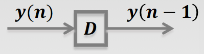

alias:: 延时单元

- 时域离散系统的基本单元之一是**延时单元**，它对信号进行时间上的延迟操作。在这里，我们将详细介绍延时的概念和定义。
- ### 延时单元的定义
  id:: 65d0f1cd-fa36-45e1-8533-7bd5277c45da
  在离散时间系统中，一个**延时单元**通常表示为一个操作，该操作使信号中的每个样本延迟一定的时间步长。如果我们有一个离散时间信号 \(x[n]\)，其中 \(n\) 表示离散时间索引，那么一个延时为 \(D\) 步的系统可以定义为：
  $$y[n] = x[n - D]$$
  这里，\(D\) 是一个正整数，表示信号被延迟的时间步数。\(y[n]\) 是输出信号，\(x[n]\) 是输入信号。
  
- ### 基本性质
- **线性**：延时操作保持信号的线性，这意味着如果对两个信号分别进行延时，然后将它们相加的结果，与先将这两个信号相加再对结果信号进行相同的延时操作，两者的输出是相同的。
- **时不变性**：延时单元是时不变的，因为延时操作对于信号的每个样本都以相同的方式执行，不依赖于时间\(n\)的具体值。
- ### 实例
  假设有一个信号 \(x[n] = \{1, 2, 3, 4\}\)，如果我们应用一个延时 \(D = 2\) 步的操作，输出信号 \(y[n]\) 将是 \(y[n] = x[n - 2]\)。应用延时后，输出信号的样本将会向右移动两个位置，即 \(y[n] = \{0, 0, 1, 2\}\)（这里假设未定义的信号值为0）。
- ### 在系统中的应用
  
  延时单元是构建复杂离散时间系统的基础。通过组合多个延时单元和其他基本操作（如加法和乘法），可以构造滤波器、回声生成器和其他数字信号处理系统。在实际应用中，延时操作可以通过软件算法或专用硬件来实现，用于各种任务，如信号同步、数据缓存和时间对齐等。
-