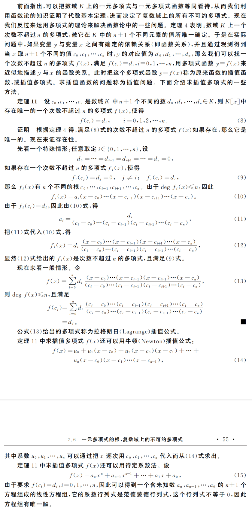

alias:: 拉格朗日插值多项式, Lagrange polynomial

- 若$$n$$**次**多项式$$l_i(x)$$$(i=0,1,\cdots,n)$在$$n+1$$个节点 \((x_0, y_0), (x_1, y_1), \ldots, (x_n, y_n)\) 上满足条件
- $$l_i(x_j) = \delta_{ij}$$
- 其中$$\delta_(ij)$$为[[克罗内克δ函数]]，就称这 $n+1$ 个$$n$$次多项式$$l_0(x), l_1(x),\cdots, l_n(x)$$为节点$$x_0, x_1, \cdots, x_n$$上的[[n次插值基函数]]。
- $$l_i(x) = \frac{(x - x_0)\cdots(x-x_{i-1})(x-x_{i+1})\cdots(x-x_n)}{(x_i - x_0)\cdots(x_i-x_{i-1})(x_i-x_{i+1})\cdots(x_i-x_n)} = \prod_{\begin{matrix}j \ne i \\ j = 0\end{matrix}}^{n}\frac{x-x_j}{x_i-x_j}$$
- 由[[n次插值基函数]]构造的n次插值多项式$$L_n(x)$$即为[[拉格朗日多项式]]，表示为：
- $$L_n(x)=\sum_{i=0}^{n}y_il_i(x)$$
- 由$$l_i(x)$$的定义知，
- $$L_n(x_j) = \sum_{i=0}^{n}y_il_i(x_j)=y_j, \quad j=0, 1, \cdots, n$$
- $$L_1(x)=y_0\frac{x-x_1}{x_0-x_1} + y_1\frac{x - x_0}{x_1 - x_0}$$
- $$L_2(x) = y_0\frac{(x-x_1)(x-x_2)}{(x_0-x_1)(x_0-x_2)} + y_1\frac{(x-x_0)(x-x_2)}{(x_1-x_0)(x_1-x_2)} + y_2\frac{(x-x_0)(x-x_1)}{(x_2-x_0)(x_2-x_1)}$$
- 
- ## 拉格朗日基多项式的特点
	- **唯一性**：对于一组给定的数据点，拉格朗日插值多项式是唯一的。
	- **构造简单**：拉格朗日基多项式的形式简单，便于计算。
	- **插值准确度**：在插值点上，拉格朗日插值多项式完全通过这些点。
	- **适用范围**：它适用于小到中等规模的数据集。对于大数据集，可能会出现数值不稳定的问题。
- ### 注意事项
	- **[[Runge 现象]]**：在插值点数量较多时，尤其是在端点附近，拉格朗日插值多项式可能会出现较大的振荡。这被称为 Runge 现象。
	- **计算效率**：当数据点数量增加时，拉格朗日插值多项式的计算变得更加复杂和耗时。
	- **适用性**：对于某些函数和某些数据点的分布，拉格朗日插值可能不是最佳选择，特别是在数据点非常密集或非常稀疏的情况下。