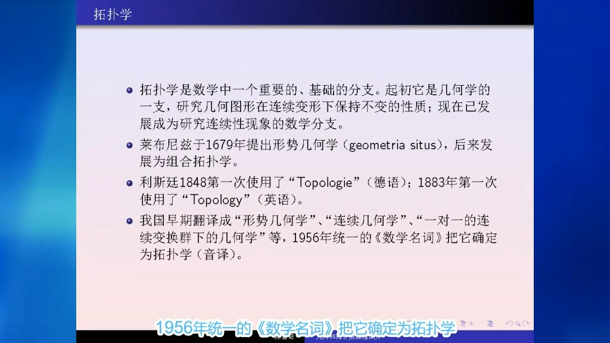

- 忘掉具体的形状信息，研究更本质的空间结构。
- 拓扑学的终极目标：分类互不[[同胚]]的空间。
	- 重要的方法：[[拓扑不变量]]
		- 若$\mu$为一个*拓扑不变量*，$X$，$Y$满足$\mu(X)\ne\mu(Y)$，则$X$必为与$Y$不[[同胚]]
- 观察[[连续映射]]的定义只需要用[[开集]]的概念。
- {:height 349, :width 606}
- # [[set topology]]
- # Reference
	- [Topology Pearson New International Edition (Munkres, James Raymond) (Z-Library).pdf](../assets/Topology_Pearson_New_International_Edition_(Munkres,_James_Raymond)_(Z-Library)_1688927838769_0.pdf)
	- _(Z-Library)_1695393355802_0.pdf)
	- _(Z-Library)_1695393361871_0.pdf)
	- _(Z-Library)_1695393366280_0.pdf)
	- _(Tammo_tom_Dieck)_(Z-Library)_1695393380634_0.pdf)
	- _(Z-Library)_1695393385187_0.pdf)
	- _(Z-Library)_1695393389975_0.pdf)
	- _(Z-Library)_1695393398290_0.pdf)
-
	-
		-
	-
	-
	-
	-
	-
-