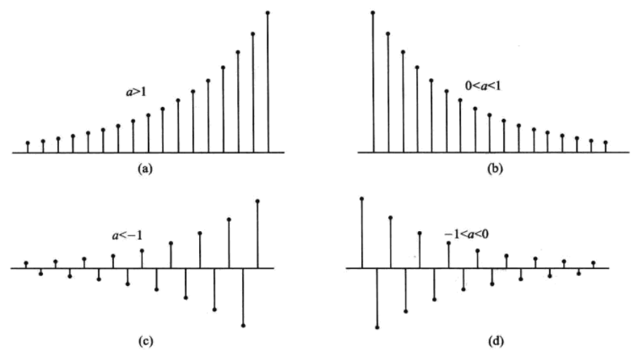

- [[指数序列]]的数学表达式如下：
  $$x(n)=a^{n}$$
  式中, $a$  为实数,当  $|a|>1$  时,  $x(n)$  随  $n$  的增加而指数发散; 
  当  $|a|<1$  时,  $x(n)$  随  $n$  的增加而指数收敛; 当  $|a|=1$  时,  $x(n)$  为常数。
  如果  $a$  是正数,  $x(n)$  的函数值是单调变化; 
  如果  $a$  是负数,则  $x(n)$  的函数值是正负交替变化。
  下图给出了[[单边实指数序列]]在不同  $a$  值下的波形图。
  {:height 424, :width 752}
- >实指数信号可以描述许多物理现象。例如, 生物的自然繁衍、银行存款的本金利息、原子核的裂变等都具有指数增长的特性; 而声音在大气中的传播、  RC 电路的响应、收到污染的生态环境质量等则是按指数衰减特性发生变化。
- 如果  $a$  为复数, 可将  $a$  写成  $a=r \mathrm{e}^{\mathrm{j} \omega}$（[[复数的指数形式]]）的形式, 式中  $r>0$，$\omega \neq 0, \pi$  。这样  $x(n)$  就变成[[复指数信号]], 即  $x(n)=r^{n} \mathrm{e}^{\mathrm{j} \omega n}$  。
  若  $r=1$ , 则变为前面所说的[[复正弦信号]]; 若  $r<1$ , 则  $x(n)$  为衰减的复正弦信号; 若 $r>1$ , 则  $x(n)$  为发散的复正弦信号。
-