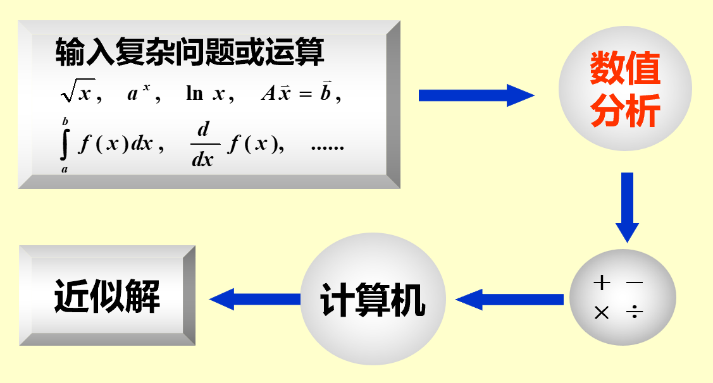

alias:: Numerical Analysis

- # Definition
- 数值分析是研究[[数值问题]]的[[算法]], 概括起来有四点:
	- 面向计算机, 要根据计算机的特点提供切实可行的有效算法，即算法只能包括加、减、乘、除运算和逻辑运算 这些计算机能直接处理的运算.
	  logseq.order-list-type:: number
	- 有可靠的理论分析, 能任意[[逼近]]并达到[[精度]]要求, 对[[近似算法]]要保证[[收敛性]]和[[数值稳定性]],还要对[[误差]]进行分析，这些都建立在相应数学理论的基础上.
	  logseq.order-list-type:: number
	- 要有好的[[计算复杂性]], [[时间复杂性]]好是指节省计算时间, [[空间复杂性]]好是指节省存储空间, 这也是建立算法要研究的问题,它关系到算法能否在计算机上实现 .
	  logseq.order-list-type:: number
	- 要有[[数值实验]], 即任何一个算法除了从理论上要满足上述三点外,还要通过数值试验证明是行之有效的.
	  logseq.order-list-type:: number
- 
- [[插值]]
- [[数值积分]]
- [[解线性方程组]]
- [Sauer - Numerical Analysis 2e.pdf](../assets/Sauer_-_Numerical_Analysis_2e_1695522893953_0.pdf)
- [数值分析 第五版 (李庆扬 王能超 易大义) (Z-Library).pdf](../assets/数值分析_第五版_(李庆扬_王能超_易大义)_(Z-Library)_1695523531327_0.pdf)
- [数值分析第2版 (李红).pdf](../assets/数值分析第2版_(李红)_1695619907592_0.pdf)
-