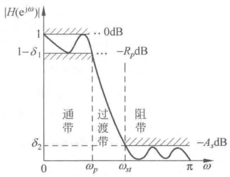
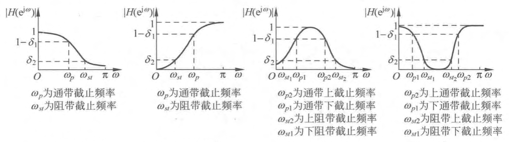

- 一般情况下，数字滤波器的技术指标是以其频率响应的幅度特性给出的，与[[理想幅度特性]]不同，在[[通带]]和[[阻带]]上都有允许的**误差**范围，而且还给出通带与阻带之间的[[过渡带]]，图 1 所示即为对[[理想低通滤波器]]的[[逼近]]的[[误差容限图]]，而 DF 的技术指标要求可以用容限图来表征 。
  
- ## [[低通滤波器幅度响应容限图]]
  见图 1 ，有 $\omega_{p}$ ， $\omega_{s t}$ ， $\delta_{1}\left[R_{p}(\mathrm{~dB})\right]$ ， $\delta_{2}\left[A_{s}(\mathrm{~dB})\right]$ 几个指标
	- 有[[通带]]、[[阻带]]和[[过渡带]]。
	  logseq.order-list-type:: number
	- ^^通带^^中，称 $\omega_{p}$ 为[[通带截止频率]]， $\delta_{1}$ 为[[通带波纹]]。
	  logseq.order-list-type:: number
	  $$1-\delta_{1} \leqslant\left|H\left(\mathrm{e}^{\mathrm{j} \omega}\right)\right| \leqslant 1, \quad|\omega| \leqslant \omega_{\mu} \tag{1}$$
	- ^^阻带^^中，称 $\omega_{s t}$ 为[[阻带截止频率]]， $\delta_{2}$ 为[[阻带波纹]]。
	  logseq.order-list-type:: number
	  $$\left|H\left(\mathrm{e}^{\mathrm{j} \omega}\right)\right| \leqslant \delta_{2}, \quad \omega_{s i} \leqslant|\omega| \leqslant \pi \tag{2}$$
	- $\omega_{p} \sim \omega_{s t}$ 之间称为^^过渡带^^，过渡带带宽为 $\omega_{s l}-\omega_{p}$ ，在此频带内，频率响应幅度从通带边沿到阻带边沿是平滑过渡的。
	  logseq.order-list-type:: number
	- 一般采用[[分贝]]（ $\mathrm{dB}$ ）数表示，即在技术指标中，给定[[通带]]允许的[[最大衰减]]（[[波纹]]）${R}_{p}~\mathrm{dB}$ 以及[[阻带]]应达到的最小衰减 ${A}_{s}~\mathrm{dB}$  。（已归一化为 $\left|H\left(\mathrm{e}^{\mathrm{j} \omega}\right)\right|_\mathrm{max }=1$），要求
	  logseq.order-list-type:: number
	  $$
	  R_{p} \geqslant 20 \lg \frac{\left|H\left(\mathrm{e}^{\mathrm{j} \omega}\right)\right|_{\max }}{\left|H\left(\mathrm{e}^{\mathrm{j} \omega_{p}}\right)\right|}=-20 \lg \left|H\left(\mathrm{e}^{\mathrm{j} \omega_{p}}\right)\right|=-20 \lg \left(1-\delta_{1}\right)(\mathrm{dB})\tag{3}$$
	  $$A_{s} \leqslant 20 \lg \frac{\left|H\left(\mathrm{e}^{\mathrm{j} \omega}\right)\right|_{\max }}{\left|H\left(\mathrm{e}^{\mathrm{j} \omega_{st}}\right)\right|}=-20 \lg \left|H\left(\mathrm{e}^{\mathrm{j} \omega_{\alpha_{s}}}\right)\right|=-20 \lg \delta_{2}(\mathrm{~dB})\tag{4}$$
	- 如果用分贝（ $\mathrm{dB}$ ）表示增益，则把  $\omega=0$ 处$|H(e^{j0})| = 1$ 的[[增益]] $20 \lg \left|H\left(\mathrm{e}^{\mathrm{j} \omega}\right)\right|_\mathrm{max }=0$ 。称为 $0 \mathrm{~dB}$ 。则通带边沿 $\left(\omega=\omega_{p}\right)$ 处增益为 $-R_{p}$ ，而其衰减则称为 $R_{p} ( R_{p}$ 为正数，单位为 $\mathrm{dB} )$ ；同样阻带起始频率 $\omega_{s t}$ 处的增益为 $-A_{s}$ ，而其衰减则为 $A_{s} ( A_{s}$ 也为正数，单位为 $\mathrm{dB} )$ 。
		- 例如，当 $\omega=\omega_{m}$ 时 $($ 多数情况 $\left.\omega_{m}=0\right)$ ， $\left|H\left(\mathrm{e}^{\mathrm{j} \omega_{m}}\right)\right|_{max }=1$ ，即增益为 $20 \lg \left|H\left(\mathrm{e}^{\mathrm{i} \omega_{m}}\right)\right|_{max }=0 \mathrm{~dB}$ ；
		  若要求 $\omega=\omega_{p}$ 时， $\left|H\left(\mathrm{e}^{\mathrm{j} \omega_{p}}\right)\right|=1-\delta_{\mathrm{I}}=\frac{1}{\sqrt{2}}=0.707$ ；
		  则在 $\omega=\omega_{p}$ 处衰减为 $20 \lg \left[\frac{\left|H\left(\mathrm{e}^{\mathrm{j} \omega_{m}}\right)\right|}{\left|H\left(\mathrm{e}^{\mathrm{j} \omega_{p}}\right)\right|}\right]=-20 \lg \left|H\left(\mathrm{e}^{\mathrm{j} \omega_{p}}\right)\right|=-20 \lg \left(1-\delta_{1}\right)=3 \mathrm{~dB}$ 
		  即在 $\omega=\omega_{p}$ 处增益为 $-3 \mathrm{~dB} ($ 衰减为 $\left.3 \mathrm{~dB}\right)\left[\right.$ 把 $\left|H\left(\mathrm{e}^{\mathrm{j} \omega}\right)\right|$ 的最大值的增益定为 $\left.0 \mathrm{~dB}\right]$ 。
		  在 $\omega=\omega_{p}$ 处的衰减，也可以要求是其他分贝数，例如 $1 \mathrm{~dB}$ 、 $2 \mathrm{~dB}$ 等。
	- 当然也可给出相位的逼近容限，或给出时域冲激响应的逼近容限，但最常用的还是 滤波器幅度响应的逼近容限 要求。
- ### 各种滤波器的幅度响应的容限图及技术指标
  
- ## 表征数字滤波器[[频率响应特性]]的三个参量
	- ### [[幅度平方响应]] $\left|{H}\left({e}^{{j} \omega}\right)\right|^{2}$
	  logseq.order-list-type:: number
	  $$\left|H\left(\mathrm{e}^{\mathrm{j} \omega}\right)\right|^{2}=H\left(\mathrm{e}^{\mathrm{j} \omega}\right) H^{*}\left(\mathrm{e}^{\mathrm{j} \omega}\right)=H\left(\mathrm{e}^{\mathrm{j} \omega}\right) H\left(\mathrm{e}^{-\mathrm{j} \omega}\right)=H(z) H\left(z^{-1}\right)_{z=\mathrm{e}^{\mathrm{j} \omega}} \quad \tag{5}$$
		- $H(z) H\left(z^{-1}\right)$ 的[[极点]]和[[零点]]是共轭的又是以单位圆 $(|z|=1)$ 为镜像的（就是[[共轭倒数]]）。若极点是复数 $z=z_{i}$ ，则有 $z=z_{i}^{*}$ ， $z=\frac{1}{z_{i}}$ 以及 $z=\frac{1}{z_{i}^{*}}$ ，这四个点都是 $H(z) H\left(z^{-1}\right)$ 的极点。若极点是实数 $z=r_{i}$ ，则 $z=\frac{1}{r_{i}}$ ，这两个点都是 $H(z) H\left(z^{-1}\right)$ 的极点。零点也有同样关系。
		  logseq.order-list-type:: number
		- $H(z) H\left(z^{-1}\right)$ 在 $z$ 平面单位圆内的极点属于 $H(z)$ ，在单位圆外的极点属于 $H\left(z^{-1}\right)$ ，且 $H(z)$ 在 $z=\infty$ 处不能有极点，这样 $H(z)$ 才能是[因果]([[因果性]])[稳定]([[系统稳定性]])的。
		  logseq.order-list-type:: number
		- $H(z) H\left(z^{-1}\right)$ 的零点，对称的一半属于 $H(z)$ ，视系统要求，单位圆内的零点不一定属于 $H(z)$ ；若 $H(z) H\left(z^{-1}\right)$ 在单位圆内的一半零点属于 $H(z)$ ，则 $H(z)$ 是[[最小相位延时系统]]。
		  logseq.order-list-type:: number
	- ### [[相位响应]]
	  logseq.order-list-type:: number
	  由于 $H\left(\mathrm{e}^{\mathrm{j} \omega}\right)$ 是复数，可表示成
	  $$H\left(\mathrm{e}^{\mathrm{j} \omega}\right)=\left|H\left(\mathrm{e}^{\mathrm{j} \omega}\right)\right| \mathrm{e}^{\mathrm{j} \beta\left(\mathrm{e}^{\mathrm{j} \omega}\right)}=\operatorname{Re}\left[H\left(\mathrm{e}^{\mathrm{j} \omega}\right)\right]+\mathrm{j} \operatorname{Im}\left[H\left(\mathrm{e}^{\mathrm{j} \omega}\right)\right]$$
	  所以
	  $$\beta\left(\mathrm{e}^{\mathrm{j} \omega}\right)=\arctan \left\{\frac{\operatorname{Im}\left[H\left(\mathrm{e}^{\mathrm{j} \omega}\right)\right]}{\operatorname{Re}\left[H\left(\mathrm{e}^{\mathrm{j} \omega}\right)\right]}\right\}$$
	  由于
	  $$H^{*}\left(\mathrm{e}^{\mathrm{j} \omega}\right)=\left|H\left(\mathrm{e}^{\mathrm{j} \omega}\right)\right| \mathrm{e}^{-\mathrm{j} \beta\left(\mathrm{e}^{\mathrm{j} \omega}\right)}$$
	  所以又有
	  $$\begin{aligned}
	  \beta\left(\mathrm{e}^{\mathrm{j} \omega}\right) & =\frac{1}{2 \mathrm{j}} \ln \left[\frac{H\left(\mathrm{e}^{\mathrm{j} \omega}\right)}{H^{*}\left(\mathrm{e}^{\mathrm{j} \omega}\right)}\right]=\frac{1}{2 \mathrm{j}} \ln \left[\frac{H\left(\mathrm{e}^{\mathrm{j} \omega}\right)}{H\left(\mathrm{e}^{-\mathrm{j} \omega}\right)}\right] \\
	  & =\frac{1}{2 \mathrm{j}} \ln \left[\frac{H(z)}{H\left(z^{-1}\right)}\right]_{z=\mathrm{e}^{\mathrm{j} \omega}}
	  \end{aligned}$$
	- ### [[群时延响应]]
	  logseq.order-list-type:: number
	  它是^^滤波器平均延迟^^的一个度量，定义为[[相位响应]]对[[角频率]]的导数的负值，即
	  $$\tau\left(\mathrm{e}^{\mathrm{j} \omega}\right)=-\frac{\mathrm{d} \beta\left(\mathrm{e}^{\mathrm{j} \omega}\right)}{\mathrm{d} \omega}$$
	  可以化为
	  $$\tau\left(\mathrm{e}^{\mathrm{j} \omega}\right)=-\left.\frac{\mathrm{d} \beta(z)}{\mathrm{d} z} \frac{\mathrm{d} z}{\mathrm{~d} \omega}\right|_{z=\mathrm{e}^{\mathrm{j} \omega}}=-\left.\mathrm{j} z \frac{\mathrm{d} \beta(z)}{\mathrm{d} z}\right|_{z=\mathrm{e}^{\mathrm{j} \omega}}$$
	  由于
	  $$\ln \left[H\left(\mathrm{e}^{\mathrm{j} \omega}\right)\right]=\ln \left|H\left(\mathrm{e}^{\mathrm{j} \omega}\right)\right|+\mathrm{j} \beta\left(\mathrm{e}^{\mathrm{j} \omega}\right)$$
	  所以
	  $$\beta\left(\mathrm{e}^{\mathrm{j} \omega}\right)=\operatorname{Im}\left\{\ln \left[H\left(\mathrm{e}^{\mathrm{j} \omega}\right)\right]\right\}$$
	  因而又有
	  $$\tau\left(\mathrm{e}^{\mathrm{j} \omega}\right)=-\operatorname{Im}\left[\frac{\mathrm{d}}{\mathrm{d} \omega}\left\{\ln \left[H\left(\mathrm{e}^{\mathrm{j} \omega}\right)\right]\right\}\right]$$
	  同样可化为
	  $$\begin{aligned}
	  \tau\left(\mathrm{e}^{\mathrm{j} \omega}\right) & =-\operatorname{Im}\left[\frac{\mathrm{d}\{\ln [H(z)]\}}{\mathrm{d} z} \frac{\mathrm{d} z}{\mathrm{~d} \omega}\right]_{z=\mathrm{e}^{\mathrm{j} \omega}} \\
	  & =-\operatorname{Im}\left[\mathrm{j} z \frac{\mathrm{d}\{\ln [H(z)]\}}{\mathrm{d} z}\right]_{z=\mathrm{e}^{\mathrm{j} \omega}}=-\operatorname{Re}\left[z \frac{\mathrm{d}}{\mathrm{d} z}\{\ln [H(z)]\}\right]_{z=\mathrm{e}^{\mathrm{j} \omega}} \\
	  & =-\operatorname{Re}\left[z \frac{\mathrm{d} H(z)}{\mathrm{d} z} \frac{1}{H(z)}\right]_{z=\mathrm{e}^{\mathrm{j} \omega}}
	  \end{aligned}$$
	  当要求滤波器为[[线性相位响应]]特性时，[[通带]]内群延迟特性就应是**常数**。