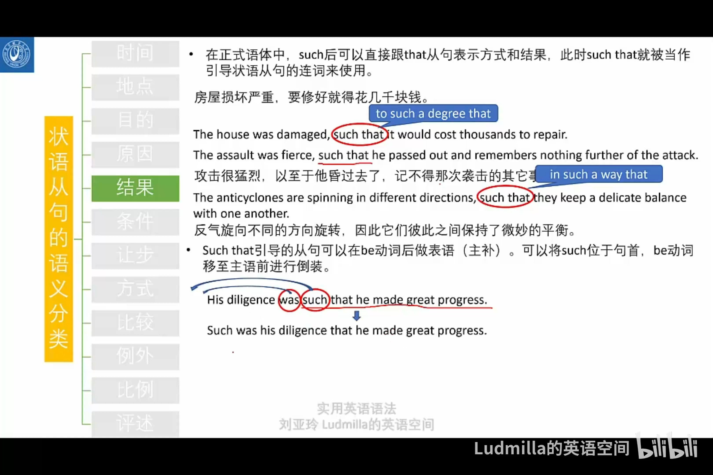

- s.t. such that 使得；$exits$后通常接一个s.t.
  $\exist\epsilon>0$, s.t.
  {:height 413, :width 608}
- |abbr|full|meaning|
  |--|--|--|
  |W.L.O.G|without loss of generality|不失一般性|
- # 格式
- That is 后不加 `,`
	- >`,`不能用来分割谓语和后面的成分(除了插入语)，其他情况下可以用`,`来断句