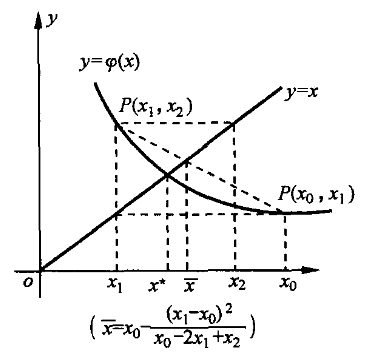
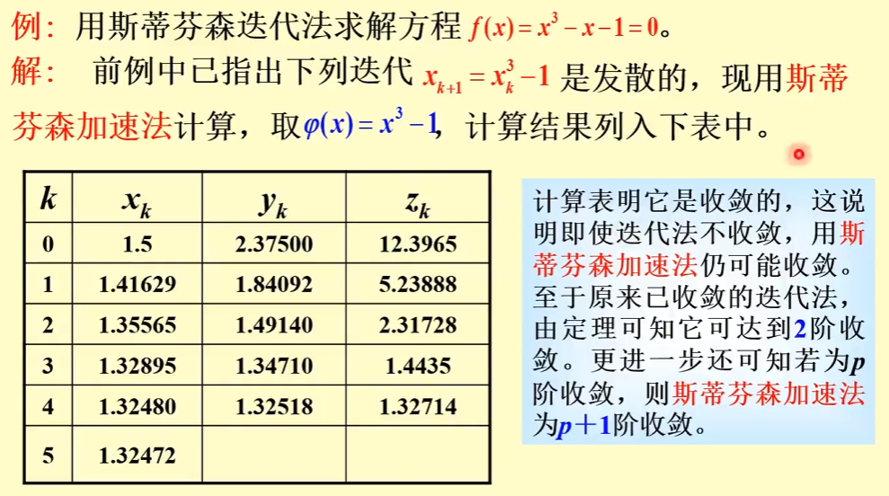
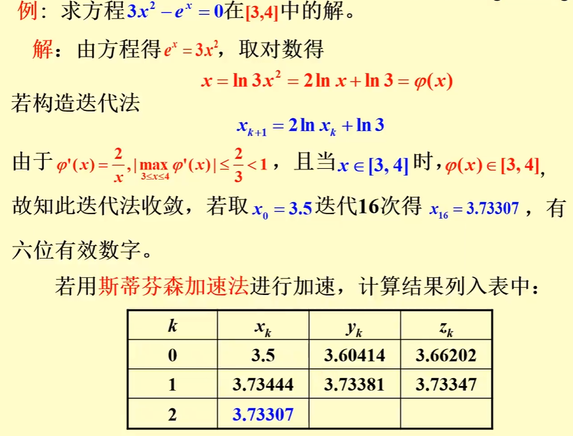

alias:: Steffensen's Method

- [[埃特金算法]]不管原序列  $\left\{x_{k}\right\}$  是怎样产生的, 对  $\left\{x_{k}\right\}$  进行加速计算, 得到序列  $\left\{\bar{x}_{k}\right\}$ ,如果把埃特金加速技巧与[[不动点迭代法]]结合, 则可得到如下的迭代法:
  $$y_{k}=\varphi\left(x_{k}\right), \quad z_{k}=\varphi\left(y_{k}\right)$$
  $$x_{k+1}=x_{k}-\frac{\left(y_{k}-x_{k}\right)^{2}}{z_{k}-2 y_{k}+x_{k}}, \quad k=0,1,2, \cdots, \tag{1}$$
  称为**斯蒂芬森迭代法**.
- 其几何解释如图所示, 
   
  它可以这样理解, 我们要求  $x=\varphi(x)$  的根  $x^{*}$ , 令  $\varepsilon(x)=\varphi(x)-x$ , $\varepsilon\left(x^{*}\right)=\varphi\left(x^{*}\right)-x^{*}=0$ , 已知  $x^{*}$  的近似值  $x_{k}$  及  $y_{k}$ , 其误差分别为
  $$\begin{array}{l}
  \varepsilon\left(x_{k}\right)=\varphi\left(x_{k}\right)-x_{k}=y_{k}-x_{k}, \\
  \varepsilon\left(y_{k}\right)=\varphi\left(y_{k}\right)-y_{k}=z_{k}-y_{k},
  \end{array}$$
- 把误差  $\varepsilon(x)$  “外推到零” , 即过  $\left(x_{k}, \varepsilon\left(x_{k}\right)\right)$  及  $\left(y_{k}\right. ,  \left.\varepsilon\left(y_{k}\right)\right)$  两点做线性插值函数, 它与  $yx$  轴的交点就是式 $(1)$ 中的  $x_{k+1}$ , 即方程
  $$\varepsilon\left(x_{k}\right)+\frac{\varepsilon\left(y_{k}\right)-\varepsilon\left(x_{k}\right)}{y_{k}-x_{k}}\left(x-x_{k}\right)=0$$
  的解
  $$x=x_{k}-\frac{\varepsilon\left(x_{k}\right)}{\varepsilon\left(y_{k}\right)-\varepsilon\left(x_{k}\right)}\left(y_{k}-x_{k}\right)=x_{k}-\frac{\left(y_{k}-x_{k}\right)^{2}}{z_{k}-2 y_{k}+x_{k}}=x_{k+1} .$$
- 实际式 $(1)$ 是将[[不动点迭代法]]计算两步合并成一步得到的, 可将它写成另一种不动点迭代
  $$x_{k+1}=\psi\left(x_{k}\right), \quad k=0,1,2, \cdots, \tag{2}$$
  其中
  $$\psi(x)=x-\frac{[\varphi(x)-x]^{2}}{\varphi(\varphi(x))-2 \varphi(x)+x} . \tag{3}$$
- 对不动点迭代 $(2)$ 有以下[[局部收敛性]]定理.
- ## 定理
	- 若  $x^{*}$  为式 $(3)$ 定义的迭代函数  $\psi(x)$  的[[不动点]], 则  $x^{*}$  为  $\varphi(x)$  的不动点; 
	  反之, 若  $x^{*}$  为  $\varphi(x)$  的不动点, 设  $\varphi^{\prime \prime}(x)$  存在,  $\varphi^{\prime}\left(x^{*}\right) \neq 1$ , 则  $x^{*}$  是  $\psi(x)$  的不动点, 且 Steffensen 迭代法 $(1)$ 是[2 阶收敛]([[迭代法的收敛速度]])的.
- ## 例子
	- 
	- 