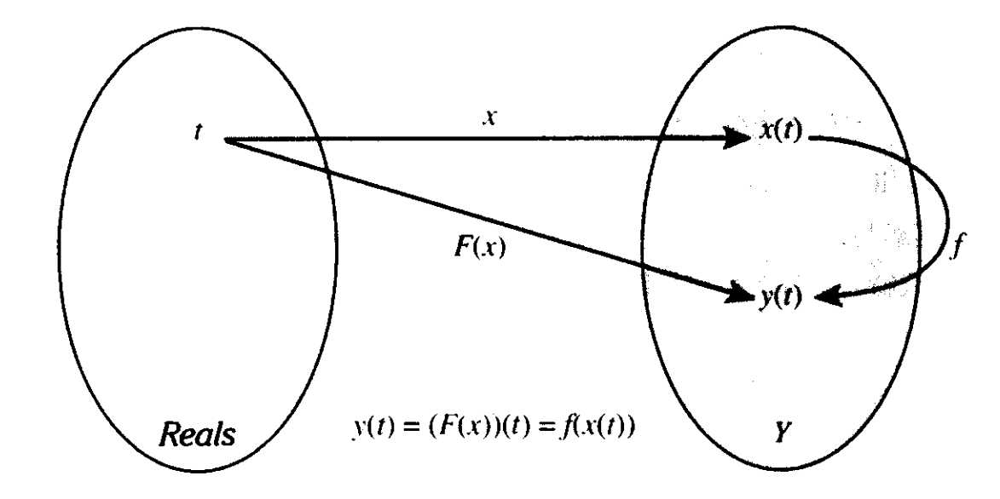

alias:: 无记忆, 无记忆的, memoryless system, memoryless

- 一个[[系统]] $F{:}[\mathbb{R}\to Y]\to[\mathbb{R}\to Y]$是[[无记忆]]的,若有一个[[函数]] $f{:}Y{\to}Y$ 满足
  $$(F(x))(t)=f(x(t)),\quad \forall t\in \mathbb{R}, \forall x\in[\mathbb{R}\to Y]$$
  换言之, 在任何 *时刻* $t$ , *输出* $(F(x))(t)$ 只取决于同 *时刻* 的 *输入* $x(t)$ 特别地, 而不依赖于 $t$ 或 *以往* 与 *未来* 的 $x$ 值。如下图所示：
  {:height 397/2, :width 778/2}
	- 即在确定当前 *输出值* 时,不需要 *记忆* 以前的 *输入值* 。
	- 若[[集合]] $Y$ 是[[有限]]的, 则可用[[表格]]来描述。