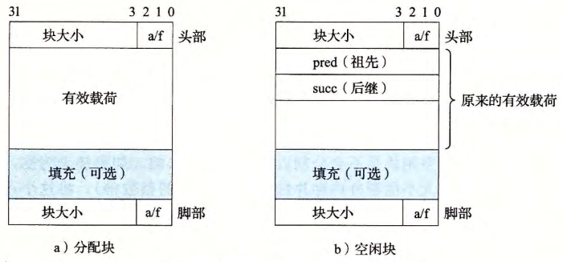

- 一种更好的方法是将空闲块组织为某种形式的显式数据结构。因为根据定义，程序不需要一个空闲块的主体，所以实现这个数据结构的指针可以存放在这些空闲块的主体里面。例如，堆可以组织成一个双向空闲链表，在每个空闲块中，都包含一个 `pred`(前驱）和 `succ`(后继）指针，分别指向 前面和后面的[[空闲块]] 如图所示：
  
- 使用双向链表而不是隐式空闲链表，使首次适配的分配时间从块总数的线性时间减少到了空闲块数量的线性时间。
- 不过，[[释放]]一个块的时间可以是线性的，也可能是个常数，这取决千我们所选择的空闲链表中块的排序策略。
	- 一种方法是用[[后进先出]](LIFO)的顺序维护链表，将新释放的块放置在链表的开始处。使用 LIFO的顺序和首次适配的放置策略，分配器会最先检查最近使用过的块。在这种情况下，释放一个块可以在常数时间内完成。如果使用了边界标记，那么合并也可以在常数时间内完成。另一种方法是按照地址顺序来维护链表，其中链表中每个块的地址都小于它后继的地址。在这种情况下，释放一个块需要线性时间的搜索来定位合适的前驱。平衡点在于，按