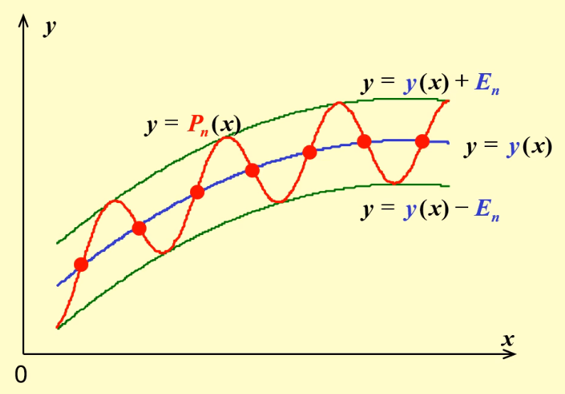

<<<<<<< HEAD
alias:: 最佳一致逼近多项式, optimal uniform approximating polynomial, OUAP

- ## 定义
	- 设 $f\in \mathbb C[a,b], p_{n}\in H_{n}=\mathrm{span}\left\{1,x,\cdots,x^{*}\right\}$，称
	  $$
	  \Delta(f,p_{n})=\parallel f-p_{n}\parallel_{\infty}=\max_{a\leq x\leq b}\parallel f(x)-p_{n}(x)\parallel 
	  $$
	  ([[最大范数]])
	  为 $p_{n}$ 与 $f$ 的[[偏差]]； 
	  若 $p_n(x_0)-f(x_0)=\pm\Vert p_n-f\Vert_\infty$，则称 $x_0$  为 $\pm$[[偏差点]]。
	- $$
	  E_{n}=\inf_{\rho_{n}\in H_{n}}\Delta(f,p_{n})=\min_{\rho_{n}\in H_{n}}\Delta(f,p_{n})
	  $$
	  称为 $p_n$ 与 $f$ 的[[最小偏差]]。
	  设 $f\in C[a,b]$ , 若存在 $p_n^*\in H_n$, 使
	  $$
	  \Delta(f,p_{n}^{*})=E_{n}=\min_{\rho_{n}\in H_{n}}\Delta(f,p_{n})\:,
	  $$
	  则称 $p_n^*$ 为 $f$ 在$[a,b]$上的[[最佳一致逼近多项式]].
- ## 性质
	- ### Borel 定理（唯一性定理）
	  logseq.order-list-type:: number
	  若 $f\in \mathbb C[a,b]$ , 则存在唯一 $p_n^*\in H_n$，使式 $\Delta(f, p_n^*)=E_n=\min_{p_n\in H_n}\Delta(f, p_n)$ 成立（即存在唯一最优一致逼近多项式）。
	- OUAP 必同时有 $±$[[偏差点]]。
	  logseq.order-list-type:: number
	- ### [[Chebyshev 交替定理]]
	  logseq.order-list-type:: number
	  $n$ 次最优一致逼近多项式与原函数 \( f(x) \) 之间的最大误差在 \([a, b]\) 上至少有 \( n+2 \) 个交替的 $\pm$[[偏差点]]。
		- 即存在点集 $a\leq x_1<...<x_{n+2}\leq b$ 使得 $P_n(x_k)-y(x_k)=\pm(-1)^k\left\|P_n-y\right\|_\infty$ 称为[[切比雪夫交错点组]].
		- #### 推论
		  ${P_n(x)-y(x)}$ 在定义域上至少变号 $n+1$ 次，故至少有 $n+1$ 个[[根]]。
		  
		  > 可见 $P_n(x)$ 是 $y(x)$ 的某一个[[插值多项式]]。
	- 若$f(x)\in \mathbb C[a,b]$, 则 $n$ 次 OUAP 唯一。
	  logseq.order-list-type:: number
- ### 计算方法
	- 找到最优一致逼近多项式的过程可能相当复杂，尤其是对于非线性或复杂函数。常用的方法包括：
		- **[[Remez 交换算法]]**：一种迭代方法，用于找到最优一致逼近多项式。
		- [[切比雪夫多项式逼近]]：在特定情况下，使用Chebyshev多项式作为基函数进行逼近。
	- 这些方法通常需要计算机辅助设计，因为它们涉及到复杂的迭代计算和数值优化。
=======
<<<<<<< HEAD
alias:: 最佳一致逼近多项式, optimal uniform approximating polynomial, OUAP

- ## 定义
	- 设 $f\in \mathbb C[a,b], p_{n}\in H_{n}=\mathrm{span}\left\{1,x,\cdots,x^{*}\right\}$，称
	  $$
	  \Delta(f,p_{n})=\parallel f-p_{n}\parallel_{\infty}=\max_{a\leq x\leq b}\parallel f(x)-p_{n}(x)\parallel 
	  $$
	  ([[最大范数]])
	  为 $p_{n}$ 与 $f$ 的[[偏差]]； 
	  若 $p_n(x_0)-f(x_0)=\pm\Vert p_n-f\Vert_\infty$，则称 $x_0$  为 $\pm$[[偏差点]]。
	- $$
	  E_{n}=\inf_{\rho_{n}\in H_{n}}\Delta(f,p_{n})=\min_{\rho_{n}\in H_{n}}\Delta(f,p_{n})
	  $$
	  称为 $p_n$ 与 $f$ 的[[最小偏差]]。
	  设 $f\in C[a,b]$ , 若存在 $p_n^*\in H_n$, 使
	  $$
	  \Delta(f,p_{n}^{*})=E_{n}=\min_{\rho_{n}\in H_{n}}\Delta(f,p_{n})\:,
	  $$
	  则称 $p_n^*$ 为 $f$ 在$[a,b]$上的[[最佳一致逼近多项式]].
- ## 性质
	- ### Borel 定理（唯一性定理）
	  logseq.order-list-type:: number
	  若 $f\in \mathbb C[a,b]$ , 则存在唯一 $p_n^*\in H_n$，使式 $\Delta(f, p_n^*)=E_n=\min_{p_n\in H_n}\Delta(f, p_n)$ 成立（即存在唯一最优一致逼近多项式）。
	- OUAP 必同时有 $±$[[偏差点]]。
	  logseq.order-list-type:: number
	- ### [[Chebyshev 交替定理]]
	  logseq.order-list-type:: number
	  $n$ 次最优一致逼近多项式与原函数 \( f(x) \) 之间的最大误差在 \([a, b]\) 上至少有 \( n+2 \) 个交替的 $\pm$[[偏差点]]。
		- 即存在点集 $a\leq x_1<...<x_{n+2}\leq b$ 使得 $P_n(x_k)-y(x_k)=\pm(-1)^k\left\|P_n-y\right\|_\infty$ 称为[[切比雪夫交错点组]].
		- #### 推论
		  ${P_n(x)-y(x)}$ 在定义域上至少变号 $n+1$ 次，故至少有 $n+1$ 个[[根]]。
		  
		  > 可见 $P_n(x)$ 是 $y(x)$ 的某一个[[插值多项式]]。
	- 若$f(x)\in \mathbb C[a,b]$, 则 $n$ 次 OUAP 唯一。
	  logseq.order-list-type:: number
- ### 计算方法
	- 找到最优一致逼近多项式的过程可能相当复杂，尤其是对于非线性或复杂函数。常用的方法包括：
		- **[[Remez 交换算法]]**：一种迭代方法，用于找到最优一致逼近多项式。
		- [[切比雪夫多项式逼近]]：在特定情况下，使用Chebyshev多项式作为基函数进行逼近。
	- 这些方法通常需要计算机辅助设计，因为它们涉及到复杂的迭代计算和数值优化。
=======
alias:: 最佳一致逼近多项式

- ### 定义
  给定一个函数 \( f(x) \) 定义在某个区间上，例如 \([a, b]\)，以及一个正整数 \( n \)，[[最优一致逼近多项式]]是指在所有最高次数不超过 \( n \) 的多项式 \( P_n(x) \) 中，使得 \( f(x) \) 和 \( P_n(x) \) 之间的最大绝对差异（差的[[最大范数]]）最小的那个多项式。即，找到 \( P_n(x) \) 使得
  $$ \max_{x \in [a, b]} |f(x) - P_n(x)| $$
  最小。
- ### 性质
  1. **唯一性**：对于给定的 \( f(x) \) 和 \( n \)，存在唯一的最优一致逼近多项式。
  2. **最大误差的极值点**：最优一致逼近多项式与原函数 \( f(x) \) 之间的最大误差在 \([a, b]\) 上至少有 \( n+2 \) 个交替的极值点，这是由[[Chebyshev 交替定理]]确定的。
- ### 计算方法
  找到最优一致逼近多项式的过程可能相当复杂，尤其是对于非线性或复杂函数。常用的方法包括：
- **Remez交换算法**：一种迭代方法，用于找到最优一致逼近多项式。
- **Chebyshev多项式逼近**：在特定情况下，使用Chebyshev多项式作为基函数进行逼近。
  
  这些方法通常需要计算机辅助设计，因为它们涉及到复杂的迭代计算和数值优化。
-
>>>>>>> a248c038068cac24d7081fb376bc97464feb5673
>>>>>>> f06c40ce77eed7015b880d0efee03cab2bbde75f
