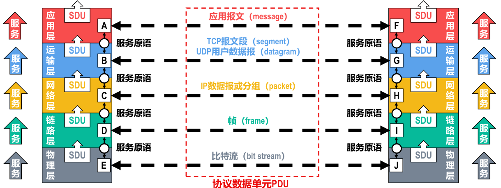

- 在[[协议]]的控制下，两个对等实体在水平方向的逻辑通信使得**本层**能够向**上一层**提供[[服务]]。
- 要实现**本层**协议，还需要使用**下面一层**所提供的[[服务]]。
- 协议是“水平”的，而服务是“垂直”的。
- 实体看得见下层提供的服务，但并不知道实现该服务的具体协议。下层的协议对上层的实体是 *透明* 的。
- 在同一系统中相邻两层的实体交换信息的逻辑接口称为[[服务访问点]]SAP，它被用于区分不同的服务类型。
	- > 例如，[[数据链路层]]的[[帧]]的“类型”字段、[[IP数据报]]的[[协议字段]]，[[TCP报文段]]或[[UDP用户数据报]]的[[端口号字段]]都是SAP。
- 上层要使用下层所提供的服务，必须通过与下层交换一些命令，这些命令称为[[服务原语]]。
- **对等层次**之间传送的 *数据包* 称为该层的[[协议数据单元]]（Protocol Data Unit，PDU）。
- **同一系统**内**层与层**之间交换的 *数据包* 称为[[服务数据单元]]（Service Data Unit，SDU）。
  id:: 6537e248-8f26-4796-9c11-1e46e9900e72
- 