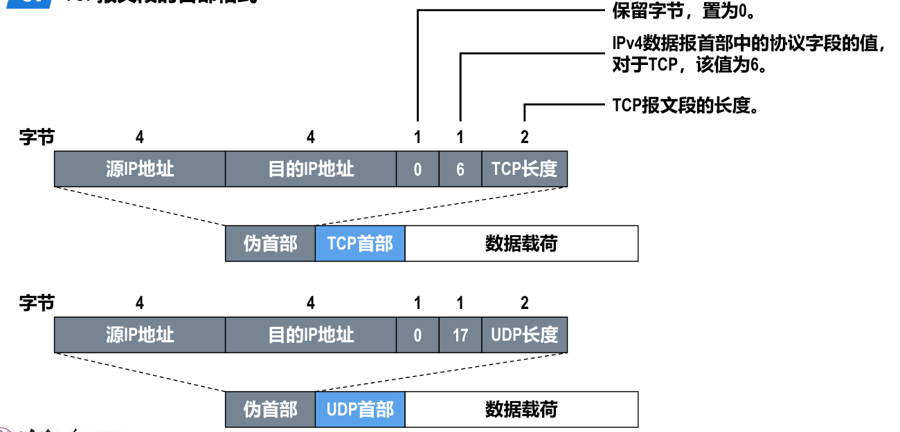

- 
- ## 发送方检验和计算方法
	- 将TCP首部中检验和字段的值置为0。
	  logseq.order-list-type:: number
	- 将[[伪首部]]、TCP首部以及数据载荷这三部分划分成若干个 2 字节的字。若伪首部、TCP首部以及数据载荷这三部分的总长度不是偶数个字节，则在最后添加1个“全0”字节。
	  logseq.order-list-type:: number
	- 对划分出的全部2字节的字进行[[反码]][[算数运算求和]]，并将求和结果取 *反码* 。
	  logseq.order-list-type:: number
	- 将步骤 3 得到的结果写入TCP首部中的检验和字段。
	  logseq.order-list-type:: number
- ## 接收方通过检验和字段的值判断TCP报文段在传输过程中是否误码的方法
	- 给接收到的TCP报文段前面添加一个12字节的伪首部。
	  logseq.order-list-type:: number
	- 将伪首部、TCP首部以及数据载荷这三部分划分成若干个2字节的字。
	  logseq.order-list-type:: number
	- 对划分出的全部2字节的字进行反码算数运算求和，并将求和结果取反码。
	  logseq.order-list-type:: number
	- logseq.order-list-type:: number