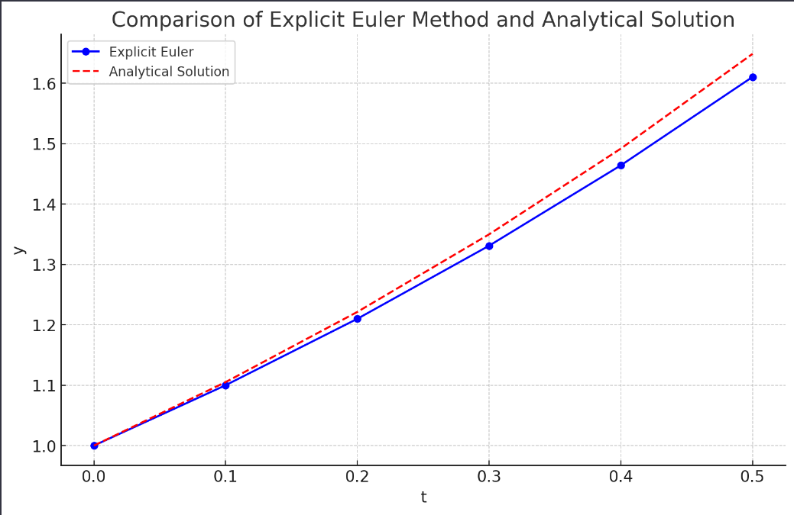

alias:: Euler's rule, 欧拉法

- 用  $x_{n}$  处的[[向前差商]]、[[向后差商]]分别代替[[初值问题]]左边的[[微商]], 实现微分算子离散化, 即
  $$
  \frac{y\left(x_{n}+h\right)-y\left(x_{n}\right)}{h} \approx f\left(x_{n}, y\left(x_{n}\right)\right), \tag{1} 
  $$
  $$
  \frac{y\left(x_{n}+h\right)-y\left(x_{n}\right)}{h} \approx f\left(x_{n+1}, y\left(x_{n+1}\right)\right) . \tag{2}
  $$
  令  $y_{n}$  为  $y\left(x_{n}\right)$  的近似值, 将上面两个近似式写成等式, 整理后得
  $$
  y_{n+1}=y_{n}+h f\left(x_{n}, y_{n}\right), \tag{3} 
  $$
  $$
  y_{n+1}=y_{n}+h f\left(x_{n+1}, y_{n+1}\right) . \tag{4}
  $$
- 从  $x_{0}$  处的初值  $y_{0}$  开始, 按式 ${3}$ , 逐点计算以后各点的值, 即  $y_{0} \rightarrow y_{1} \rightarrow y_{2} \rightarrow \cdots$  称式 ${3}$ 为[[显式欧拉公式]].
- 由于式 $(4)$ 的右端隐含有待求函数值  $y_{n+1}$ , 不能逐步显式计算, 称式 $(4)$ 为[[隐式欧拉公式]].
- 如果将两式做算术平均, 就得到[梯形公式]([[梯形欧拉公式]])
  $$y_{n+1}=y_{n}+\frac{h}{2}\left[f\left(x_{n}, y_{n}\right)+f\left(x_{n+1}, y_{n+1}\right)\right] .$$
  梯形公式也是隐式公式.
- 统称以上的离散公式为[[差分公式]]. 以上差分公式都是由  $y_{n}$  去计算 $y_{n+1}$ , 故称它们为[[单步法]].
- ## 例子
	- 用显式欧拉方法近似求解简单的微分方程 \( \frac{dy}{dt} = y \)，初始条件为 \( y(0) = 1 \)。解析解为 \( y = e^t \)。我们将使用步长 \( h = 0.1 \) 来进行数值近似。
	  在图中：
	- 红色曲线表示解析解 \( y = e^t \)。
	- 蓝色点表示使用显式欧拉方法得到的近似值。
	   
	  通过显式欧拉方法，我们可以从 \( t = 0 \) 开始，使用以下迭代公式计算：
	  $$ y_{n+1} = y_n + h \cdot y_n $$
	  
	  例如：
		- 初始时 \( t_0 = 0 \)，\( y_0 = 1 \)。
		- 下一步 \( t_1 = 0.1 \)，计算 \( y_1 = 1 + 0.1 \times 1 = 1.1 \)。
		- 继续这个过程，得到 \( t_2 = 0.2 \)，计算 \( y_2 = 1.1 + 0.1 \times 1.1 \) 等等。
	- 通过这种方法，我们得到一系列近似值，虽然这些值不如解析解精确，但它们提供了对解的一个很好的近似，特别是在小的步长下。