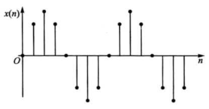

alias:: 离散正弦信号, 正弦序列

- 正弦信号的波形如图所示。其数学表达式如下:
  $$x(n)=A \sin (\omega n+\varphi) \tag{1}$$
  式中,  $A$  表示[[信号的幅度]],  $\omega$  为[[数字角频率]],  $\varphi$  为[[初始相位]]。 
  $\omega$  通常也称为 数字频率 , 它的单位是弧度, 表示**信号变化的速率**, 或者说表示相邻两个信号值之间变化的弧度数。  
  
  >$\omega$  和通常所说的以  $\mathrm{Hz}$  为单位的[[模拟频率]]  $f$ ,既有联系又有区别。
- 式 $(1)$ 所示的 离散的正弦信号 可以看作是由如下的[[模拟正弦信号]]:
  id:: 65cc33d8-e43e-4d06-97c5-7cda45e344e2
  $$x_{\mathrm{a}}(t)=A \sin (2 \pi f t+\varphi)$$
  经[[采样]]得到, 即:
  $$x(n)=\left.x_{\mathrm{a}}(t)\right|_{t=n T_{\mathrm{s}}}=A \sin \left(2 \pi f T_{\mathrm{s}} n+\varphi\right)=A \sin \left(\Omega T_{\mathrm{s}} n+\varphi\right)$$
  式中,  $f$  为[[模拟频率]], 单位为  $\mathrm{Hz}$ ; $T_{\mathrm{s}}$  为[[采样周期]], 单位为秒  ( $\mathrm{s}$ ), $\Omega=2 \pi f$  称为[[模拟角频率]], 单位为弧度  /  秒 ( $\mathrm{rad} / \mathrm{s}$ )  。
  [[模拟频率]]  $f$  、[[模拟角频率]]  $\Omega$  和[[数字角频率]]  $\omega$  三者的关系如下:
  $$\omega=2 \pi f T_{\mathrm{s}}=2 \pi f / f_{\mathrm{s}}=\Omega T_{\mathrm{s}}=\Omega / f_{\mathrm{s}}$$
  式中  $f_{\mathrm{s}}$  是[[采样频率]]。
	- 上式表明, 凡是经模拟信号采样后得到的离散信号, 其模拟频率和模拟角频率与数字角频率成线性关系。
- 也可以看出, [[数字频率]]  $\omega$  等于[[模拟角频率]]  $\Omega$  被[[采样频率]]  $f _s$ [归一化]([[归一化频率]])后的频率; 或说, 数字频率  $\omega$  等于[[模拟频率]]  $f$  先被采样频率  $f_s$  归一化, 再乘以  $2 \pi$  后的频率。
  id:: 65dee8ce-44b5-4191-a058-04009c03bff7
  因而可用以下表格来表示它们之间的对应关系
  |$f$|$\Omega$|$\omega$|
  |--|--|--|
  |$0$|$0$|$0$|
  |$f_s/2$|$\Omega_s/2$|$\pi$|
  |$f_s$|$\Omega_s$|$2\pi$|
	-
- 正弦信号的复数形式, 即[[复正弦信号]], 其数学定义式如下:
  $$x(n)=\mathrm{e}^{\mathrm{j} \omega n}=\cos (\omega n)+\mathrm{j} \sin (\omega n)$$
  > 这也是非常重要的一种基本信号。因为它不仅是离散信号做傅里叶变换时的基函数, 同时也是线性时不变系统的特征信号。