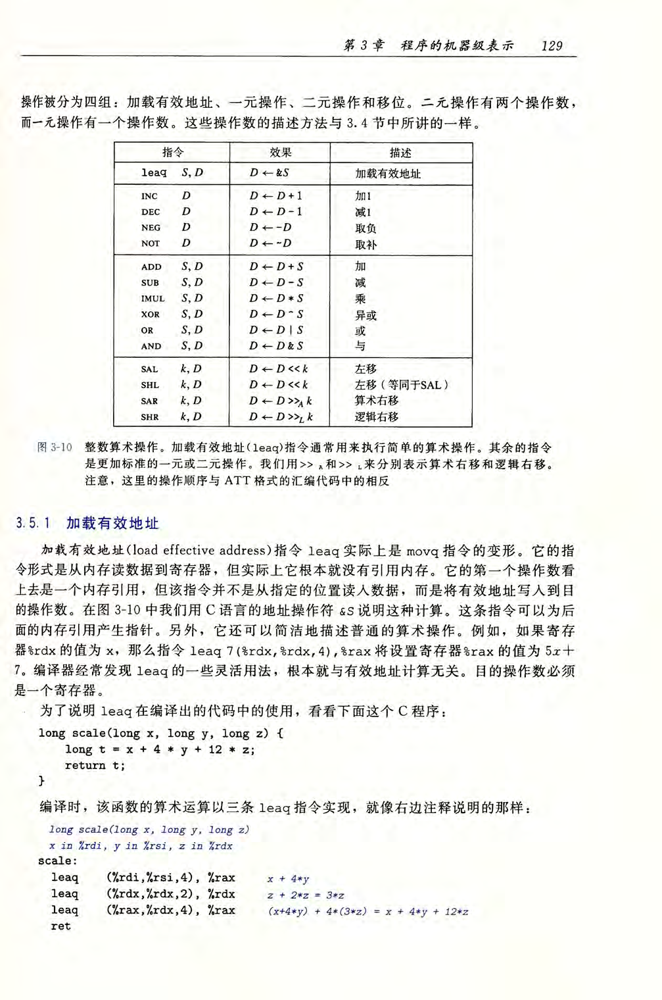

alias:: assembly language, asm

- [[汇编语言]]是用人类看得懂的语言来描述[[指令集]]。
- [[汇编指令]]是[[二进制指令]]的文本形式，二者是一一对应的关系。比如，加法指令`00000011`写成[[汇编指令]]就是`ADD`。
  把这些 汇编指令 翻译成 二进制指令 ，这个步骤就称为[[assembling]]，完成这个步骤的程序就叫做[[assembler]]。
- 每一种 CPU 的[[机器指令]]都是不一样的，因此对应的[[汇编语言]]也不一样。
- # x86 汇编语言
	- ## [[寄存器]]
	- ## [[CPU 指令]]
		- ### 例子
			- ``` c
			  int add_a_and_b(int a, int b) {
			     return a + b;
			  }
			  
			  int main() {
			     return add_a_and_b(2, 3);
			  }
			  ```
			- 用[[gcc]]将这个程序转成汇编语言。
			  
			  ``` shell
			  $ gcc -S example.c
			  ```
			- 上面的命令执行以后，会生成一个文本文件`example.s`，里面就是汇编代码，包含了几十行指令。
			  下面是经过简化后的样子
			  ``` asm
			  _add_a_and_b:
			   push   %ebx
			   mov    %eax, [%esp+8] 
			   mov    %ebx, [%esp+12]
			   add    %eax, %ebx 
			   pop    %ebx 
			   ret
			  - _main:
			   push   3
			   push   2
			   call   _add_a_and_b 
			   add    %esp, 8
			   ret
			  ```
			- 可以看到，原程序的两个函数`add_a_and_b`和`main`，对应两个[[标签]]`_add_a_and_b`和`_main`。每个标签里面是该函数所转成的 CPU 运行流程。
			- 每一行就是 CPU 执行的一次操作。它又分成两部分，就以其中一行为例。
			  ```
			  push   %ebx
			  ```
			- 这一行里面，`push`是[[CPU指令]]，`%ebx`是该指令要用到的[[操作数]]。
			  一个 CPU指令 可以有零个到多个 操作数。
		- ## [[operand]]
		- 下面是一些常用指令（`S`表示 源位置 ，`D`表示 目标位置，大写指令表示[[指令类]]）：
			- `MOV S, D`
				- 传送数据，把数据从 `S` [[复制]]到 `D` 。
				- `D`不能是[[立即数]]。
				- `S`和`D`不能都是[[memory]]，也就是不能直接从一个内存地址复制到另一个内存地址。
			- `pushq S`
				- 将[[quad word]] `S` 压入[[栈]]
				- 效果：
				  R[%rsp] ← R[%rsp] − 8;
				  M[R[%rsp]] ← S
			- `popq D`
				- 将[[quad word]] `D` 弹出[[栈]]
				- 效果：
				  D ← M[R[%rsp]]; 
				  R[%rsp] ← R[%rsp] + 8
			- `leaq S, D`
				- 加栽有效地址（[[load effective address]])
			- 
		- |指令|描述|
		  |--|--|
		  |push||
		  |pop||
		  |call||
		  |||
		  |add||
		  |ret||
		- C语言数据类型在[[X86-64]]中的大小：
		  |C 声明|Intel 数据类型|汇编代码后缀|大小(字节）|
		  |--|--|--|--|
		  |char|[[byte]]|b|1|
		  |short|[[word]]|w|2|
		  |int|[[double word]]|l|4|
		  |long|[[quad word]]|q|8|
		  |char *|quad word|q|8|
		  |float|[[single precision]]|s|4|
		  |double|[[double precision]]|l|8|
- # Reference
	- [汇编语言（第4版） (王爽) (Z-Library) (1).pdf](../assets/汇编语言（第4版）_(王爽)_(Z-Library)_(1)_1699540385047_0.pdf)
-