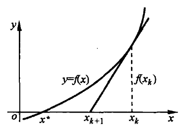
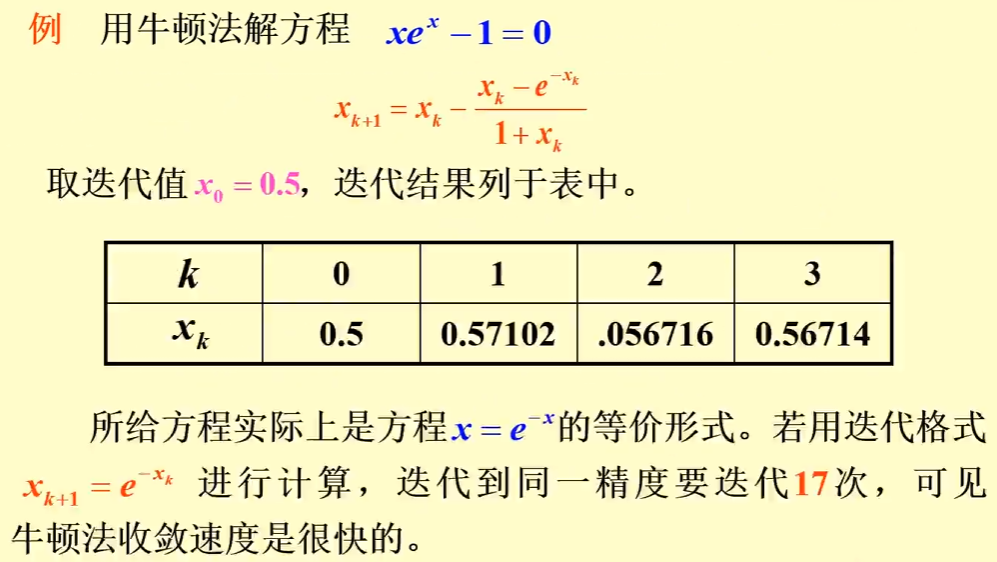

alias:: Newton-Raphson Method, Newton's method, 切线法

- #+BEGIN_TIP
  [[解非线性方程]]  $f(x)=0$  的牛顿法, 是一种将非线性方程**线性化**方法. 它是[[代数方程]]和[[超越方程]]的有效方法之一。牛顿方法在单根附近具有较高的收敛速度, 而且牛顿方法不仅可以用来求  $f(x)=0$  的实根, 还可用来求代数方程的复根, 同时还可推广用来[[解非线性方程组]]。
  #+END_TIP
- 用[[简单迭代法]]求方程 $f(x)=0$ 的根  $x^{*}$ , 十分重要的问题是构造迭代函数  $\varphi(x)$ . 为了使收敛速度的阶高一些, 由[定理](((65c8ca84-50d5-4aad-847a-c0d7d45ece33)))知, 应尽可能使  $\varphi(x)$  在  $x=x^{*}$  处有更高阶导数等于 $0$ .
	- ((65c8c
- 现令  $\varphi(x)=x+h(x) f(x)$, $h(x)$  为待定函数, 但  $h\left(x^{*}\right) \neq 0$ , 则方程  $f(x)=0$ 与方程  $x=x+h(x) f(x)$  有共同的根  $x^{*}$ .
- 现用条件  $\varphi^{\prime}\left(x^{*}\right)=0$  确定  $h(x)$ , 由
  \begin{aligned}
  \varphi^{\prime}\left(x^{*}\right) & =1+h^{\prime}\left(x^{*}\right) f\left(x^{*}\right)+h\left(x^{*}\right) f^{\prime}\left(x^{*}\right) \\
  & =1+h\left(x^{*}\right) f^{\prime}\left(x^{*}\right)=0
  \end{aligned}
  知,  $h(x)$  必需满足  $h\left(x^{*}\right)=\frac{-1}{f^{\prime}\left(x^{*}\right)}$ 。
- 显然, 取  $h(x)=\frac{-1}{f^{\prime}(x)}$  就具备这个条件, 并且也满足  $h\left(x^{*}\right) \neq 0$ 。 
  于是确定
  $$\varphi(x)=x-f(x) / f^{\prime}(x),$$
  它满足  $\varphi^{\prime}\left(x^{*}\right)=0$ , 由此得出下面的特殊的[[简单迭代法]]
  $$x_{k+1}=x_{k}-f\left(x_{k}\right) / f^{\prime}\left(x_{k}\right), \quad k=0,1,2, \cdots, \tag{1}$$
  上式所表示的迭代法称为[[牛顿法]]. 如果 Newton 法 收敛于方程 $f(x)=0$ 的根,则它至少有[二阶收敛速度]([[迭代法的收敛速度]]) 。
- Newton 法可求 $f(x)=0$ 的实数根和[[复数根]].
- 当求实数根时, Newton 法有明显的几何意义. 当获得  $x_{k}$  之后, 过曲线  $y=f(x)$  上的点  $\left(x_{k}, f\left(x_{k}\right)\right)$  作该曲线的[[切线]], 此切线与  $x$  轴相交所得的**交点**的横坐标就是 Newton 法迭代序列的第  $(k+1)$  个元素  $x_{k+1}$ , 如图所示. 
  
  事实上, 该切线的方程为
  $$y=f^{\prime}\left(x_{k}\right)\left(x-x_{k}\right)+f\left(x_{k}\right),$$
  令  $y=0$ , 就得
  $$x=x_{k}-\frac{f\left(x_{k}\right)}{f^{\prime}\left(x_{k}\right)}=x_{k+1} .$$
  因此 牛顿法 又称为[[切线法]]。
- ## 定理
	- 给定  $f(x)=0$ , 若满足条件
		- $f(x)$  在根  $x^{*}$  邻域二阶连续可微;
		  logseq.order-list-type:: number
		- $f^{\prime}\left(x^{*}\right) \neq 0$ , 
		  logseq.order-list-type:: number
	- 则存在  $x^{*}$  的一个邻域  $R:\left\{x \mid | x-x^{*}| \leqslant \delta\right\}$  使对于任意初值  $x_{0} \in R$ , Newton 迭代序列  $\left\{x_{k}\right\}$  收敛于  $x^{*}$ , 并有
	  $$\lim _{k \rightarrow \infty} \frac{e_{k+1}}{e_{k}^{2}}=\frac{f^{\prime \prime}\left(x^{*}\right)}{2 f^{\prime}\left(x^{*}\right)}$$
	  其中 $e_{k}=x_{k}-x^{*}$ 为[[迭代误差]], 从而 Newton 法至少[二阶收敛]([[迭代法的收敛速度]]).
	  > 对 单根 有 二阶收敛速度，对[[重根]]有 线性收敛速度 。
	- ### 证明
		- 称  $\varphi(x)=x-f(x) / f^{\prime}(x)$  为[[牛顿迭代函数]]. 当  $f^{\prime}\left(x^{*}\right) \neq 0$  时, 显然有  $x^{*}   =\varphi\left(x^{*}\right)$ , 即  $x^{*}$  是  $\varphi(x)$  的不动点. 进而容易求出
		  $$\varphi^{\prime}(x)=1-\frac{\left[f^{\prime}(x)\right]^{2}-f(x) f^{\prime \prime}(x)}{\left[f^{\prime}(x)\right]^{2}}=\frac{f(x) f^{\prime \prime}(x)}{\left[f^{\prime}(x)\right]^{2}} .$$
		  因为  $f^{\prime}\left(x^{*}\right) \neq 0$ , 所以  $\varphi^{\prime}\left(x^{*}\right)=0$ . 于是, 由[定理](((65c8ca84-50d5-4aad-847a-c0d7d45ece33))) 得知 Newton 迭代法 至少具有[二阶收敛]([[迭代法的收敛速度]]).
		- 进而, 在点  $x_{k}$  处作[[泰勒展开]]
		  $$0=f\left(x^{*}\right)=f\left(x_{k}\right)+f^{\prime}\left(x_{k}\right)\left(x^{*}-x_{k}\right)+\frac{f^{\prime \prime}\left(\xi_{k}\right)}{2}\left(x^{*}-x_{k}\right)^{2},$$
		  其中,  $\xi_{k}$  在  $x_{k}$  与  $x^{*}$  之间.
		- Newton 迭代法 $(1)$ （两端同乘 $f'(x)$ ）等价于
		  $$f\left(x_{k}\right)-f^{\prime}\left(x_{k}\right) x_{k}=-f^{\prime}\left(x_{k}\right) x_{k+1},$$
		  将它代入上式,得到
		  $$
		  0=f^{\prime}\left(x_{k}\right)\left(x^{*}-x_{k+1}\right)+\frac{f^{\prime \prime}\left(\xi_{k}\right)}{2}\left(x^{*}-x_{k}\right)^{2}, $$
		  即
		  $$-\frac{e_{k+1}}{e_{k}^{2}}=\frac{f^{\prime \prime}\left(\xi_{k}\right)}{2 f^{\prime}\left(x_{k}\right)} .$$
		  令  $k \rightarrow \infty$ , 由[[局部收敛性]]得知  $x_{k} \rightarrow x^{*}$ , 同时  $\xi_{k} \rightarrow x^{*}$ , 于是有
		  $$\lim _{k \rightarrow \infty} \frac{e_{k+1}}{e_{k}^{2}}=\frac{f^{\prime \prime}\left(x^{*}\right)}{2 f^{\prime}\left(x^{*}\right)}$$
- ## 例子
	- 
- ## [[改进牛顿法]]
- ## 初值选择
	- 牛顿法的初始值选择对于算法的成功收敛至关重要。不当的初始值选择可能导致迭代过程发散，或收敛至错误的根。以下是一些选择牛顿法初始值的策略和建议：
	- ### 1. 图形方法
	- **可视化函数图像**：使用计算机软件（如MATLAB、Mathematica、Python等）绘制函数 \(f(x)\) 的图像，以直观地识别根的大致位置。选择靠近根的点作为初始值。
	- ### 2. 物理或几何直觉
	- **基于问题背景**：如果问题来源于物理、工程或其他应用背景，可以根据直觉或经验来估计根的大致位置。
	- ### 3. 使用简化方法
	- **二分法**：先使用二分法等简单但鲁棒的方法寻找根的大致区域，然后以此区域内的点作为牛顿法的初始值。
	- **不动点迭代**：对某些函数形式，不动点迭代可能更容易找到近似根，其结果可以作为牛顿法的初始猜测。
	- ### 4. 分析法
	- **导数符号变化**：分析函数导数 \(f'(x)\) 的符号变化，选择导数不为零且变化平稳的区域内的点作为初始值。
	- **函数值变号点**：寻找函数值 \(f(x)\) 从正变负或从负变正的点，这些点附近可能存在根。
	- ### 5. 多个初始值
	- **尝试多个初始值**：为了提高找到根的概率，可以从不同的位置尝试多个初始值，特别是当函数有多个根时。
	- ### 注意事项
	- **避免导数为零的点**：选择初始值时应避开函数导数 \(f'(x)\) 接近零或为零的点，因为这会导致牛顿法迭代中的分母接近零，使得迭代过程不稳定。
	- **考虑全局性质**：理解函数的全局性质有助于更好地选择初始值，避免收敛至局部极值点或鞍点。
	- **动态调整**：在迭代过程中，如果发现收敛速度慢或似乎不收敛，可以考虑更换初始值重新开始。
	  
	  合理选择初始值是应用牛顿法成功求解非线性方程的关键。虽然没有一劳永逸的方法保证总是选到最佳初始值，但以上策略和建议可以显著提高找到有效根的几率。
-