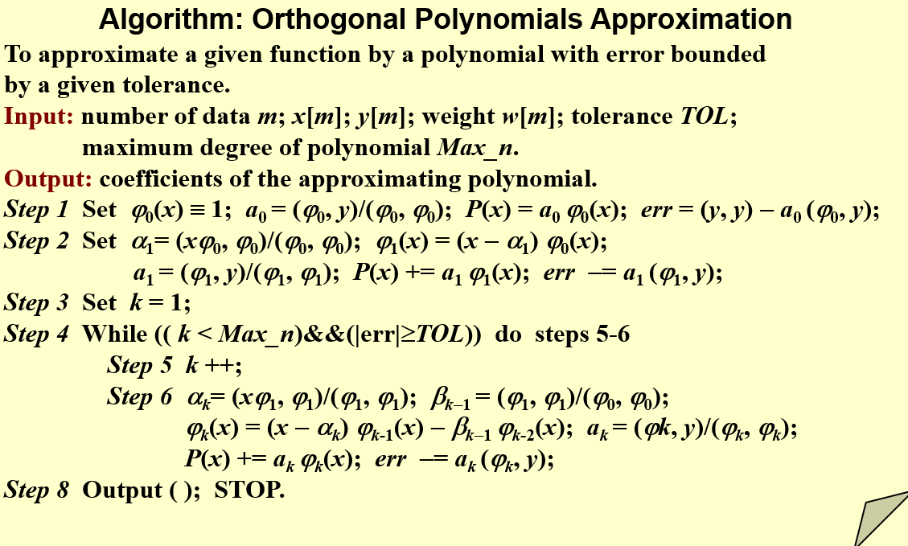

- 
  
- 
  > \begin{aligned} err &=\left\|P-y\right\|^{2}=\left(P-y,P-y\right)=\left(\sum_{k=0}^{n}a_{k}\varphi_{k}-y,\sum_{i=0}^{n}a_{i}\varphi_{i}-y\right) \\
  &=\sum_{k=1}^na_k^2(\varphi_k,\varphi_k)-2\sum_{k=0}^na_k(\varphi_k,y)+(y,y)=(y,y)-\sum_{k=0}^na_k(\varphi_k,y)\end{aligned}
- ## 例子
	- 
	  
-