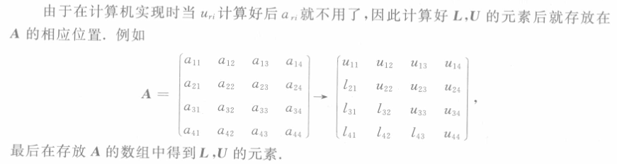

- 将[[高斯消去法]]改写为[[紧凑形式]]，可以直接从矩阵 $\boldsymbol A$ 的元素得到计算 $\boldsymbol L,\boldsymbol U$ 元素的递推公式，而不需任何中间步骤，这就是所谓[[直接三角分解法]].
- 一旦实现了矩阵 $\boldsymbol A$ 的[[LU 分解]]，那么求解 $Ax=b$ 的问题就等价于求解两个 *三角形方程组* ：
	- $\boldsymbol{Ly}=\boldsymbol{b}$, 求 $\boldsymbol y$ ；
	  logseq.order-list-type:: number
	- $\boldsymbol{Ux}=\boldsymbol{y}$,求 $\boldsymbol x$ 。
	  logseq.order-list-type:: number
- ## 不选主元的三角分解法
	- 
		- #+BEGIN_PINNED
		   
		  #+END_PINNED
	- 
	- #+BEGIN_TIP
	  由直接三角分解计算公式，需要计算形如 $\sum a_ib_i$ 的式子，可采用[[双精度累加]], 以提高精度。
	  #+END_TIP
	- 直接分解法大约需要 $n^3/3$ 次乘除法，和[[高斯消去法]][[计算量]]基本相同. 
	  如果已经实现了 $\boldsymbol A=\boldsymbol{LU}$ 的分解计算，且$L,U$ 保存在$A$ 的相应位置，则用直接三角分解法解具有相同系数的方程组 $Ax=(b_1b_2...b_m)$ 是相当方便的，每解一个方程组 $Ax=b_j$ **仅**需要增加$n^2$次乘除法运算。
	- 矩阵 $\boldsymbol A$ 的分解公式
	  $$
	  u_{ri}=a_{ri}-\sum_{k=1}^{r-1}l_{rk}u_{ki},\mathrm{~}i=r,r+1,\cdots,n
	  $$
	  $$
	  l_{ir}=\left(a_{ir}-\sum_{k=1}^{r-1}l_{ik}u_{kr}\right)/u_{rr},i=r+1,\cdots,n,\text{且} r\neq n
	  $$
	  
	  又称为[[杜利特尔分解]]。
-