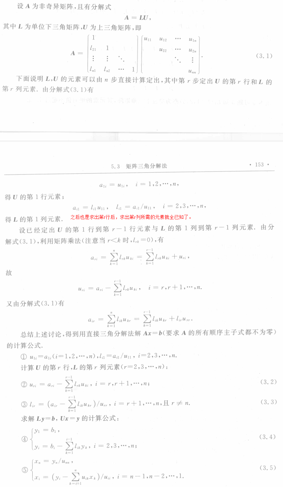
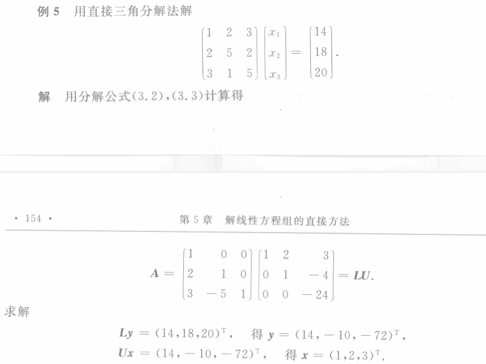

- 将[[高斯消去法]]改写为[[紧凑形式]]，可以直接从矩阵 $\boldsymbol A$ 的元素得到计算 $\boldsymbol L,\boldsymbol U$ 元素的递推公式，而不需任何中间步骤，这就是所谓[[直接三角分解法]].
- 一旦实现了矩阵 $\boldsymbol A$ 的[[LU 分解]]，那么求解 $Ax=b$ 的问题就等价于求解两个 *三角形方程组* ：
	- $\boldsymbol{Ly}=\boldsymbol{b}$, 求 $\boldsymbol y$ ；
	  logseq.order-list-type:: number
	- $\boldsymbol{Ux}=\boldsymbol{y}$,求 $\boldsymbol x$ 。
	  logseq.order-list-type:: number
- ## 不选主元的三角分解法
  
	- #+BEGIN_PINNED
	   
	  #+END_PINNED
-