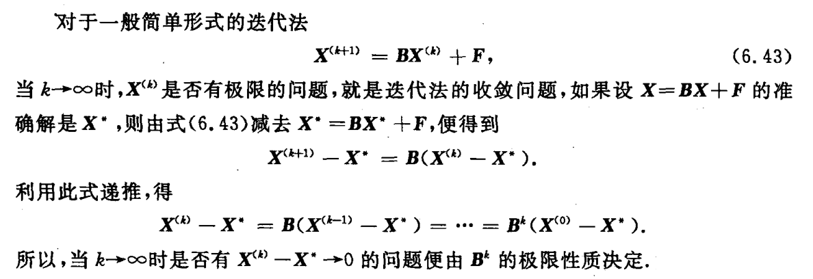

alias:: 矩阵序列的收敛性

- ## Definition
	- 设有[[矩阵序列]] $\boldsymbol A_k=(a_{ij}^{(k)})_{n\times n}\ (k=1,2,\cdotp\cdotp\cdotp)$ 及 $\boldsymbol A=(a_y)_{n\times n}$，如果
	  logseq.order-list-type:: number
	  $$\lim_{k\to\infty} a_y^{(k)}=a_y,\quad i,j=1,2,...,n$$
<<<<<<< HEAD
	  成立，则称$\{\boldsymbol A_k\}$收敛于$\boldsymbol A$,记为
=======
	  成立，则称$\{\boldsymbol A_k\}$收敛于$A$,记为
>>>>>>> a248c038068cac24d7081fb376bc97464feb5673
	  $$\lim_{k\to\infty}\boldsymbol  A_k=\boldsymbol A.$$
- ## Theorem
	- logseq.order-list-type:: number
	  $$\underset{k\to\infty}{\operatorname*{\mathrm{lim}}}\boldsymbol A_k=\boldsymbol A\Longleftrightarrow\underset{k\to\infty}{\operatorname*{\mathrm{lim}}}\parallel\boldsymbol A_k-\boldsymbol A\parallel=\boldsymbol 0$$
	  其中 $\parallel\cdot\parallel$ 为 *矩阵* 的任意一种[[算子范数]].
		- 
	- 设矩阵 $\boldsymbol B\in\mathbb{R}^{n\times n}$, 则 $\lim\boldsymbol B^k=0$ 的**充分必要条件**是 $\rho(\boldsymbol B)<1$, 其中 $\rho(\boldsymbol B)$为 $\boldsymbol B$ 的[[谱半径]].
	  logseq.order-list-type:: number