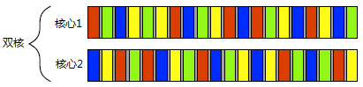

- [[多核处理器]]能够真正的[[并行]]多个任务，我们称其为[[硬件并发]]。
- 有些处理器可以在一个[[核心]]上执行多个[[线程]]，但[[硬件并发]]在 多处理器 上效果更加显著。
- 硬件线程最重要的是**数量**，也就是可以并发运行独立任务的数量。
- 即便是 硬件并发 的系统，也有比硬件 可并行最大任务数 还要多的任务需要执行，所以[[任务切换]]在这些情况下仍然适用。
  
- 如何使用并发，很大程度上取决于可用的[[硬件并发]]。