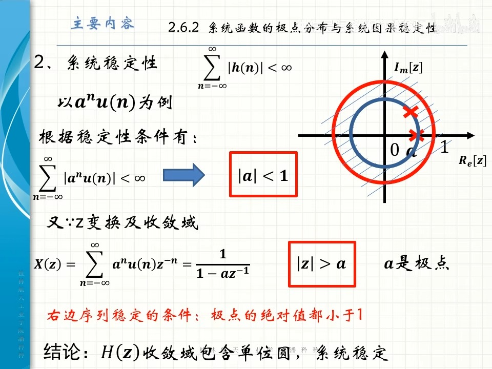
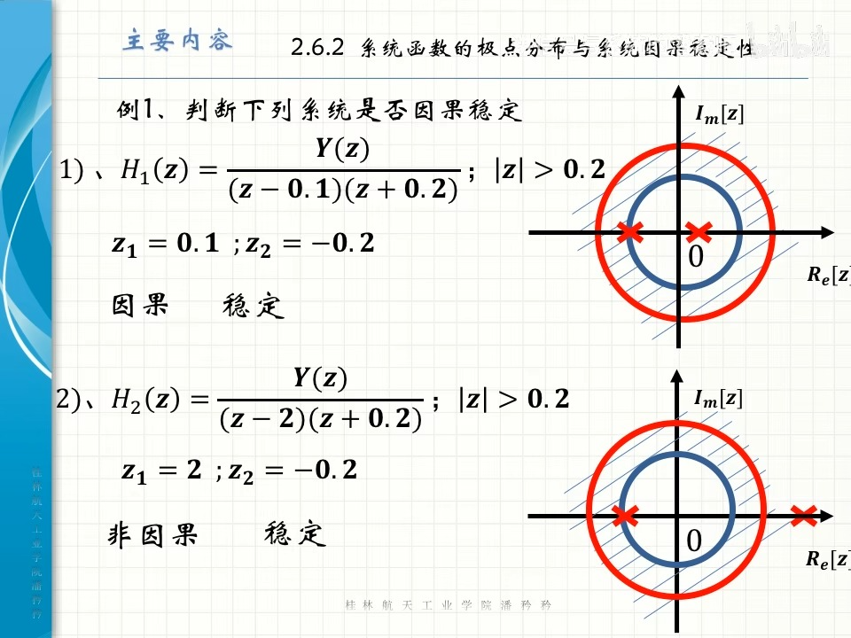
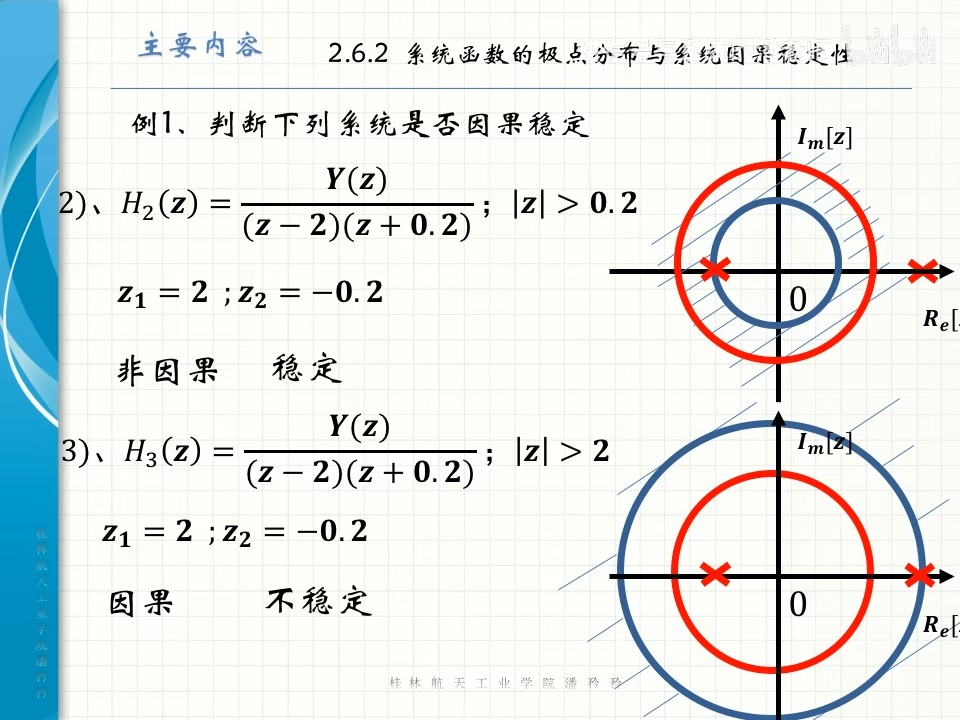
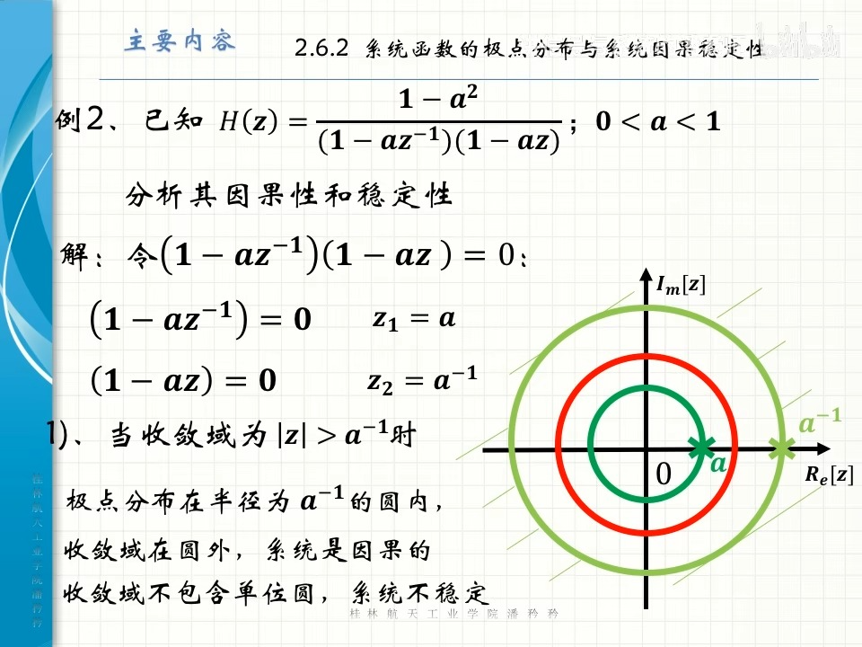
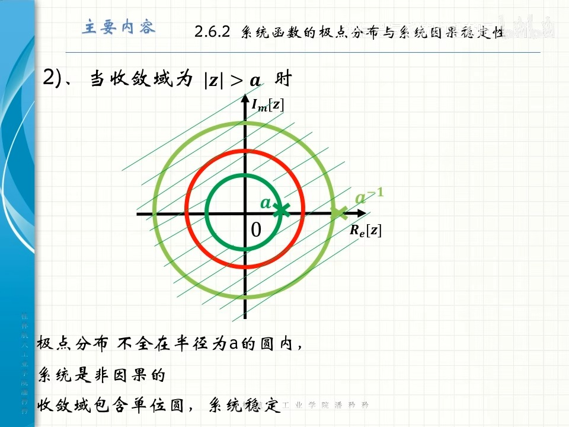
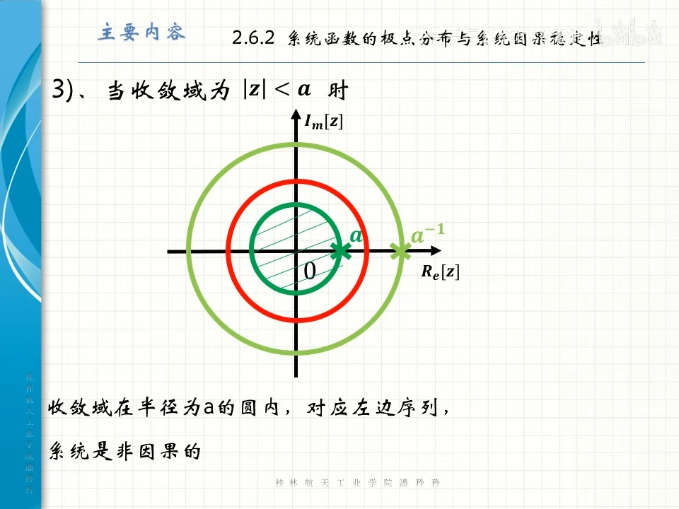
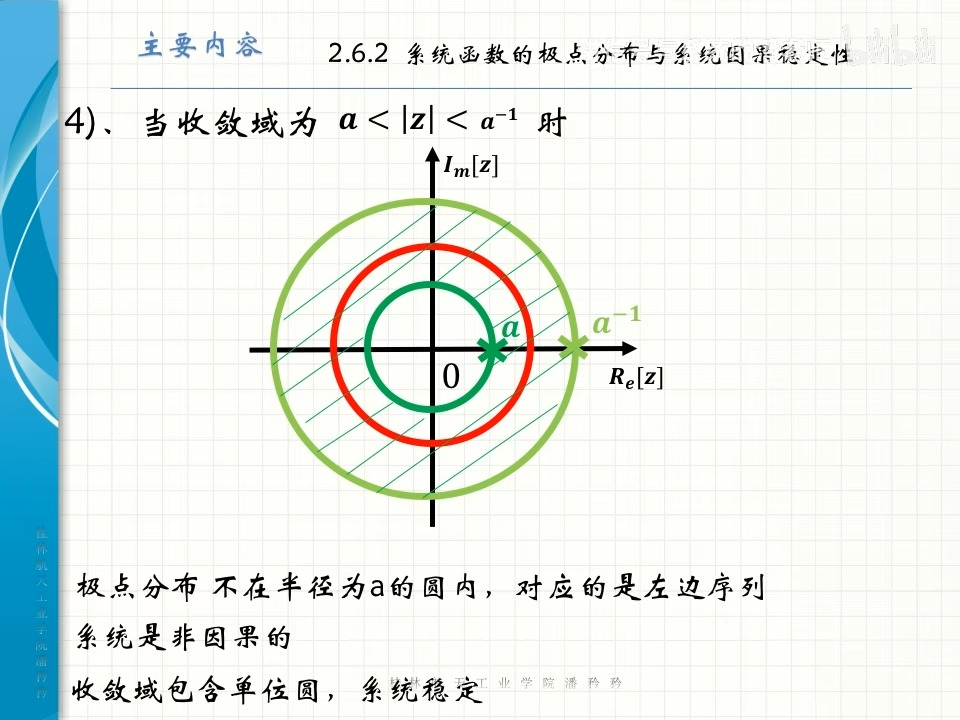
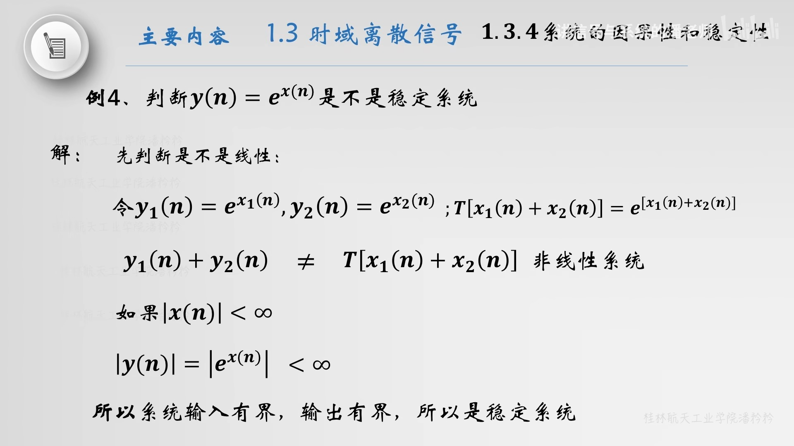
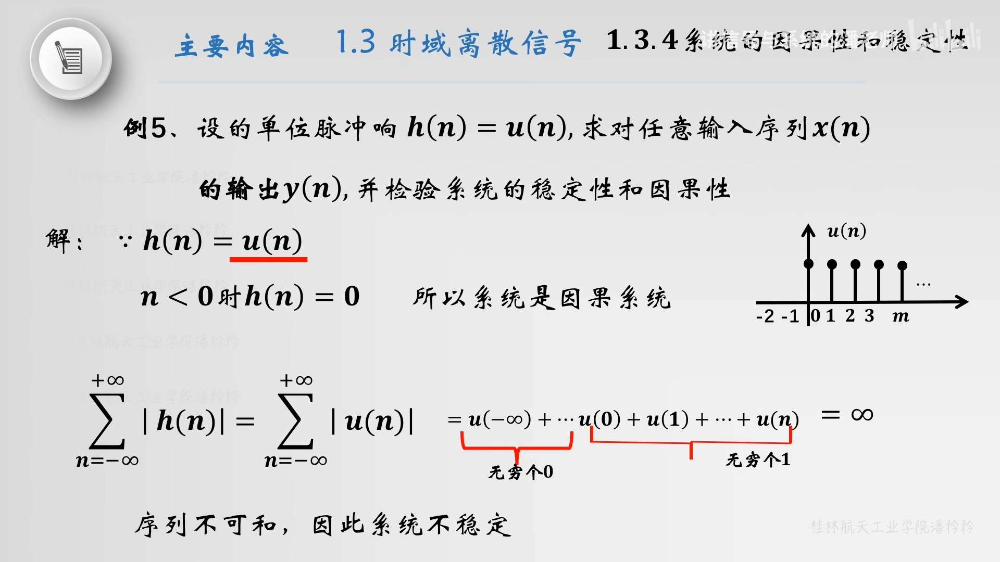
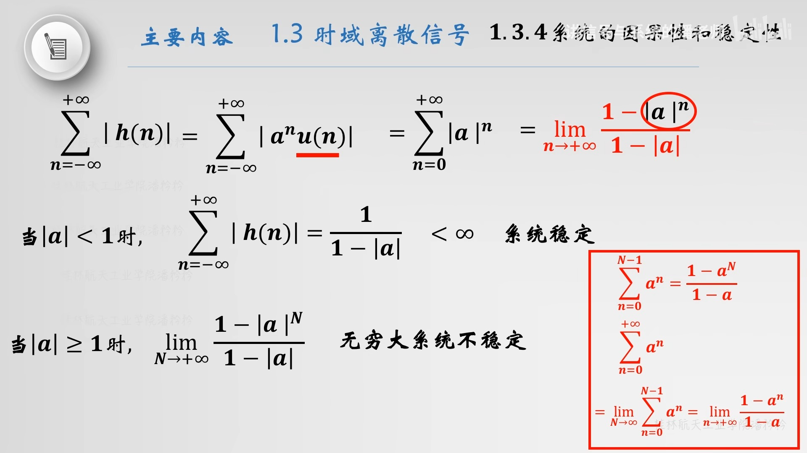

alias:: 系统的稳定性, 系统稳定性

- 如果对有界输入, 系统产生的输出也是[[有界]]的, 则称该系统具有稳定性（[[BIBO稳定性]]）, 或称该系统为^^稳定系统^^。
- ## 定理
	- [[线性时不变系统]]稳定的充分必要条件:
	  系统的[[单位脉冲响应]][[绝对可和]], 用公式表示为
	  $$\sum_{n=-\infty}^{\infty}|h(n)|<\infty$$
	- [[系统函数]] $H(z)$ [[收敛域]]包含[[单位圆]], ^^系统稳定^^。
		- [[因果序列]]稳定的充分必要条件是[[极点]]的绝对值都小于 $1$ 。
		- [[左边序列]]稳定的充分必要条件是[[极点]]的绝对值都大于 $1$ 。
	- ### 例子
		- 
		- 
		- 
		- 
		- 
		- 
		- 
- ## 例子
	- 
	- 
	- 
	- 
-
- ### 稳定性分类
	- 1. **BIBO稳定性（有界输入有界输出稳定性）**：
		- 如果对于任何有界输入信号，系统的输出信号都保持有界，那么系统是BIBO稳定的。
	- 2. **内部稳定性**：
		- 考虑系统内部状态的稳定性。如果系统的所有内部状态响应都不会随时间无限增长，则系统内部稳定。
	- 3. **稳态稳定性**：
		- 当系统在长时间运行后达到稳定状态，即输出不再随时间变化时，系统具有稳态稳定性。
	- 4. **渐进稳定性**：
		- 如果系统的输出随时间逐渐趋向于某个固定值或稳定状态，则系统是渐进稳定的。
- ### 稳定性分析方法
  
  1. **基于特征方程的分析**：
	- 对于线性时不变（LTI）系统，稳定性可以通过分析系统的特征方程来确定。对于连续系统，所有特征根（系统方程的解）必须位于复平面的左半部分；对于离散系统，所有特征根必须位于单位圆内。
- 2. **利用零极点图**：
	- 在复平面上绘制系统的零点和极点。对于连续时间系统，所有极点必须位于左半平面；对于离散时间系统，所有极点必须位于单位圆内，以确保系统的稳定性。
- 3. **利用频率响应方法**：
	- 通过分析系统的频率响应（如伯德图或奈奎斯特图），可以判断系统的稳定性。特别是，可以使用奈奎斯特判据来确定闭环系统的稳定性。
- 4. **利用李雅普诺夫方法**：
	- 李雅普诺夫稳定性理论提供了一种判断非线性系统稳定性的方法。如果可以找到一个正定的李雅普诺夫函数，其导数沿着系统轨迹是负定的，则系统是稳定的。
- ### 系统稳定性的重要性
  系统的稳定性对于确保其可靠和安全运行至关重要。在设计控制系统、电力系统、通信系统等时，稳定性分析是必不可少的步骤。一个不稳定的系统可能会导致性能下降、设备损坏甚至安全事故。因此，系统设计和分析的初期阶段就需要进行稳定性评估和验证。