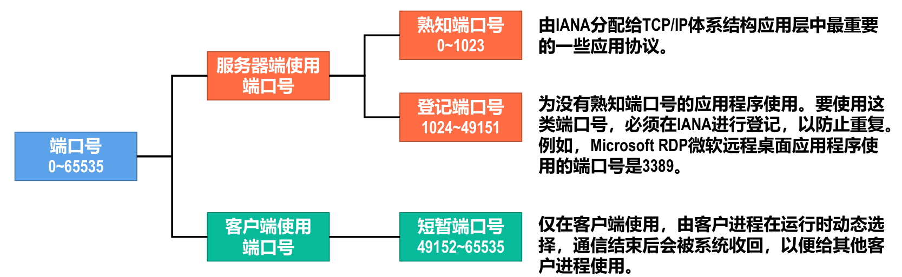

- 运行在计算机上的[[进程]]是使用[[进程标识符]]（PID）来标识的。
- > 为了使运行不同操作系统的计算机的应用进程之间能够基于网络进行通信，就必须使用统一的方法
  对TCP/IP体系的应用进程进行标识。
- TCP/IP体系结构的运输层使用[[端口号]]来标识和区分[[应用层]]的不同[[应用进程]]。端口号的长度为 16 比特，取值范围是 0~65535 。
- 
- [[熟知端口号]]
  |FTP|SMTP|DNS|DHCP|HTTP|BGP|HTTPS|RIP|
  |--|--|--|--|--|--|--|--|
  |21/20|25|53|67/68|80|179|443|520|