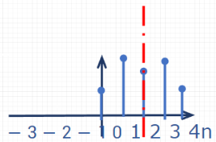
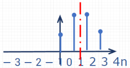
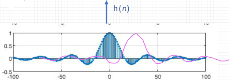
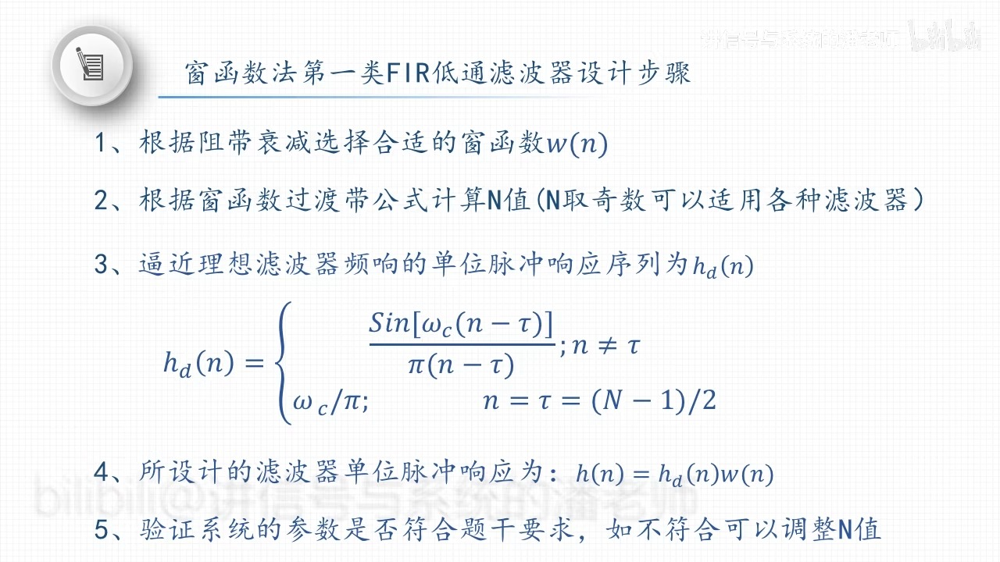

alias:: 第一类线性相位

- ## 第一类线性相位滤波器设计
- ### 设计公式
	- 时域约束条件
	  logseq.order-list-type:: number
	  $$\mathrm{h}(n)=\mathrm{h}(N-1-n)$$
	- 系统的群时延：$T=\frac{N-1}{2}$ （可以理解为对称轴）
	  logseq.order-list-type:: number
	- 系统的[[相频特性]] 
	  logseq.order-list-type:: number
	  $$\varphi(\omega)=-\tau \omega$$
	- 系统的[[幅频响应特性]]
	  logseq.order-list-type:: number
		- 情况 $1 ( N$ 为奇数 $)$ ： 
		  logseq.order-list-type:: number
		  $$\left|H\left(e^{j \omega}\right)\right|=h(\tau)+\sum_{n=0}^{\tau-1} 2 h(n) \cos [\omega(n-\tau)]$$
		  
		- 情况 $2 (N$ 为偶数 $)$ ： 
		  logseq.order-list-type:: number
		  $$\left|H\left(e^{j \omega}\right)\right|=\sum_{n=0}^{\frac{N}{2}-1} 2 h(n) \cos [\omega(n-\tau)]$$
		  
- ### 例子
  collapsed:: true
	- ((6617e8c8-5e13-482a-806d-49dcd1de0107))
		- > 其中用到：
		  {{embed ((66129619-2cbf-43a6-a7e8-ad2c443d828f))}}
- ## 窗函数设计法
- ### 近似[[理想低通滤波器]]幅频响应的 FIR 序列
	- 对于数字滤波器，理想情况是无法实现的，因为理想低通滤波器的冲激响应是无限长的。但我们可以通过[[截断]]和[[窗函数]]的方法，设计出近似的有限冲激响应（FIR）滤波器。
	  设定FIR滤波器的长度为 \( N \)，中心点 \( \tau = \frac{N-1}{2} \)，则理想低通滤波器的冲激响应 \( h_d(n) \) 为：
	  $$
	  h_{d}(n)=\frac{\omega_{c}}{\pi} \text{Sa}\left[\omega_{c}(n-\tau)\right]
	  $$
	  
	- 进一步地，将其写成正弦函数形式，我们得到：
	  $$
	  h_{d}(n)=\left\{\begin{array}{ll}
	  \frac{\sin\left[\omega_{c}(n-\tau)\right]}{\pi(n-\tau)}, & n \neq \tau \\
	  \frac{\omega_{c}}{\pi}, & n=\tau
	  \end{array}\right.
	  $$
	- 由于理想低通滤波器的冲击响应 \( h_d(n) \) 是无限长的，实际应用中需要将其截断以形成有限长度的响应 \( h(n) \)。这可以通过两种主要方法来实现：矩形窗截断和一般窗函数截断。
- ### 矩形窗截断
  在矩形窗截断中，理想低通滤波器的冲激响应 \( h_d(n) \) 通过与矩形窗 \( R_N(n) \) 相乘来截断，得到实际的FIR滤波器响应：
  $$
  h(n) = h_d(n) R_N(n)
  $$
  其中 \( R_N(n) \) 是一个[[矩形窗函数]]，它在 \( 0 \) 到 \( N-1 \) 范围内的值为 \( 1 \)，其他地方的值为 \( 0 \)。这种方法简单直接，但会导致频响中出现较大的[[旁瓣]]，从而影响滤波器的性能。
- ### 一般窗函数截断
  为了改善滤波器性能并减少截断造成的旁瓣效应，通常会使用不同的[[窗函数]]来平滑截断的边缘。这时，理想滤波器响应 \( h_d(n) \) 与窗函数 \( w(n) \) 相乘，得到截断后的FIR响应：
  $$
  h(n) = h_d(n) w(n)
  $$
  这里的 \( w(n) \) 可以是汉明窗、汉宁窗、布莱克曼窗等，不同的窗函数影响着滤波器的主瓣宽度和旁瓣高度。通过选取合适的窗函数，可以在减少旁瓣高度和保持主瓣宽度之间取得平衡，从而设计出性能优良的FIR低通滤波器。
- ### [[窗函数]]
- ### [[加窗后频响特性]]
- ## 总结
	- 第一类线性相位滤波器可以实现的滤波器类型
		- 当 $\mathrm{N}$ 为奇数时，可以实现低通、带通、高通、带阻滤波
		  logseq.order-list-type:: number
		- 当 $\mathrm{N}$ 为偶数时，可以实现低通、带通，不能实现高通、带阻滤波
		  logseq.order-list-type:: number
	- 完整设计步骤
	  {:height 368, :width 640}
- ### 例子
	- ((66180514-b99d-4095-8937-5acd6764bbc4))
- ## [[频率采样法]]