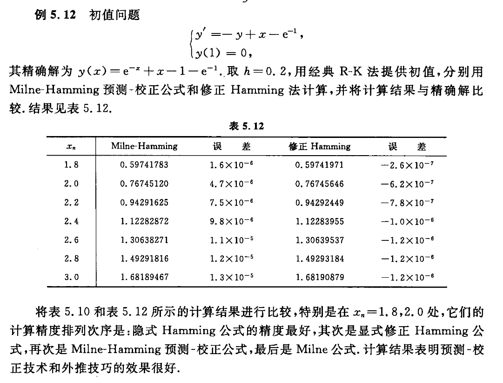

alias:: Milne-Hamming method, 修正哈明预测-校正公式, 修正哈明公式, PMECME

- 将[[Milne 公式]]和[[Hamming 公式]]结合, 构成[[预测-校正公式]]
  \begin{array}{l}
  y_{n+1}^{\mathrm{p}}=y_{n-3}+\frac{4 h}{3}\left(2 f_{n}-f_{n-1}+2 f_{n-2}\right), \\
  y_{n+1}=\frac{1}{8}\left(9 y_{n}-y_{n-2}\right)+\frac{3 h}{8}\left(f\left(x_{n+1}, y_{n+1}^{p}\right)+2 f_{n}-f_{n-1}\right) .
  \end{array}
  > $p$ 代表 predict ，$c$ 代表 correct , $m$ 代表 Modified
- Milne 公式和 Hamming 公式的[[局部截断误差]]分别为
  \begin{array}{l}
  T_{n+1}^{\mathrm{M}}=y\left(x_{n+1}\right)-y_{n+1}^{\mathrm{M}}=\frac{14}{45} h^{5} y^{(5)}\left(x_{n}\right)+O\left(h^{6}\right), \\
  T_{n+1}^{\mathrm{H}}=y\left(x_{n+1}\right)-y_{n+1}^{\mathrm{H}}=-\frac{1}{40} h^{5} y^{(5)}\left(x_{n}\right)+O\left(h^{6}\right) .
  \end{array}
- 利用[[外推原理]], 即  $\frac{1}{40} \times T_{n+1}^{\mathrm{M}}$  加上  $\frac{14}{45} \times T_{n+1}^{\mathrm{H}}$  后, 消去[[局部截断误差主项]], 使
  $$y\left(x_{n+1}\right)-\frac{\frac{1}{40} y_{n+1}^{\mathrm{M}}+\frac{14}{45} y_{n+1}^{\mathrm{H}}}{\frac{1}{40}+\frac{14}{45}}=O\left(h^{6}\right),$$
  说明经过外推后的算法其[精度]([[数值解法的精度]])提高了一阶. 忽略误差项, 上式可改写为
  $$
  y\left(x_{n+1}\right)-y_{n+1}^{\mathrm{M}} \approx \frac{112}{121}\left(y_{n+1}^{\mathrm{H}}-y_{n+1}^{\mathrm{M}}\right), \tag{1}
  $$
  $$
  y\left(x_{n+1}\right)-y_{n+1}^{\mathrm{H}} \approx \frac{-9}{121}\left(y_{n+1}^{\mathrm{H}}-y_{n+1}^{\mathrm{M}}\right) .\tag{2}
  $$
  由于  $y_{n+1}^{\mathrm{M}}$  和  $y_{n+1}^{\mathrm{H}}$  是在计算过程中获得的数据, 称式 $(1)$ 和式 $(2)$ 为 Milne 公式和 Hamming 公式的[[事后误差估计式]].
	- 可以用它们来调节计算[[步长]]  $h$  的大小, 即选择一个合适的步长, 使  $\left|-\frac{9}{121}\left(y_{n+1}^{\mathrm{H}}-y_{n+1}^{\mathrm{M}}\right)\right|<\varepsilon$ , 其中  $\varepsilon$  是要求达到的[[计算精度]].
- 也可以从式 $(1)$ 和式 $(2)$ 得到的 Milne 公式和 Hamming 公式的[[修正公式]],它们分别是
  \begin{array}{l}
  y_{n+1}^{\mathrm{Mm}}=y_{n+1}^{\mathrm{M}}+\frac{112}{121}\left(y_{n+1}^{\mathrm{H}}-y_{n+1}^{\mathrm{M}}\right), \\
  y_{n+1}^{\mathrm{Hm}}=y_{n+1}^{\mathrm{H}}-\frac{9}{121}\left(y_{n+1}^{\mathrm{H}}-y_{n+1}^{\mathrm{M}}\right) .
  \end{array}
- 从而构成如下的[[修正哈明预测-校正公式]]
	- 预测
	  $$y_{n+1}^{\mathrm{p}}=y_{n-3}+\frac{4 h}{3}\left(2 f_{n}-f_{n-1}+2 f_{n-2}\right),$$
	- 修正（通过[[外推]]修正[[预测值]]）
	  $$y_{n+1}^{\mathrm{pm}}=y_{n+1}^{\mathrm{p}}+\frac{112}{121}\left(y_{n}^{\mathrm{c}}-y_{n}^{\mathrm{p}}\right),$$
	- 校正
	  $$y_{n+1}^{\mathrm{c}}=\frac{1}{8}\left(9 y_{n}-y_{n-2}\right)+\frac{3 h}{8}\left[f\left(x_{n+1}, y_{n+1}^{\mathrm{pm}}\right)+2 f_{n}-f_{n-1}\right],$$
	- 修正  
	  $$\quad y_{n+1}=y_{n+1}^{\mathrm{c}}-\frac{9}{121}\left(y_{n+1}^{\mathrm{c}}-y_{n+1}^{\mathrm{p}}\right) .$$
- 在应用这套公式时, 先由同阶单步法提供初值  $y_{0}, y_{1}, y_{2}, y_{3}$ . 当计算  $y_{4}$  时, 可取  $y_{3}^{\mathrm{c}}=y_{3}^{\mathrm{p}}$ .
- ## 例子
	- 