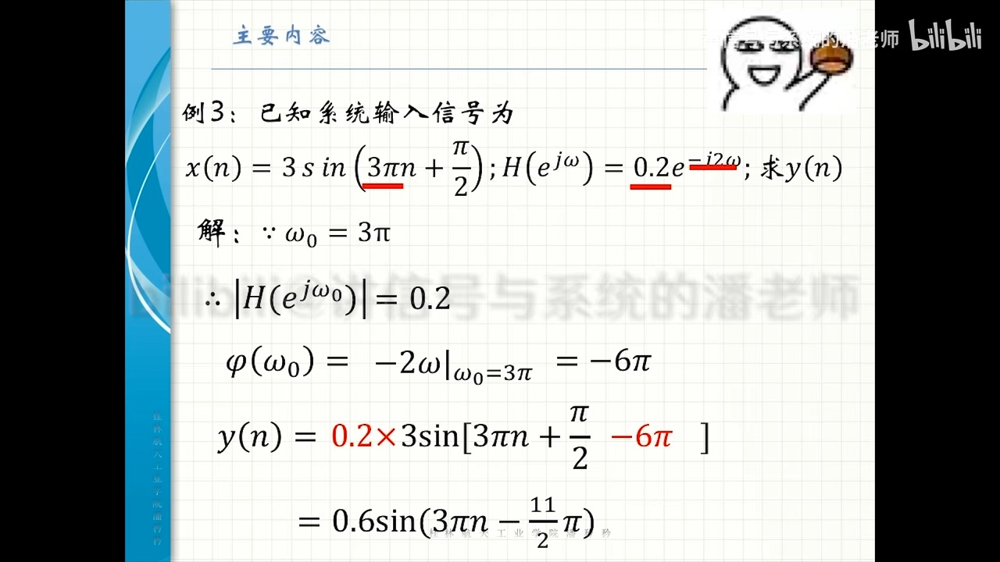

alias:: 系统的系统函数, 传递函数

- 将[[单位脉冲响应]] $$h(n)$$ 进行[[z 变换]], 得到 $$H(z)$$, 一般称 $$H(z)$$ 为^^系统的系统函数^^, 它表征了**系统的复频域特性**.
  id:: 66129619-a42e-42f0-93c0-2e42ad79ce35
- 对[[N 阶线性常系数差分方程]]进行[[z 变换]], 得到系统函数的一般表示式
  $$H(z)=\frac{Y(z)}{X(z)}=\frac{\sum_{i=0}^{M} b_{i} z^{-i}}{\sum_{i=0}^{N} a_{i} z^{-i}},\quad a_0=1$$
  如果 $$H(z)$$ 的[[收敛域]]包含单位圆 $$|z|=1 ,$$ 则[[频率响应函数]]$H\left(\mathrm{e}^{\mathrm{j} \omega}\right)$ 与 $$H(z)$$ 之间的^^关系^^如下:
  $$H\left(\mathrm{e}^{\mathrm{j} \omega}\right)=\left.H(z)\right|_{z=\mathrm{e}^{\mathrm{j} \omega}}$$
  $H\left(\mathrm{e}^{\mathrm{j} \omega}\right)$ 表示系统对[[特征序列]] $$\mathrm{e}^{\mathrm{j} \omega n}$$ 的响应特性, 这也是 $$H\left(\mathrm{e}^{\mathrm{j} \omega}\right)$$ 的物理意义所在，下面具体阐述。
	- 若系统输入[[单频信号]] $$x(n)=\mathrm{e}^{\mathrm{j} \omega n} ,$$ 则系统输出信号为
	  id:: 66129619-2cbf-43a6-a7e8-ad2c443d828f
	  $$\begin{aligned}
	  y(n) & =h(n) * x(n)=\sum_{m=-\infty}^{\infty} h(m) x(n-m)=\sum_{m=-\infty}^{\infty} h(m) \mathrm{e}^{\mathrm{j} \omega(n-m)} \\
	  & =\mathrm{e}^{\mathrm{j} \omega n} \sum_{m=-\infty}^{\infty} h(m) \mathrm{e}^{-\mathrm{j} \omega m}=H\left(\mathrm{e}^{\mathrm{j} \omega}\right) \mathrm{e}^{\mathrm{j} \omega n}
	  \end{aligned}$$
	  即
	  $$y(n)=H\left(\mathrm{e}^{\mathrm{j} \omega}\right) \mathrm{e}^{\mathrm{j} \omega n}=\left|H\left(\mathrm{e}^{\mathrm{j} \omega}\right)\right| \mathrm{e}^{\mathrm{j}[\omega n+\varphi(\omega)]}$$
	  上式说明, [[单频复指数信号]] $$\mathrm{e}^{\mathrm{j} \omega n}$$（$n$ 固定）通过[[频率响应函数]]为 $$H\left(\mathrm{e}^{\mathrm{j} \omega}\right)$$ 的系统后, 输出仍为单频复指数序列, 其[[幅度]]放大 $$\left|H\left(\mathrm{e}^{\mathrm{j} \omega}\right)\right|$$ 倍, [[相移]]为 $$\varphi(\omega)$$ 。
- ## 例子
	- 为了加深对 $$H\left(\mathrm{e}^{\mathrm{j} \omega}\right)$$ 物理意义的理解, 下面以大家熟悉的正弦信号为例进行讨论当系统输入信号 $$x(n)=\cos (\omega n)$$ 时, 求系统的输出信号 $$y(n) :$$
	  因为
	  $$x(n)=\cos (\omega n)=\frac{1}{2}\left[\mathrm{e}^{\mathrm{j} \omega n}+\mathrm{e}^{-\mathrm{j} \omega n}\right]$$
	  所以, 利用上面的结论可得到 :
	  $$y(n)=\frac{1}{2}\left[H\left(\mathrm{e}^{\mathrm{j} \omega}\right) \mathrm{e}^{\mathrm{j} \omega n}+H\left(\mathrm{e}^{\mathrm{j}(-\omega)}\right) \mathrm{e}^{-\mathrm{j} \omega n}\right]$$
	  设 $$h(n)$$ 为实序列, 则 $$H^{*}\left(\mathrm{e}^{\mathrm{j} \omega}\right)=H\left(\mathrm{e}^{-\mathrm{j} \omega}\right),\left|H\left(\mathrm{e}^{\mathrm{j} \omega}\right)\right|=\left|H\left(\mathrm{e}^{-\mathrm{j} \omega}\right)\right|, \varphi(\omega)=-\varphi(-\omega) ,$$ 故
	  $$\begin{aligned}
	  y(n) & =\frac{1}{2}\left[\left|H\left(\mathrm{e}^{\mathrm{j} \omega}\right)\right| \mathrm{e}^{\mathrm{j} \varphi(\omega)} \mathrm{e}^{\mathrm{j} \omega n}+\left|H\left(\mathrm{e}^{-\mathrm{j} \omega}\right)\right| \mathrm{e}^{\mathrm{j} \varphi(-\omega)} \mathrm{e}^{-\mathrm{j} \omega n}\right] \\
	  & =\frac{1}{2}\left|H\left(\mathrm{e}^{\mathrm{j} \omega)}\right)\right|\left\{\mathrm{e}^{\mathrm{j}[\omega n+\varphi(\omega)]}+\mathrm{e}^{-\mathrm{j}[\omega n+\varphi(\omega)]}\right\} \\
	  & =\left|H\left(\mathrm{e}^{\mathrm{j} \omega}\right)\right| \cos [\omega n+\varphi(\omega)]
	  \end{aligned}$$
	- 由此可见线性时不变系统对单频正弦信号 $$\cos (\omega n)$$ 的响应为同频正弦信号其幅度放大 $$\left|H\left(\mathrm{e}^{\mathrm{j} \omega}\right)\right|$$ 倍, 相移增加 $$\varphi(\omega) ,$$ 这就是其名称频率响应函数[[幅频响应]]和[[相频响应]]的物理含义。
	- 
	- 如果系统输入为一般的序列 $$x(n) ,$$ 则 $$H\left(\mathrm{e}^{\mathrm{j} \omega}\right)$$ 对 $$x(n)$$ 的不同的频率成分进行加权处理。对感兴趣的频段, 取 $$\left|H\left(\mathrm{e}^{\mathrm{j} \omega}\right)\right|=1 ,$$ 其他频段 $$\left|H\left(\mathrm{e}^{\mathrm{j} \omega}\right)\right|=0 ,$$ 则 $$Y\left(\mathrm{e}^{\mathrm{j} \omega}\right)= X\left(\mathrm{e}^{\mathrm{j} \omega}\right) \cdot H\left(\mathrm{e}^{\mathrm{j} \omega}\right) ,$$ 这就是对输入信号的[[理想滤波]]处理。
		- 根据[[佩利-维纳准则]], 理想滤波器的 $$H\left(\mathrm{e}^{\mathrm{j} \omega}\right)$$ 不满足物理可实现的必要条件。
		  所以, 实际中都是用可实现的滤波器来逼近理想滤波器的。