alias:: 系统框图, 方框图

- |运算|时域|z 域|z 域[[信号流图]] |
  |--|--|--|--|
  |[[延迟器]]|$𝑦(𝑛) = 𝑥(𝑛 − 1)$ 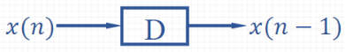 |$𝑌(𝑧) = 𝑧^{−1}𝑋(𝑧)$ 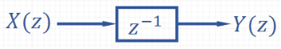 | 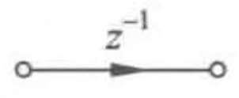 |
  |[[常数乘法器]]|$y(n)=a x(n)$  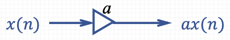 |$Y(z)=a X(z)$ 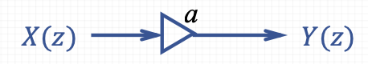 | 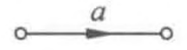 |
  |[[加法器]]|$y(n)=x_{1}(n)+x_{2}(n)$  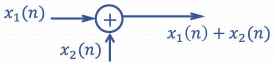 |$Y(z)=X_{1}(z)+X_{2}(z)$ 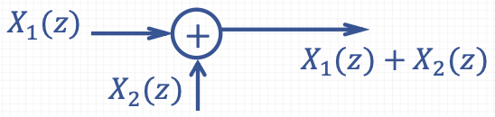 | 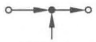 |
- ## 例子
	- ((660f8918-f8f6-42b4-b81f-3010e754910c))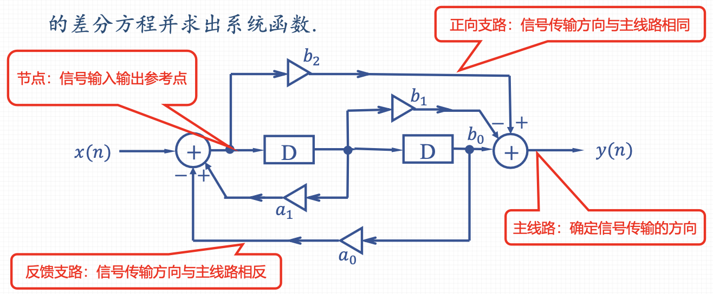
	- ### 系统框图与[[系统函数]]的对应关系
		- 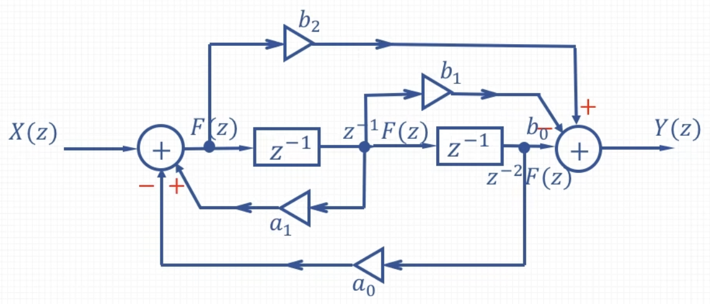
		- $$H(z)=\frac{Y(z)}{X(z)}=\frac{\left(b_{0} z^{-2}+b_{1} z^{-1}+b_{2}\right)}{\left(1-a_{1} z^{-1}+a_{0} z^{-2}\right)}$$
			- 分子多项式对应[[正向支路]]（包含[[主线路]]）；
			  系数符号与支路实际符号相同 $($ 不标注时默认为 $+ )$
			- 分母多项式对应[[输入]]和[[反馈支路]]；
			  反馈支路的系数符号与实际符号**相反**。
	- 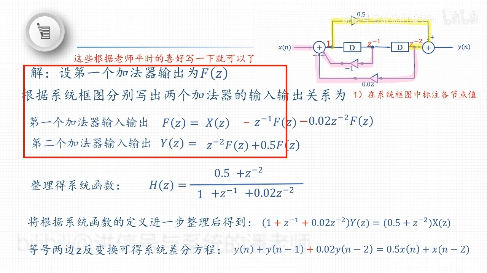
- ## 基本网络结构系统框图
- ### [[直接型]]系统框图
	- 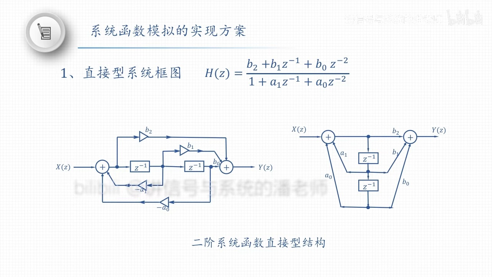
	- ### 例子
	  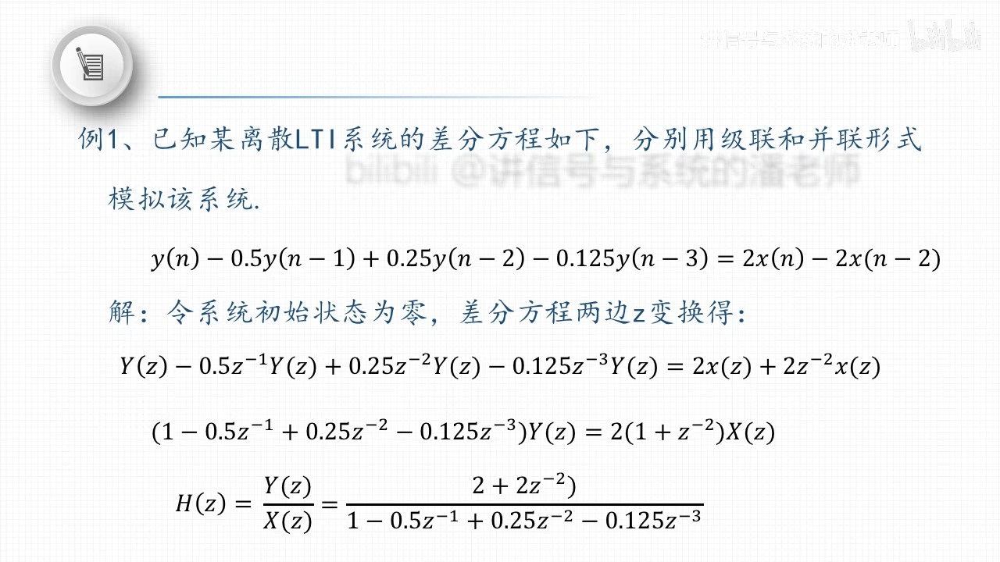
- ### [[级联型]]系统框图
	- 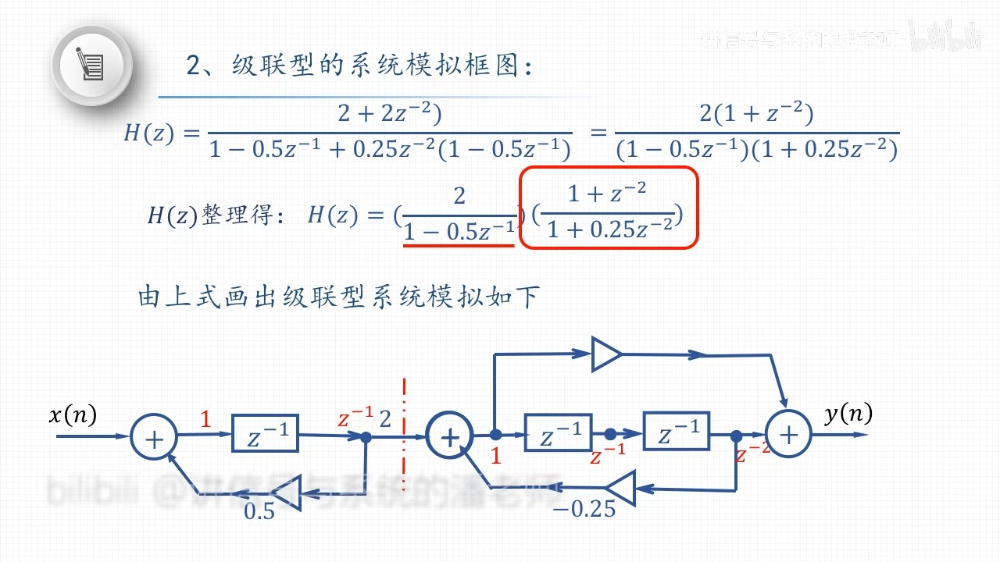 
	  分子分母四个部分可以任意组合分成两个独立的多项式，每个多项式模拟成一个独立的子系统。
- ### [[并联行]]系统框图
	- 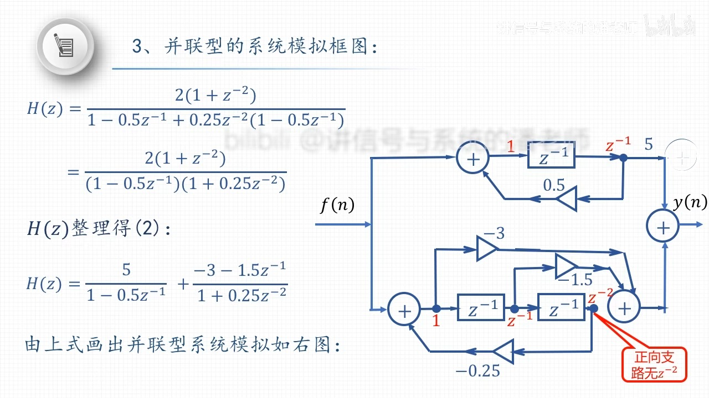 
	  对系统函数运用[[部分分式展开法]]裂项后可以得到两个多项式相加。
- >将直接型的高阶系统降为级联或并联的多个一阶或二阶系统，可以降低系统的设计难度，还可以通过仿真选择系统的最优结构，提高系统运行效率和[稳定性]([[系统的稳定性]])。
- ### 例子
  ((660fe149-8d59-420d-922a-5316fd6619b7))