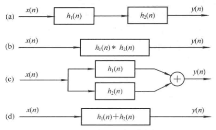

- 线性卷积服从[[交换律]]、[[结合律]]和[[分配律]]。它们分别用公式表示如下:
  $$x(n) * h(n)=h(n) * x(n) \tag{1}$$
  $$x(n) *\left[h_{1}(n) * h_{2}(n)\right]=\left[x(n) * h_{1}(n)\right] * h_{2}(n)\tag{2}$$
  $$x(n) *\left[h_{1}(n)+h_{2}(n)\right]=x(n) * h_{1}(n)+x(n) * h_{2}(n)\tag{3}$$
  设  $h_{1}(n)$  和  $h_{2}(n)$  分别是两个系统的[[单位脉冲响应]],  $x(n)$  表示输人序列。
	- 按照 $(2)$ 式的右端, 信号通过  $h_{1}(n)$  系统后再通过  $h_{2}(n)$  系统, 等效于按照 $(2)$ 式左端, 信号通过一个系统, 该系统的单位脉冲响应为  $h_{1}(n) * h_{2}(n)$ , 如图 $(a)$、$(b)$ 所示。
	  该式还表明两[[系统级联]]，其 等效系统的单位脉冲响应 等于 两系统分别的单位脉冲响应的卷积 。
	- 按照 $(3)$ 式，信号同时通过两个系统后相加，等效于信号通过一个系统，该系统的单位脉冲响应等于两个系统分别的单位脉冲响应之和，如图(c)、(d)所示。换句话说，[[系统并联]]的等效系统的单位脉冲响应等于两个系统分别的单位脉冲响应之和。
	- 
- >关于系统级联、并联的等效系统的单位脉冲响应与原来两系统分别的单位脉冲响应的关系, 是基于线性卷积的性质, 而线性卷积是基于[[线性时不变系统]]满足线性叠加原理和时不变特性。因此, **对于非线性或者时变系统, 这些结论是不成立的** 。
- 下式表示序列  $x(n)$  与[[单位脉冲序列]]的线性卷积等于序列本身  $x(n)$ ,
  $$x(n)=\sum_{m=-\infty}^{\infty} x(m) \delta(n-m)=x(n) * \delta(n) \tag{4}$$
- 如果序列与一个[[移位]]的单位脉冲序列  \delta\left(n-n_{0}\right)  进行线性卷积, 就相当于将序列本身移位  $n_{0}$  (  $n_{0}$  是整常数  ) , 如下式表示:
  $$y(n)=x(n) * \delta\left(n-n_{0}\right)=\sum_{m=-\infty}^{\infty} x(m) \delta\left(n-n_{0}-m\right)$$
  上式中求和项只有当  $m=n-n_{0}$  时才有非零值, 因此得到:
  $$x(n) * \delta\left(n-n_{0}\right)=x\left(n-n_{0}\right)\tag{5}$$
-