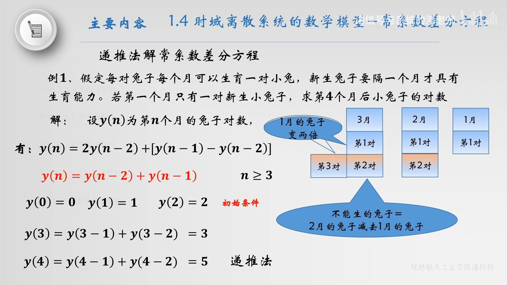

- 一个  $N$  阶线性常系数[[差分方程]]用下式表示：
  $$y(n)=\sum_{i=0}^{M} b_{i} x(n-i)-\sum_{i=1}^{N} a_{i} y(n-i)\tag{1}$$
  或者
  $$\sum_{i=0}^{N} a_{i} y(n-i)=\sum_{i=0}^{M} b_{i} x(n-i) \quad a_{0}=1\tag{2}$$
  式中,  $x(n)$  和  $y(n)$  分别是系统的输入序列和输出序列,  $a_{i}$  和  $b_{i}$  均为**常数**, 式中  $y(n-i)$  和  $x(n-i)$  项只有一次幂, 也没有相互交叉相乘项, 故称为 *线性常系数差分方程* 。
  差分方程的阶数是用方程  $y(n-i)$  项中  $i$  的最大取值与最小取值之差确定的。在 $(2)$ 式中,  $y(n-i)$ 项  $i$  最大的取值为  $N$ ,  $i$  的最小取值为零, 因此称为  $N$  阶差分方程。
- ## 线性常系数差分方程的求解
	- ### 递推解法
		- 