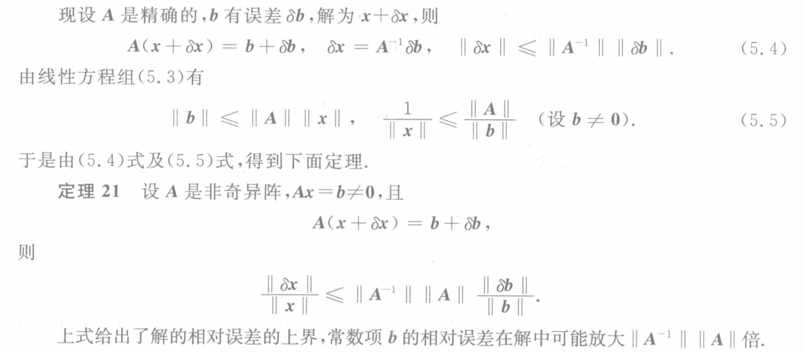
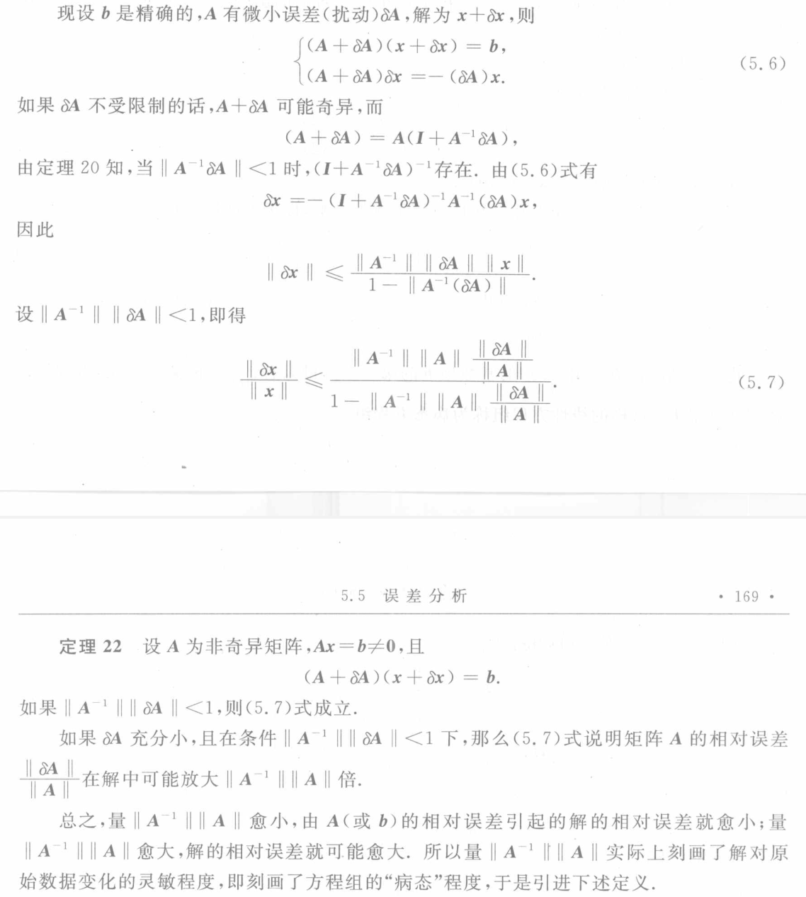
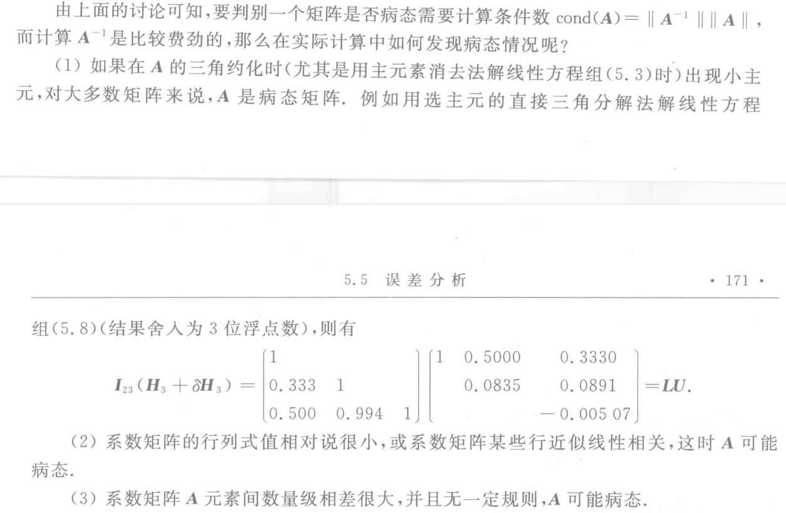
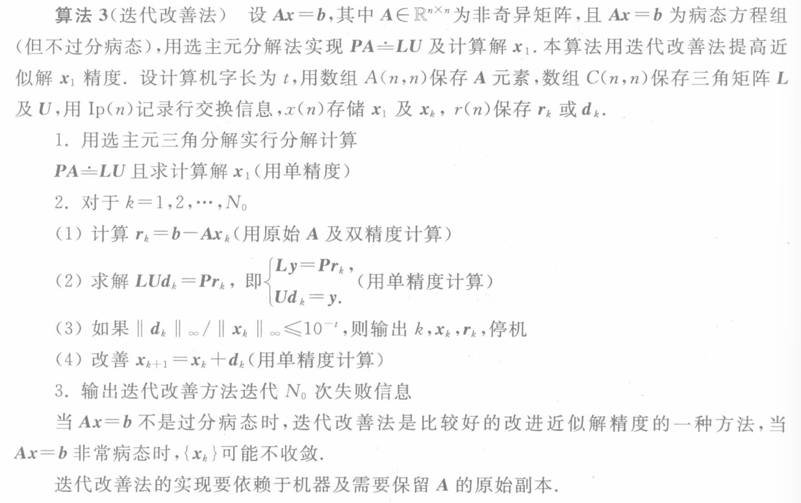

## [[病态矩阵]]
- ## 误差分析
	- 设有[[线性方程组]] 
	  $$\boldsymbol{Ax}=\boldsymbol b$$
	  其中 $\boldsymbol A$ 为 *非奇异阵* , $x$ 为线性方程组的[[准确解]]．
	- 以下我们研究线性方程组的系数矩阵 $\boldsymbol A$ (或 $\boldsymbol b$ )的微小误差([[扰动]])时对解的影响。
	- 
	- {:height 732, :width 651}
	- ### [[矩阵的条件数]]
- ## 判断矩阵是否病态的一般方法
	- 
- # 迭代改善法
	- 