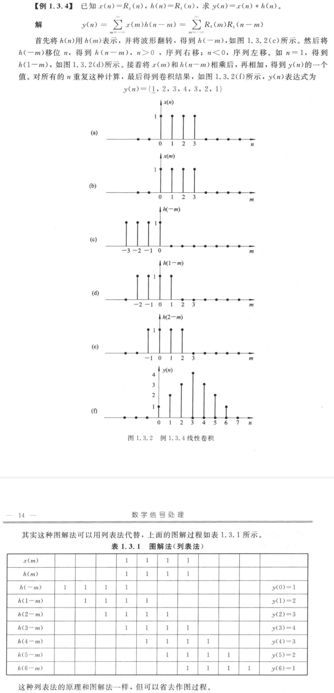

alias:: 时域离散线性时不变系统

- 同时满足[线性]([[线性系统]])和[[时不变]]特性的系统称为 *时域离散线性时不变系统* 。
- ### 时域离散系统的零输入响应、零状态响应和完全响应
	- 设  $n_{0}$  为初始观察时刻, 则可将系统的输入分为两部分, 称  $n_{0}$  以前的输入为[[历史输入信号]], 称  $n_{0}$  及  $n_{0}$  以后的输入为[[当前输入信号]] (简称输入信号)。
	- 仅由  $n_{0}$  时刻的[[初始状态]]或[[历史输入信号]]引起的[[响应]]称为[[零输入响应]]; 
	  仅由[[当前输入信号]]引起的响应称为[[零状态响应]]; 
	  将零输入响应与零状态响应之和称为系统的[[完全响应]]。
- 设系统的输入  $x(n)=\delta(n)$ , 系统输出  $y(n)$  的 初始状态 为零, 定义这种条件下的系统输出为系统的[[单位脉冲响应]], 用  $h(n)$  表示。换句话说, 单位脉冲响应即系统对于  $\delta(n)$  的[[零状态响应]]。用公式表示为
  $$h(n)=T[\delta(n)]$$
  $h(n)$  和模拟系统中的[[单位冲激响应]]  $h(t)$  相类似, 都代表系统的时域特征。
- 设系统的输入用  $x(n)$  表示, 按照[式](((65cc2452-44cb-42e9-9a6c-29dfff886abf)))表示成[[单位脉冲序列]] 移位加权和 为
  $$x(n)=\sum_{m=-\infty}^{\infty} x(m) \delta(n-m)$$
  那么系统输出为
  $$y(n)=T\left[\sum_{m=-\infty}^{\infty} x(m) \delta(n-m)\right]$$
  根据线性系统的叠加性质
  $$y(n)=\sum_{m=-\infty}^{\infty} x(m) T[\delta(n-m)]$$
  又根据时不变性质
  $$y(n)=\sum_{m=-\infty}^{\infty} x(m) h(n-m)=x(n) * h(n)$$
  式中的符号 $*$ 代表[[卷积运算]], 上式表示 线性时不变系统 的输出等于输入序列和该系统的[[单位脉冲响应的卷积]]。
  > 卷积输出序列的变量是 $n$ ，求和的变量是 $m$ ，$n$ 在求和中是反映 $x_2(-m)$ 的位移量。
  $n$ 要从 $0$ 开始逐个带入，求出 $y(n)$ 的逐个值。
- 计算卷积的基本运算是翻转、移位、相乘和相加，这类卷积称为序列的[[线性卷积]]。如果两个序列的长度分别为 $N$ 和 $M$ ，那么卷积结果的长度为 $N十M-1$ 。
- 计算卷积有三种方法: 图解法, 解析法, 利用 MATLAB 语言的工具箱函数计算法。下面先介绍图解法。
- ### 图解法
  
- 
- 