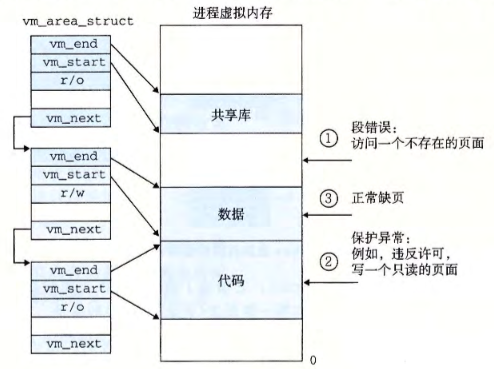

alias:: 缺页处理

- 假设[[MMU]]在试图翻译某个虚拟地址 A 时，触发了一个[[缺页异常]]。 这个异常导致控制转移到[[内核]]的[[缺页处理程序]]，处理程序随后就执行下面的步骤：
	- 虚拟地址 A 是[合法]([[地址合法]])的吗？换句话说， A 在某个[[区域结构]]定义的区域内吗？
	  logseq.order-list-type:: number
	  id:: 6571e2a0-91fa-44f5-9356-8cd685c89da3
		- 为了回答这个问题，[[缺页处理程序]]搜索[[区域结构]]的[[链表]]，把 A 和每个 区域结构 中的[[vm_start]] 和[[vm_end]]做比较。如果这个指令是 *不合法* 的，那么[[缺页处理程序]]就触发一个[[段错误]]，从而[终止这个进程]([[终止进程]])。这个情况在图中标识为 "1" 。
		- #+BEGIN_TIP
		  因为一个 *进程* 可以**创建**任意数量的新 *虚拟内存区域*（使用[[mmap]]函数），所以 *顺序搜索* *区域结构的链表* 花销可能会很大 。 因此在实际中， Linux 使用某些我们没有显示出来的字段， Linux 在[[链表]]中构建了一棵[[树]]，并在这棵树上进行查找。
		  #+END_TIP
	- 试图进行的[[内存访问]]是否[合法]([[内存访问合法]])？换句话说，进程是否有读、写或者执行这个区域内页面的权限？
	  logseq.order-list-type:: number
		- 例如，这个[[缺页]]是不是由一条试图对[[代码段]]里的 *只读页面* 进行写操作的存储指令造成的？
		- 这个缺页是不是因为一个运行在 用户模式 中的进程试图从 内核虚拟内存 中读取字造成的？
		- 如果试图进行的访问是不合法的，那么[[缺页处理程序]]会触发一个[[保护异常]]，从而[终止这个进程]([[终止进程]])。这种情况在图中标识为 "2" 。
	- 此刻，内核知道了这个[[缺页]]是由于对 *合法的虚拟地址* 进行 *合法的操作* 造成的。它是这样来处理这个缺页的：
	  logseq.order-list-type:: number
		- 选择一个[[牺牲页面]]，如果这个牺牲页面被修改过，那么就将它交换出去，换入新的页面并更新[[页表]]。当[[缺页处理程序]]返回时， [[CPU]]重新启动引起缺页的[[指令]]，这条指令将再次发送 A 到 MMU。这次， MMU就能正常地翻译 A, 而不会再产生[[缺页异常]]了。
	- 
	  logseq.order-list-type:: number
-