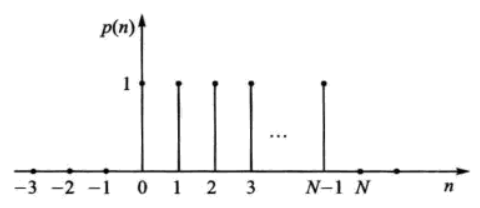

alias:: 矩形序列, 矩形信号, 方波信号, 矩形脉冲

- 脉冲信号 $p(n)$ , 其波形如图所示。其数学定义式如下:
  $$p(n)=\left\{\begin{array}{l}
  1,0 \leqslant n \leqslant N-1 \\
  0, \text { 其他 }
  \end{array}\right.$$
  式中,  $N$  为[[脉冲宽度]]。
  脉冲信号的特点是只有在  $n=0$  到  $n=N-1$  这样一个长度为  $N$  的窗内才有值, 在其他范围取值均为 $0$ 。
  
- 矩形信号作为一种最基本的[[窗函数]]，几乎应用于任何的信号处理过程中。