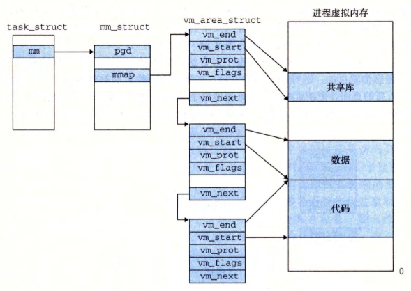

alias:: virtual memory area, 内存段, memory segment

- # Linux 虚拟内存区域
	- Linux将[[虚拟内存]]组织成一些[区域]([[虚拟内存区域]])（也叫做[段]([[内存段]])）的 *集合* 。
	  一个[[区域]]就是已经存在着的（[[已分配的]]）虚拟内存的连续[[片]](chunk), 这些页是以某种方式相关联的。
		- 例如，代码段、数据段、堆、共享库段，以及 用户栈 都是不同的区域。
		- 每个[存在的虚拟页面]([[已分配页]])都保存在某个[区域]([[虚拟内存区域]])中，而不属于某个区域的虚拟页是**不存在的**，并且**不能被[[进程]]引用**。
		- 区域的概念很重要，因为它允许虚拟地址空间有 *间隙* 。[[内核]]**不用记录那些不存在的[[虚拟页]]**，而这样的页也不占用内存、磁盘或者内核本身中的任何额外资源。
	- 下图强调了记录一个进程中虚拟内存区域的内核数据结构。
	  
	- [[内核]]为系统中的每个[[进程]]维护一个单独的[[任务结构]]（源代码中的[[task_struct]])。
	  [[任务结构]]中的元素包含或者指向**内核运行该进程所需要的所有信息**（例如，[[PID]]、[指向用户栈的指针]([[栈指针]])、[[可执行目标文件]]的名字，以及[[程序计数器]]）。
	- [[任务结构]]中的一个条目指向[[mm_struct]], 它描述了**[[虚拟内存]]的当前状态**。 
	  其中两个重要字段是[[pgd]]和[[mmap]]。
		- 其中[[pgd]]指向 *第一级[[页表]]*（[[页全局目录]]）的[[基址]]，
		- 而[[mmap]]指向一个[[vm_area_struct]](区域结构）的[[链表]]，其中每个 `vm_area_struct` 都描述了当前虚拟地址空间的一个[区域]([[虚拟内存区域]])。
	- 当内核运行这个进程时，就将[[pgd]]存放在[[CR3 控制寄存器]]中 。
	- 一个具体区域的[[区域结构]]包含下面的字段：
		- [[vm_start]]: 指向这个区域的起始处 。
		- [[vm_end]]: 指向这个区域的结束处 。
		- [[vm_prot]]: 描述这个区域内包含的所有页的[[读写许可权限]]。
		- [[vm_flags]]: 描述这个区域内的 *页面* 是与其他[[进程共享]]的，还是这个[[进程私有]]的（还描述了其他一些信息）。
		- [[vm_next]]: 指向[[链表]]中下一个[[区域结构]]。
		-