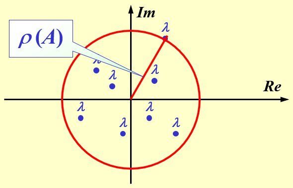

alias:: spectrum

- [[域]]$F$上[[矩阵]]$\boldsymbol{A}$ 的**全体**[[特征值]]称为 $\boldsymbol{A}$ 的[[谱]]，记作 $\sigma(\boldsymbol A)$ , 即 $\sigma(\boldsymbol A)={\lambda_1,\lambda_2,\cdots,\lambda_n}$ .
- 记
  $$
  \rho(\boldsymbol A)=\max_{1\leq_i\le n}|\lambda_i|
  $$
  称为[[矩阵]] $\boldsymbol A$ 的[[谱半径]]。
	- 其中 $\lambda_i$ 为 $\boldsymbol A$ 的[[特征根]]。
	  {:width 590/2 :height 379/2}
-