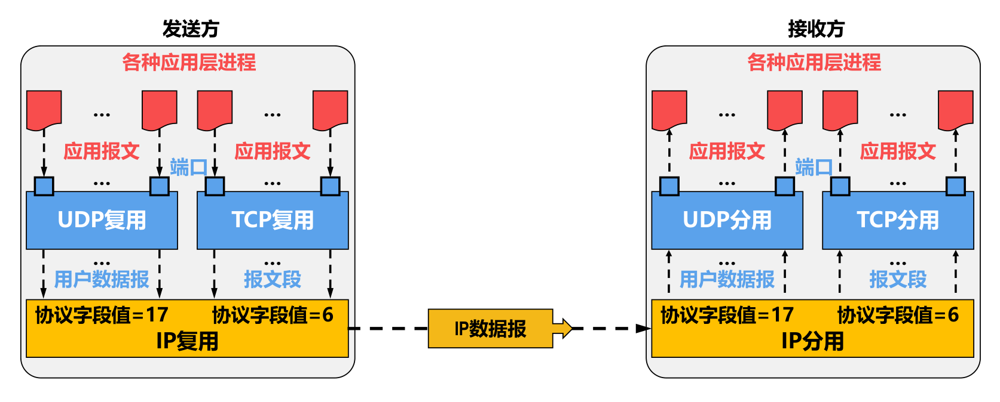
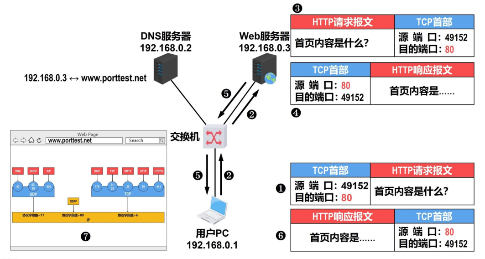
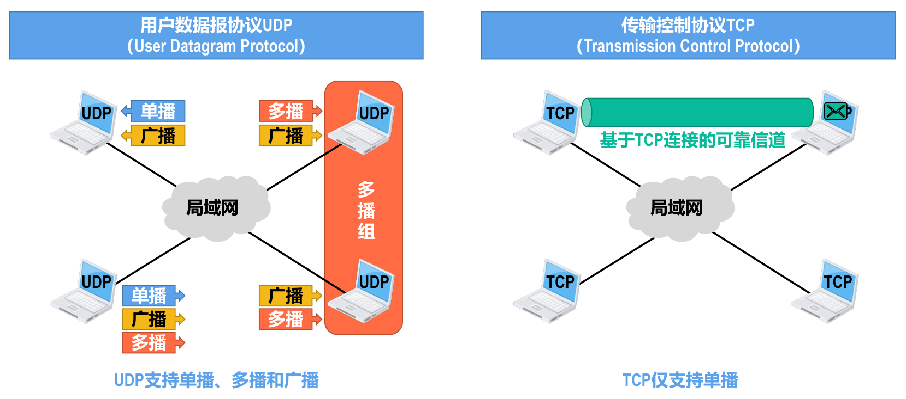
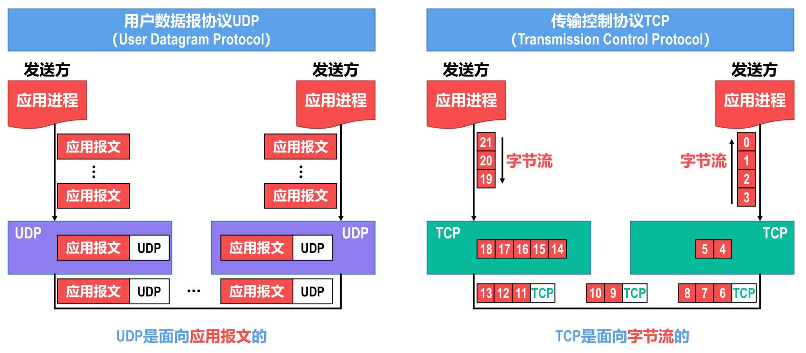
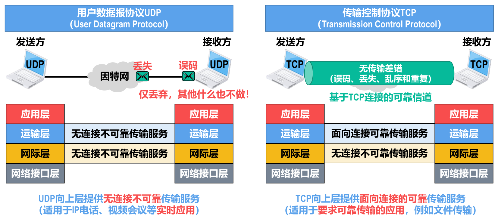
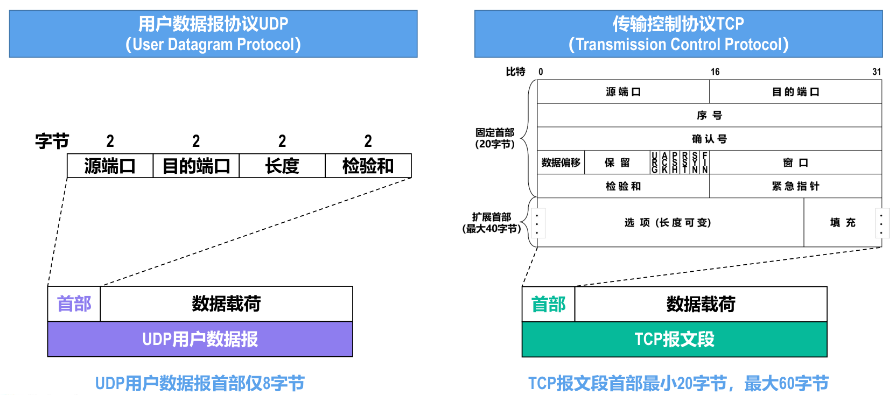
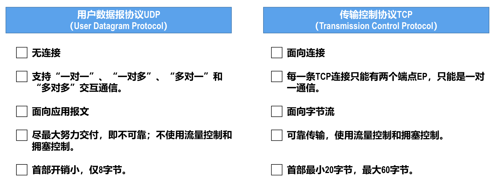

- 运输层需要考虑的主要问题：
	- [[进程]]之间基于 *网络* 的 *通信*（**进程的标识**，例如[[端口号]]）。
	  logseq.order-list-type:: number
	- 出现 *传输差错* 如何处理（[[可靠传输]]和[[不可靠传输]]）。
	  logseq.order-list-type:: number
- [[因特网]]的运输层为应用层提供了两种不同的运输层协议，即面向连接的[[TCP]]和无连接的[[UDP]]。
- # 发送方的复用和接收方的分用
  
  >例子
  
- # UDP和TCP的对比
- [[UDP]]支持[[单播]]、[[多播]]和[[广播]]
  logseq.order-list-type:: number
  [[TCP]]仅支持[[单播]]
  
- ## UDP和TCP应用层报文的处理
  logseq.order-list-type:: number
  [[UDP]]是面向[[应用报文]]的
  [[TCP]]是面向[[字节流]]的
  {:height 350, :width 778}
- ## UDP和TCP对数据传输可靠性的支持情况
  logseq.order-list-type:: number
  [[UDP]]向上层提供 *无连接* *不可靠* 传输服务（适用于IP电话、视频会议等 *实时应用* ）
  [[TCP]]向上层提供 *面向连接的* *可靠* 传输服务（适用于 *要求可靠传输的应用* ，例如文件传输）
  
- ## UDP首部和TCP首部的对比
  logseq.order-list-type:: number
  
- # DOING 总结 
  logseq.order-list-type:: number
  :LOGBOOK:
  CLOCK: [2023-10-25 Wed 19:22:07]
  :END:
  