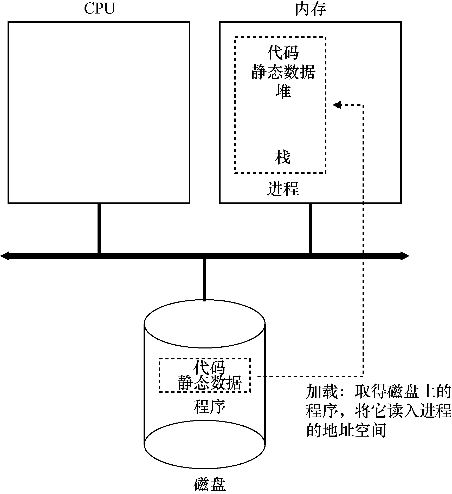

- 操作系统运行程序必须做的第一件事是将[[代码]]和所有[[静态数据]]（例如初始化变量）[[加载]]到内存中，加载到进程的[[地址空间]]中。
  > 程序最初以某种[[可执行格式]]驻留在[[磁盘]]上，因此，将程序和静态数据加载到内存中的过程，需要操作系统从磁盘读取这些字节，并将它们放在内存中的某处。
- {:width 1738/5, height 1901/5}
- 将代码和静态数据加载到内存后，操作系统在运行此进程之前还需要执行其他一些操作。
  必须为程序的[[run-time stack]]分配一些[[内存]]。
	- [[C 程序]]使用 run-time stack 存放[[局部变量]]、[[函数参数]]和[[返回地址]]。
	- 操作系统分配这些内存，并提供给进程。
	- 操作系统也可能会用参数初始化栈。具体来说，它会将参数填入`main()`函数，即 `argc` 和 `argv`
	  数组。
	- 操作系统也可能为程序的[[heap]]分配一些内存。在 C 程序中，堆用于显式请求的动态分配数据。程序通过调用 `malloc()` 来请求这样的空间，并通过调用 `free()` 来明确地释放它。
	- 操作系统还将执行一些其他初始化任务，特别是与[[I/O]]相关的任务。
	  >例如，在 UNIX 系统中，默认情况下每个进程都有 3 个打开的[[file descriptor]]，用于[[标
	  准输入]]、[[标准输出]]和 错误 。这些描述符让程序轻松读取来自终端的输入以及打印输出到屏幕。
-
-
-