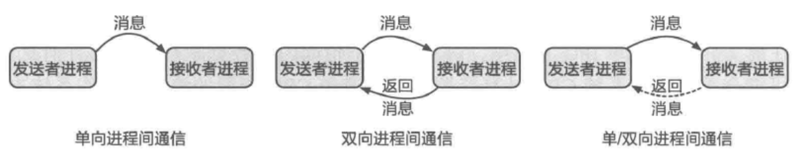

- IPC 通常包含三种可能的方向：仅支持单向通信、仅支持双向通信、单向和双向通信均可。三者的对比如图所示。
- 
- 从图中可以看到，[[单向通信]]通常指消息在一个连接上只能从一端发送到另 一端，[[双向通信]]则允许双方互相发送消息，而[[单/ 双向通信]]均可的方式则会根据通信中具体的配置选项等来判断是否需要支持单向或双向的通信。
- 通常来说，单向通信其实是系统软件实现 IPC 的一个基本单元，双向通信是可以基于单向 IPC 来搭建的。在接口上，如果通信的两端在连接建立后分别只能使用`Send`(发送消息)及`Recv`(接收消息)，那么这通常对应单向通信。
- 而前文介绍的[[RPC]]接口 则是一个有代表性的双向通信的例子。
- 在实际应用中，很多系统选择的是单/双向均可的策略，这样可以比较好地支持各种场景。
  >当然，管道等只支持单向通信的机制在实际中同样有较多的应用。